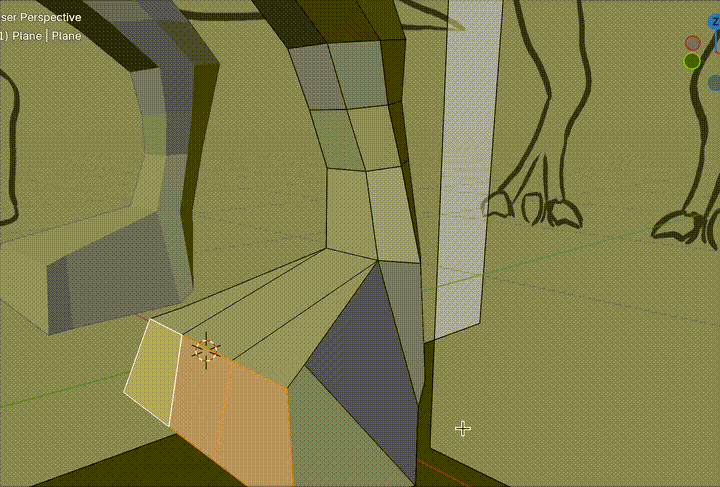
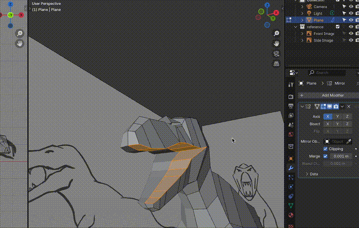
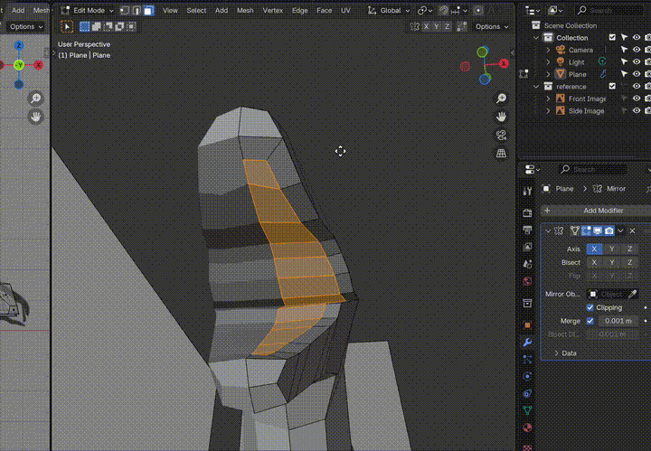
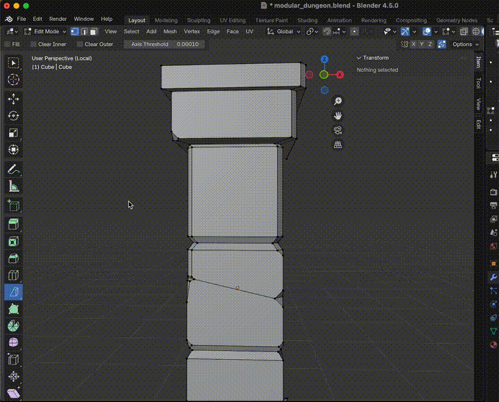
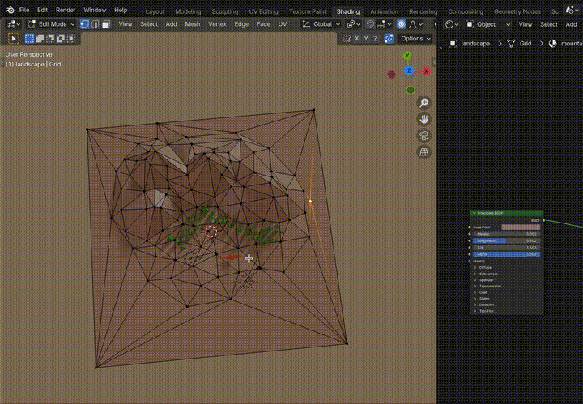
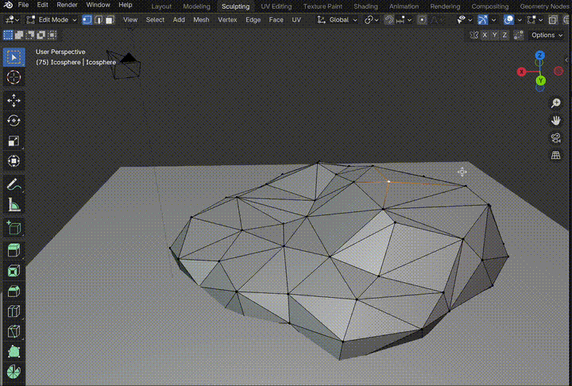

# Edit Mode

## Edit Mode - Selection

| Shortcut | Description |
|----------|------------|
| **1** | Vertex select mode |
| **2** | Edge select mode |
| **3** | Face select mode |
| **Alt + Click** | Select edge/face loop |
| **Shift + Alt + Click** | Select edge/face ring |

## Edit Mode - Mesh Operations

| Shortcut | Description | Images |
|----------|-------------|--------|
| **E** | Extrude |
| **I** | Inset faces (Press **I** for Individual, Press **B** for Boundary ) | Individual:  Boundary:  |
| **Alt + S** | Scale along Normals |  |
| **Ctrl + R** | Loop cut |
| **K** | Knife tool |  |
| **Spacebar, Shift 8** | Bisect tool |  |
| **F** | Fill/create face |
| **J** | Join vertices |  |
| **P** | Separate to a new object |  |
| **Ctrl + F** | Face menu |
| **M** | Merge menu |
| **V** | Rip vertices |
| **Alt + V** | Rip vertices and fill |
| **Ctrl + B** | Bevel |
| **Ctrl + Shift + B** | Bevel vertices |

## Edit Mode - Advanced Tools

| Shortcut | Description |
|----------|------------|
| **Ctrl + E** | Edge menu |
| **Ctrl + V** | Vertex menu |
| **W** | Specials menu (context-sensitive) |
| **Alt + M** | Merge menu |
| **Ctrl + X** | Dissolve menu |
| **Y** | Split |
| **Ctrl + T** | Triangulate faces |

## Useful Settings
| Shortcut | Name | Image |
|----------|-------------|-------|
| **O** | **Proportional Editing** Use scroll to change *circle of influence* |  |