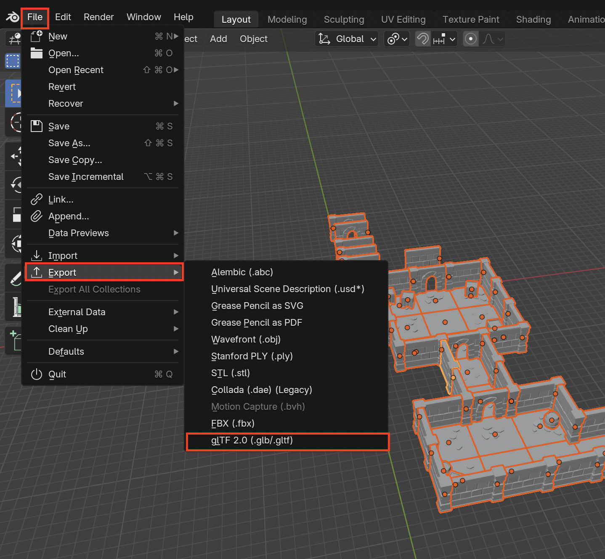
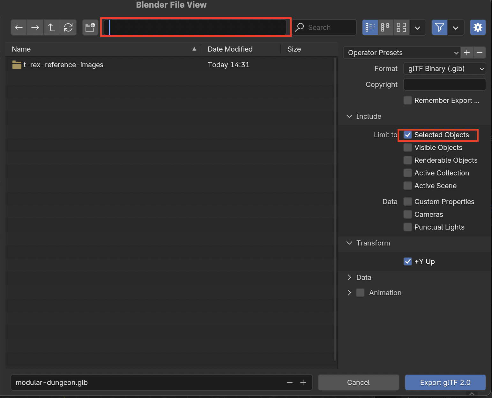

# Export Models

## Export as GLTF
1. Select all the objects you want to export

2. Go to **File > Export > gLTF 2.0 (.glb/.gltf)**

3. Select where you want to export your gltf file and make sure to enable Limit to **Selected Objects** so no extra objects get exported
