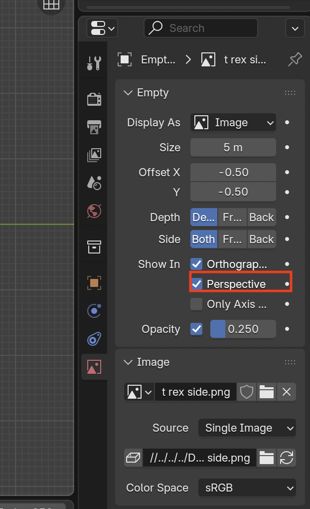
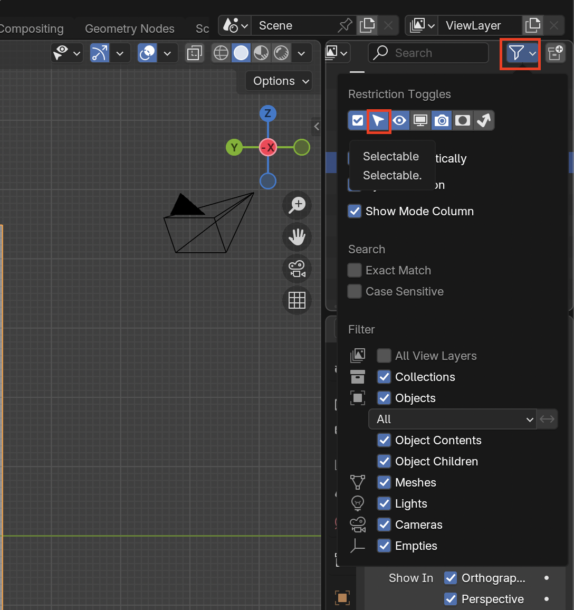
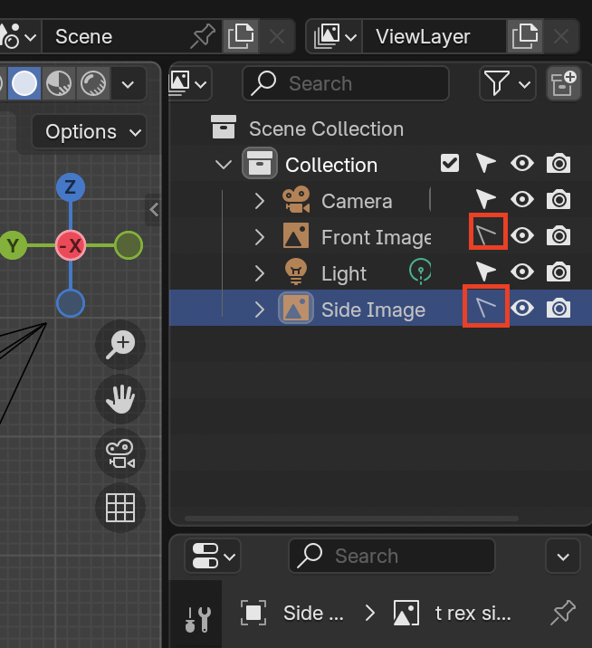

# Inserting Background Images

Often artists use background images or **image empties** to accurately trace/model objects.

## Adding Background Images

1. Simply drag and drop your image into Blender

2. You can remove rotation (**Alt + R**) and remove movement (**Alt + G**)

3. You can align the image up my pressing **R** then **X** then the numbers **90** to tell Blender to rotate along the x-axis 90 degrees

4. If you are having trouble seeing the grid lines go to the **Data** tab in Properties on the right, then enable **Opacity** and bring it down to ~0.25

5. Another helpful option is to enable/disable showing the image in perspective depending on your preferred method

6. If you do not want to select the images by accident. Go into the **Filter Menu** on the **Outliner** and select **Selectable**

7. To remove the selectability of the images, disable the selectable option near their object

## Scaling Images

1. If you want to scale an image without affecting where the feet are, set 3D Cursor to world origin

2. Change the **Transform Pivot Point** to **3D Cursor**

3. Your image will now scale with the feet staying in the proper place
