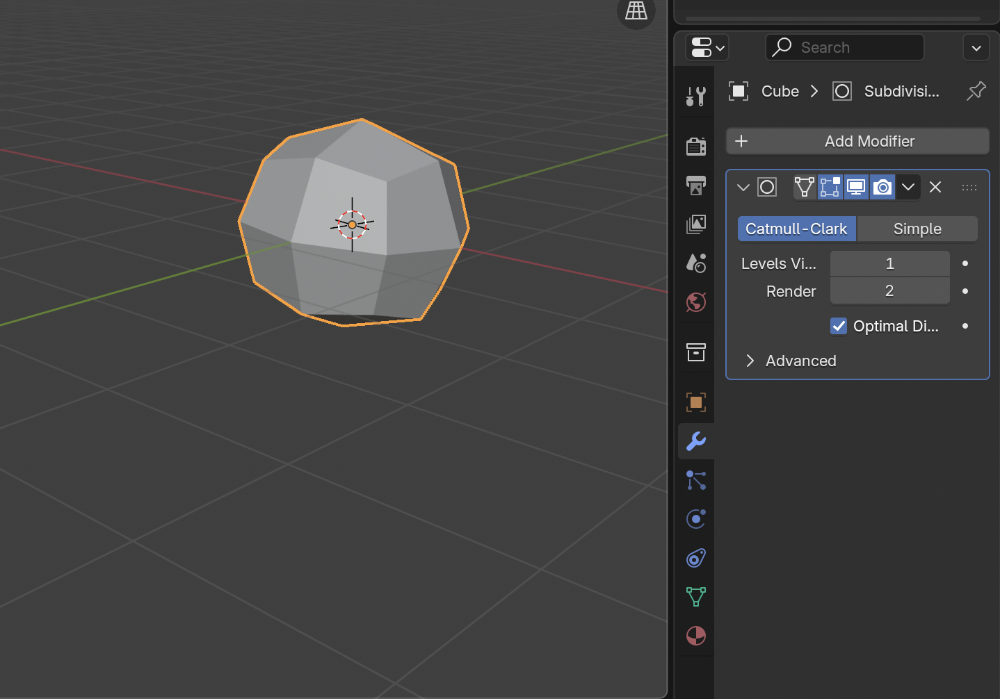
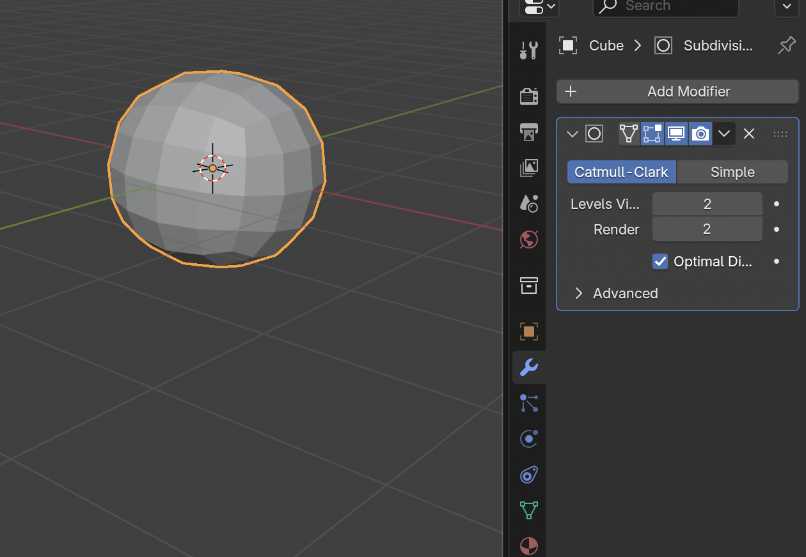
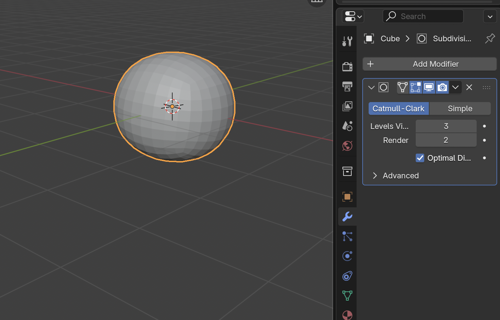
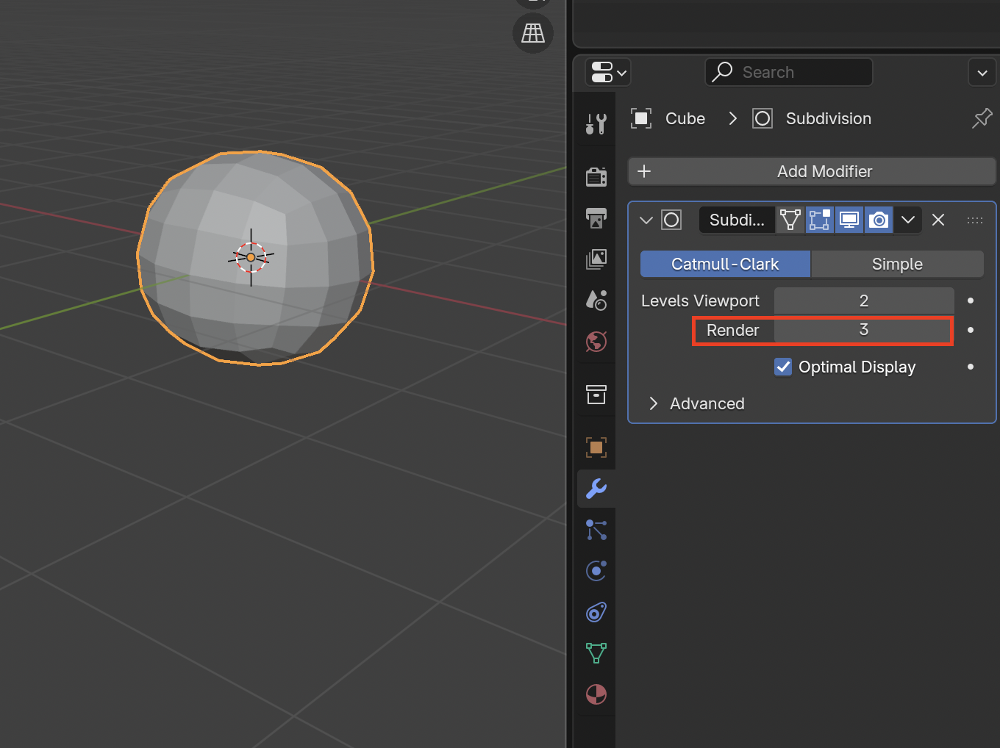
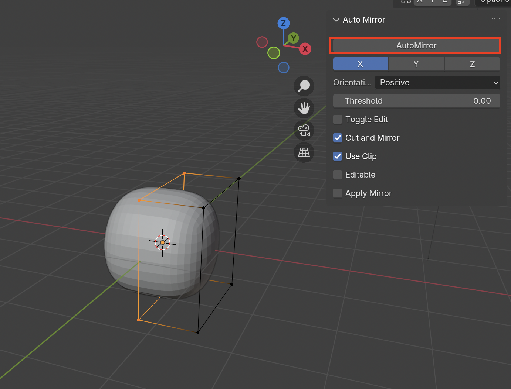

# Modelling With Subdivision Surface Modifier

To easily create a **Subdivision Surface Modifier** you can you 

| Shortcut | Image |
|----------|-------|
| **CMD + 1** |  |
| **CMD + 2** |  |
| **CMD + 3** |  |

It is a good idea to set the **Render** as higher than the **Viewport**, so that it is easier to model and having a smoother render

## Example of Modelling Workflow
