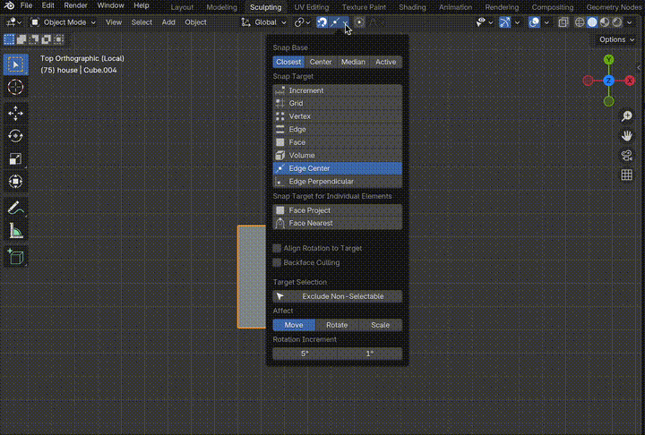
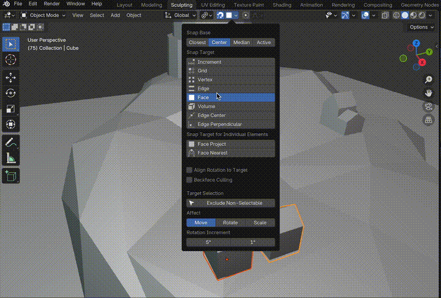
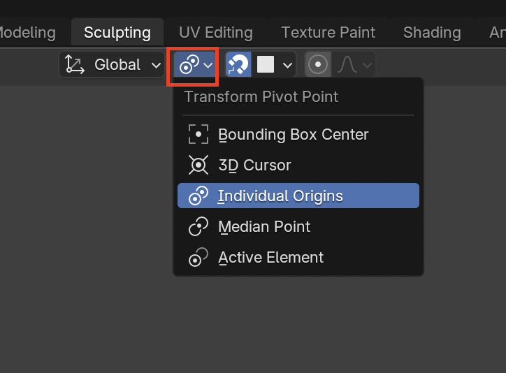
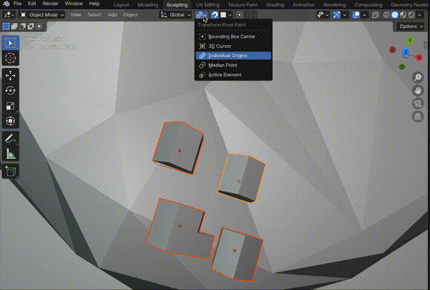
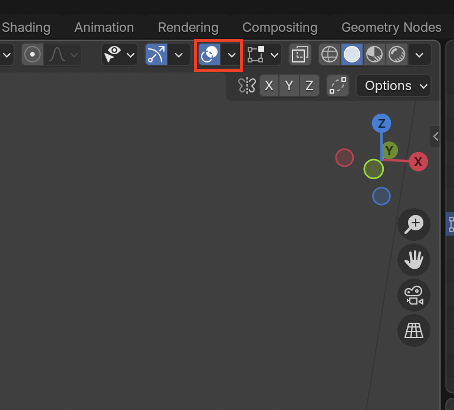
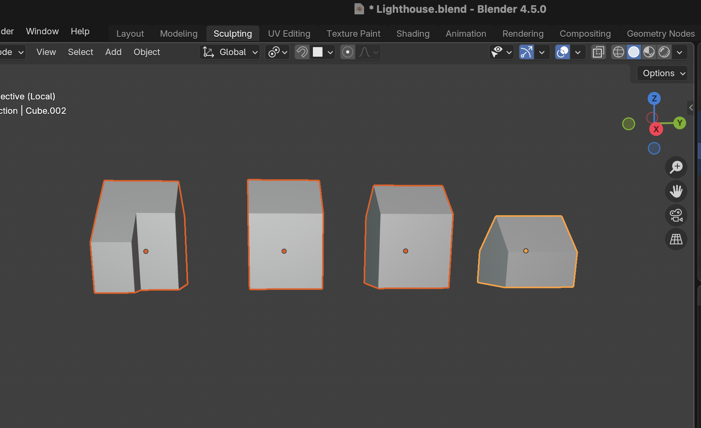
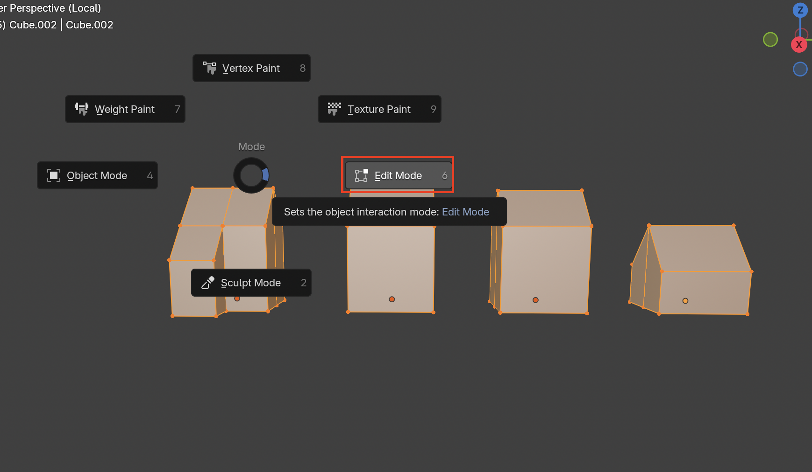
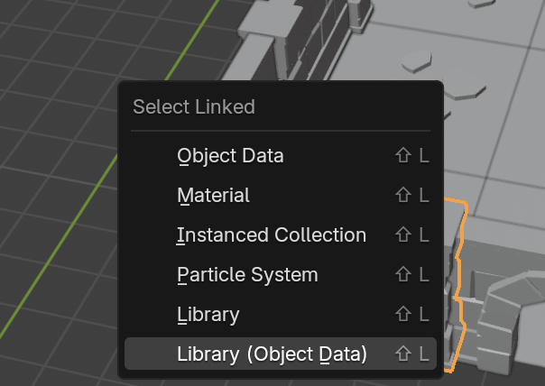
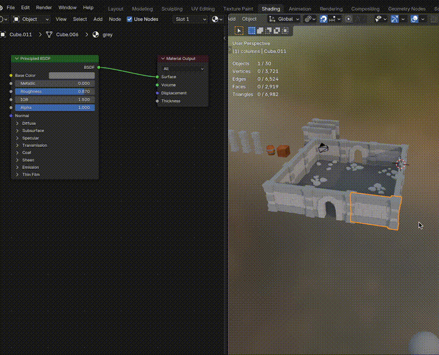
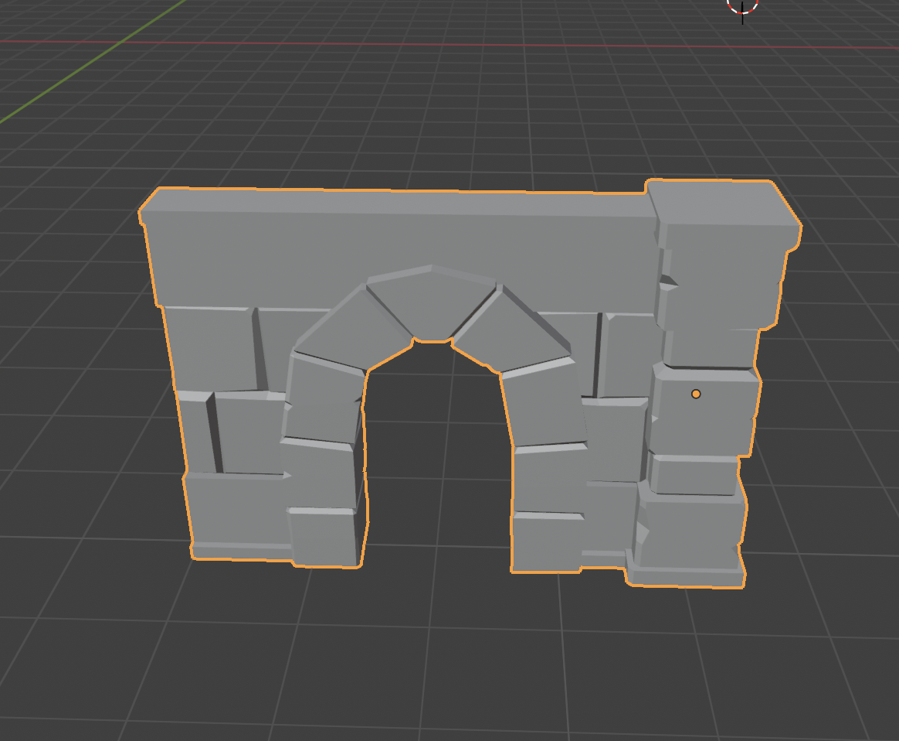

# Object Mode

## Snapping
1. Use **Shift + Tab** or select on the **snapping setting**

2. Select preferred settings

### Snapping Settings
| Target | Description | Image |
|----------|-------------|-------|
| **Increment** | Snaps from starting position |  |
| **Grid** | Snaps to Blender grid |  |
| **Face** | Snaps |  |
| **Face Project** | Snaps to face when multiple objects are selected |  |
| **Align Rotation to Target** | Rotates to the normals |  |

****
## Transform Pivot Point

### Transform Pivot Point Settings
| Target | Description | Image |
|----------|-------------|-------|
| **Individual Origins** | Uses each objects own origin to make edits |  |

****
## Updating Object Origin

### Object Mode Version
1. Enable **Options > Affects Only: Origins**

2. You can now move the origin as you would an object. Using **G** to grab

### Edit Mode Version
1. To edit multiple objects origin points at once we can do this in edit mode. First select the **Show Overlays** button

2. Ensure that **Origins** is enabled so we can see 

3. **Shift-click** the objects you want to edit

4. Enter **Edit Mode** and press **A** to select all the vertices.

5. Use grab mode **G** to move all the vertices. Essentially you are moving the objects up while the origins stay in place

****
## Select Linked

1. Press **Shift + L** to open the Select Linked menu or go to **Select > Select Linked**

2. Each select type serves different purposes

### Select Linked Menu
| Type | Description | Image |
|----------|-------------|-------|
| **Object Data** | Selects all objects that share the same mesh edits |  |
| **Material** | Selects objects that have shared materials |  |

### Unlink Object (Make Single User)
1. Select Object

2. Go to **Object > Relations > Make Single User > Object & Data**
