# Texture Paint 3D Models with Ucupaint Addon

1. Go to **Edit > Preferences > Extensions** and search for **Ucupaint**. Select **Install**
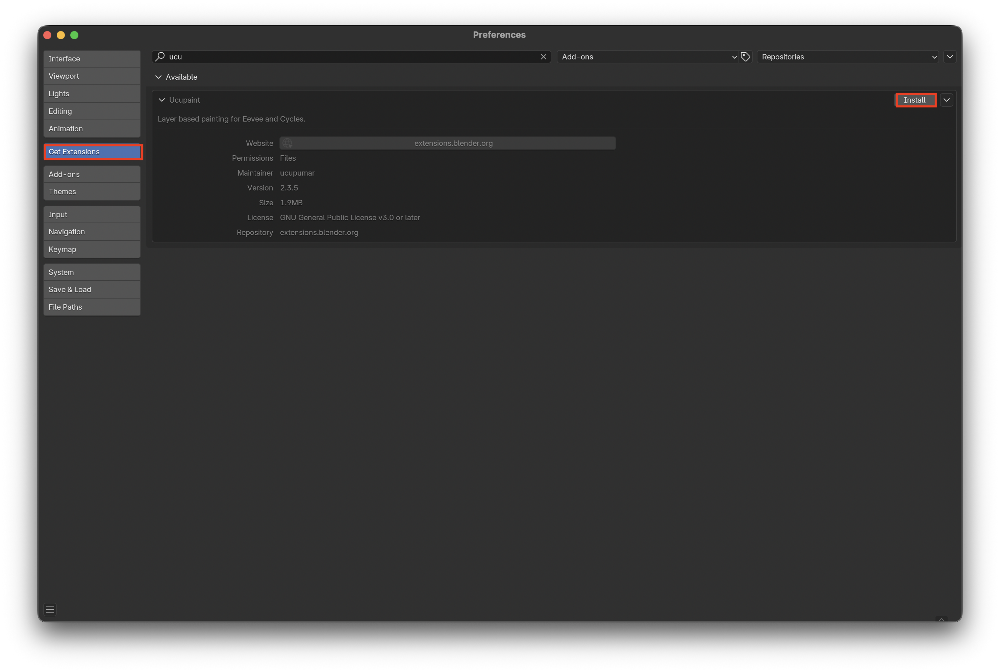

2. Create vertex groups by going into the **Data** tab and adding a new group with the (**+**) then, with your vertices selected, select **assign**. Now you can have a selection saved.
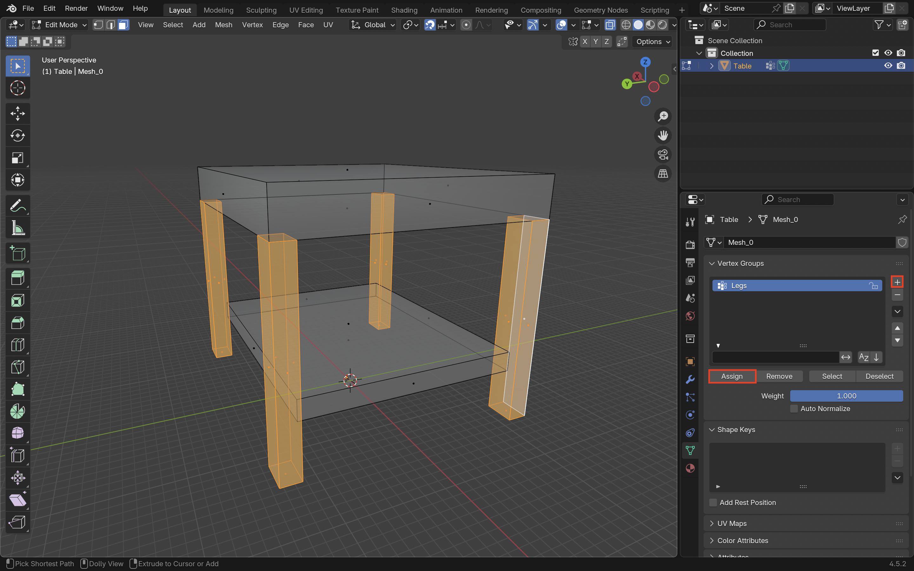

3. In **Object Mode** press **N** to open the side panel then select the **ucupaint** tab. Now press **Quick Ucupaint Node Setup**
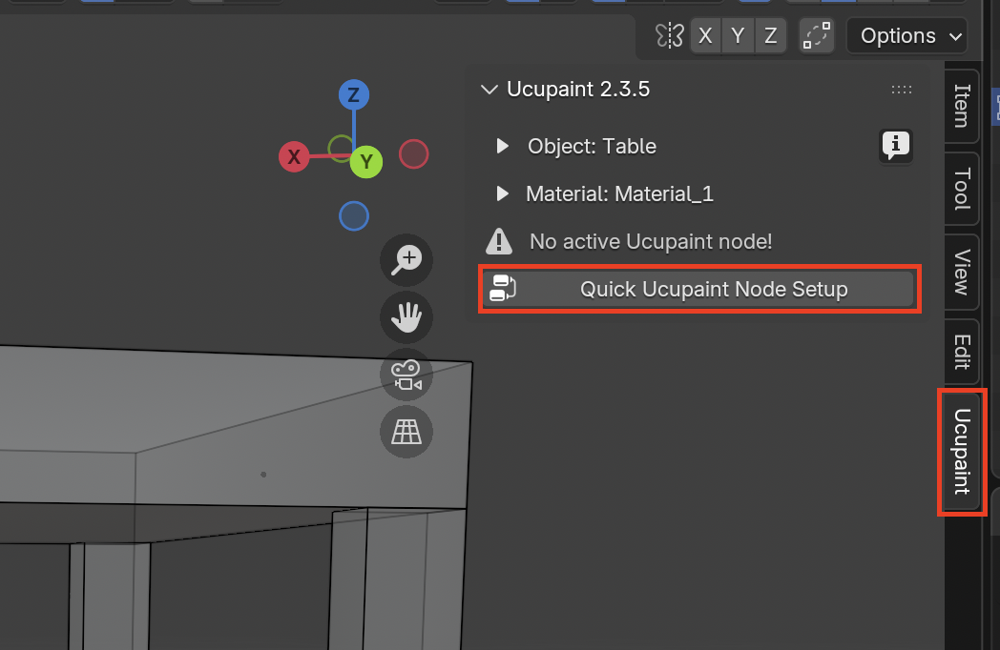

4. I recommend enabling all the **channels** so you have the option to use them in the future. Click **OK**
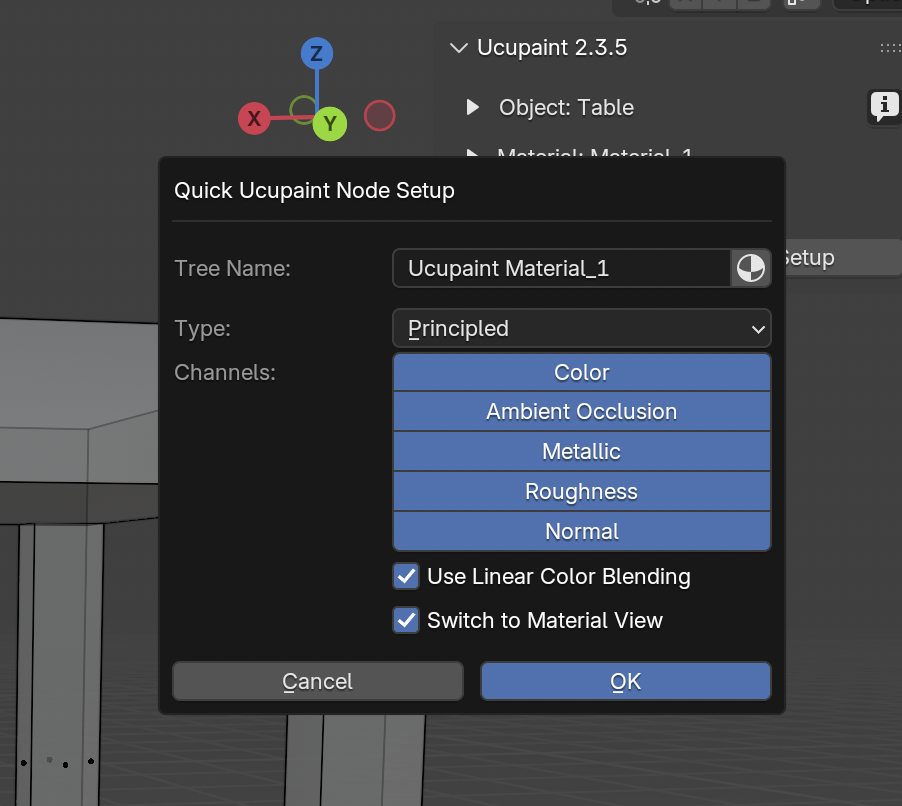

5. Enable **Alpha** in **Color Channel** so you can paint transparent if you want
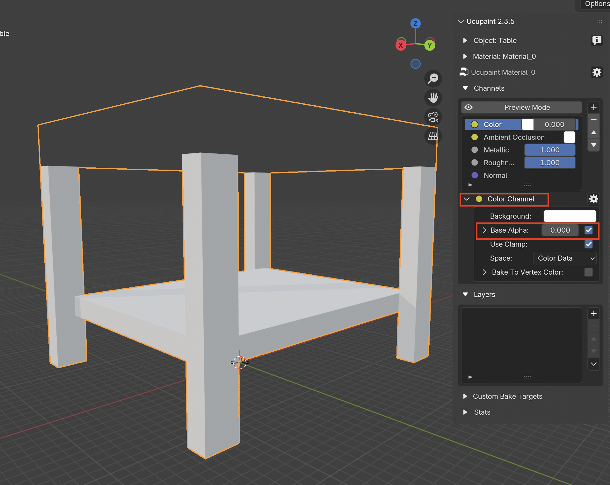

> 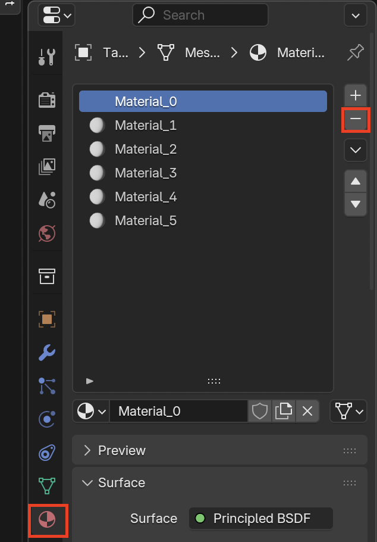
> If you have multiple materials delete the old materials and re-add the **Quick Ucupaint Node Setup**

6. Add a **Solid Color** for the base color
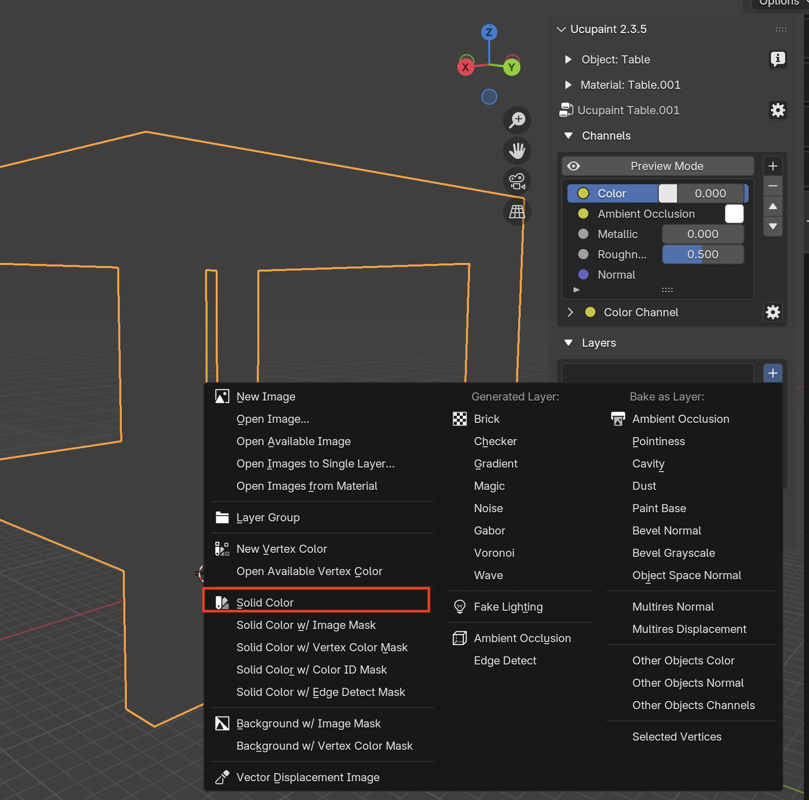
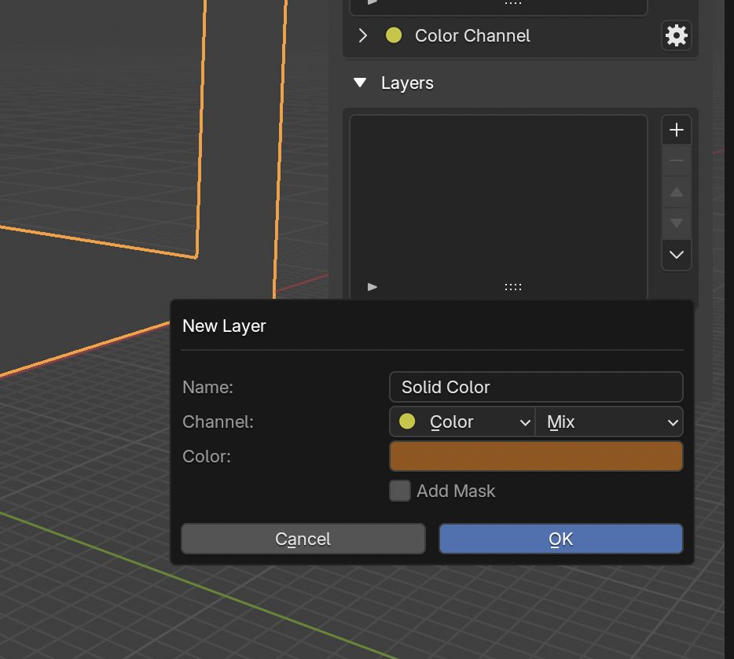

7. Edit channels to achieve the desired effect. Here I change the **roughness**
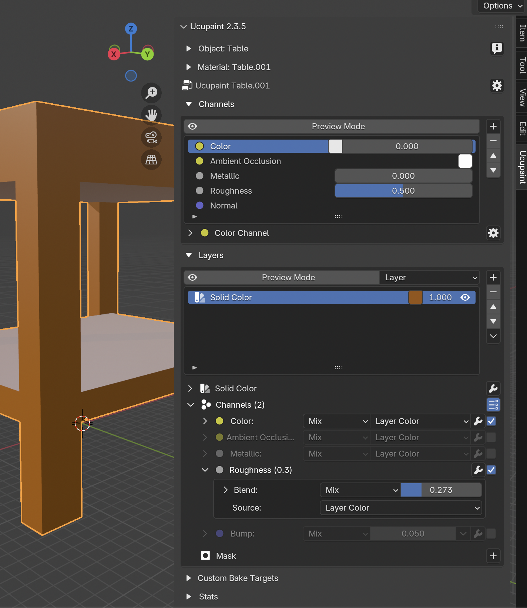
1
8. Add a new **Image** this will allow you to start painting
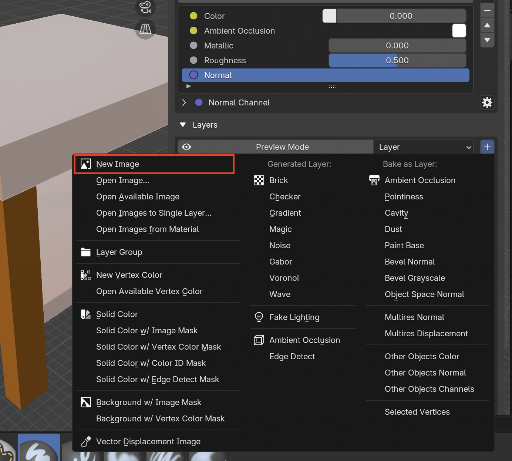

9. Select the vertices you want to paint in the **Material Properties** and enable **Paint Mask** to actually only paint those areas.
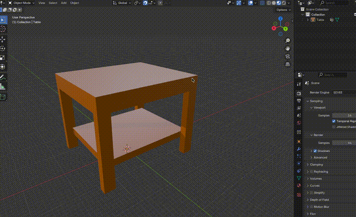