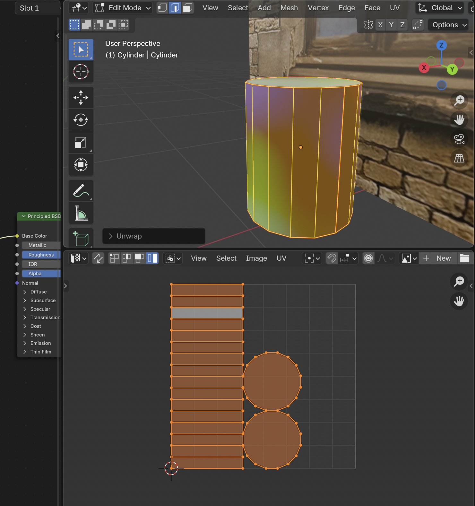

# UV Unwrapping

## UV Map

A **UV map** is a 2D representation of a 3D model's surface used to apply textures

### Edit a UV Map
1. Select the object then look under **Data** and under **UV Maps** you can see the UV Map of the object

2. Select the **UV Editing** Workspace to make edits to the **UV Map**

3. To view the texture you are going to add create an **Image Texture** for your object

4. In the **UV Editor Window** select **+ New** to create a new image texture and update the settings to your liking

5. To actually view the texture go to the **Image Texture** node on the **Shader Editor** and from the dropdown select the image you just made

6. From here you can see the kinds of effect the image texture has on the box

7. To add custom image textures select the **folder icon** in the **Image Texture** node and select your image

8. To edit your image texture in the **UV Editor** select it from the dropdown menu

9. To prevent stretching of each face while editing go into **Face Select** in the **3D Viewport** and select a face. This allows you to move only that face without affecting/stretching the others

## UV Unwrap
1. Select Mark **Seams From Islands**

> To unmark select **Clear Seam**
> 

2. The seams will be marked in red

3. Delete the original UV by going into **Data** and under **UV Maps** select the **- (Minus Sign)** to delete the **UVMap**

4. Select the object in **Object Mode** and press **Ctrl + A** to apply scale, otherwise an error may occur

5. Go back into **Edit Mode** and press **A** to select all faces and press **U** to unwrap and select one of the **Unwrap Methods**

6. Result of unwrapping the object

## Creating Custom Seams
1. Open Edge Menu with **Ctrl + E** while in Edit Mode and select **Clear Seams**

2. Select an edge and either **Right-Click** or **Ctrl + E** to open the menu to **Mark Seam**

3. Press **U** to open the unwrap menu and unwrap the mesh with the new seams
