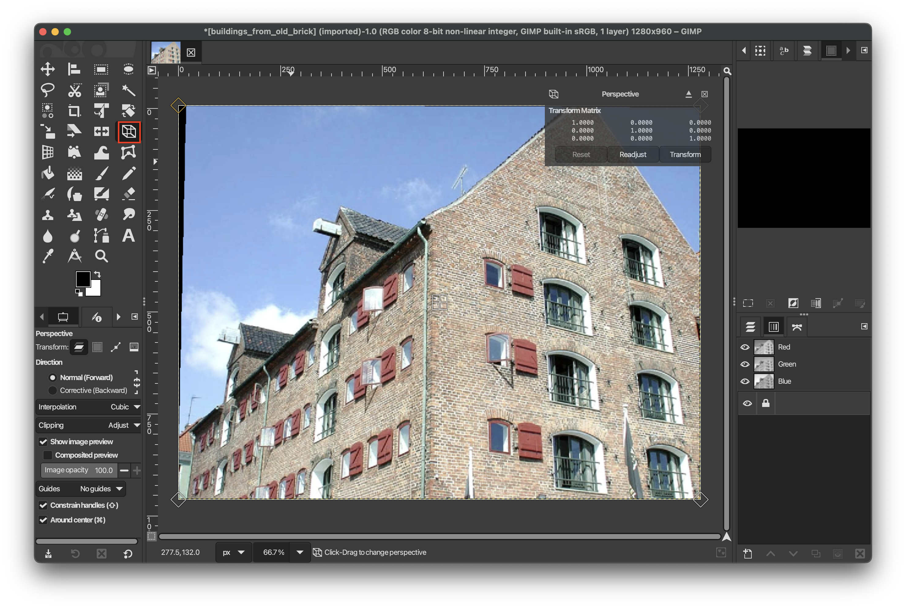
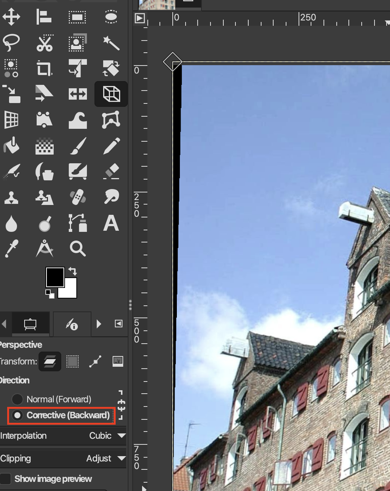
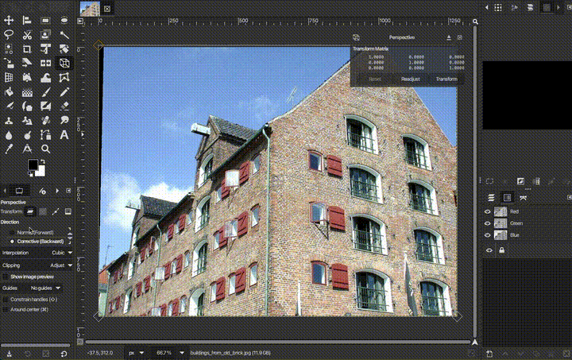

# Flatten Perspective Image

1. Select the **Perspective Tool**

2. Enable **Corrective (backwards)** Direction in the tool settings

3. Align the four corners to the corners of the wall you want to Flatten

4. Press enter and the flattened image will be generated