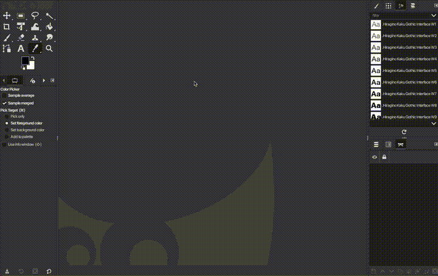

# Gimp Shortcuts

| Action                | Shortcut     | Images |
|-----------------------|--------------|--------|
| Hide Docks            | **Tab** |  |
| Create New Image   | **Ctrl + N** | 
| Move Tool   | **M** | 