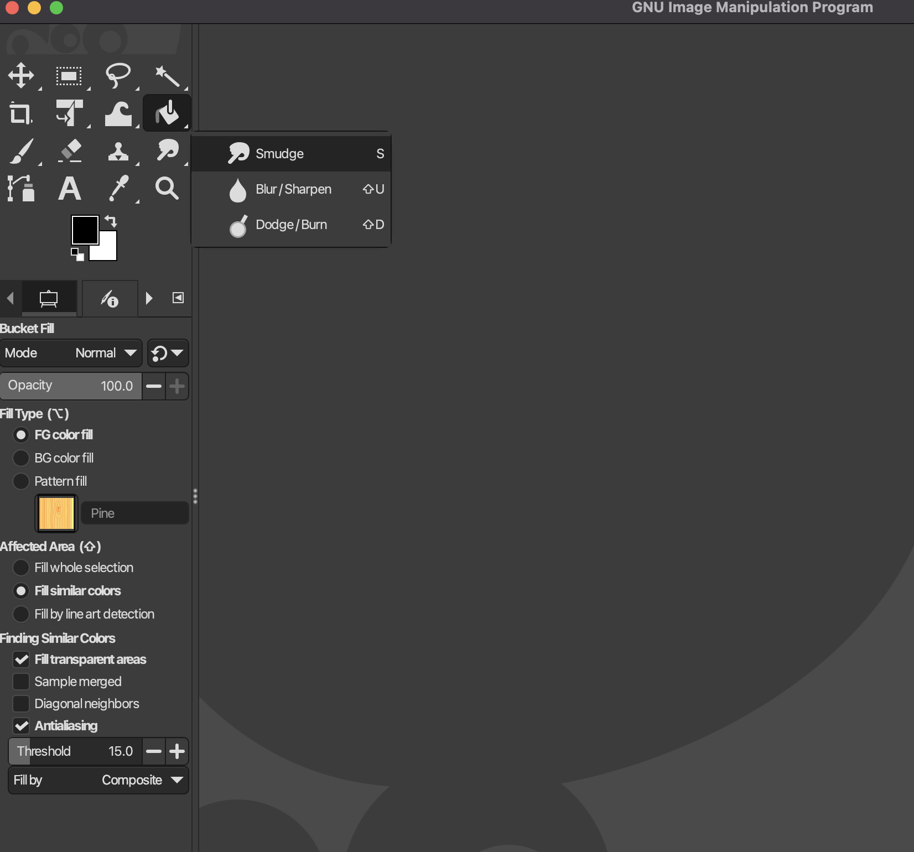
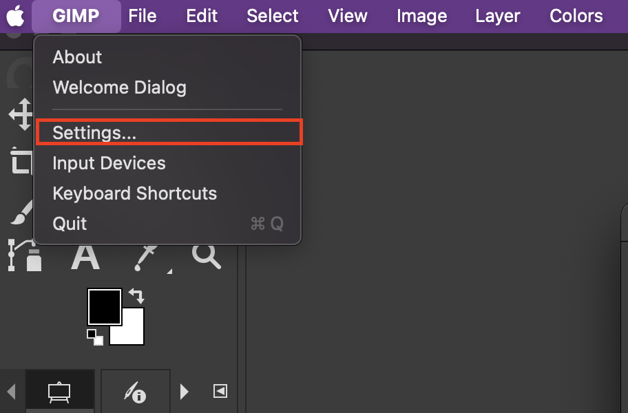
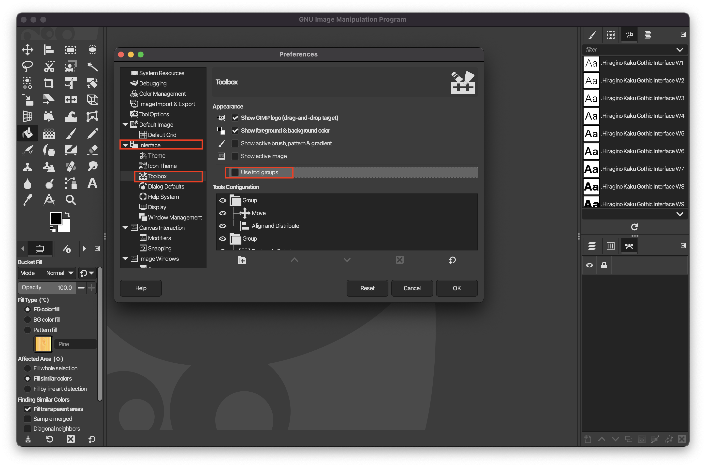

# Tool Groups

**Tool Groups** allow for tools with similar function to be grouped together, but it can make it difficult to find the tools you want.

## To Ungroup Tools
1. Go to **Settings...**

2. You can disable the group windows under **Interface > Toolbox > Use tool groups**
