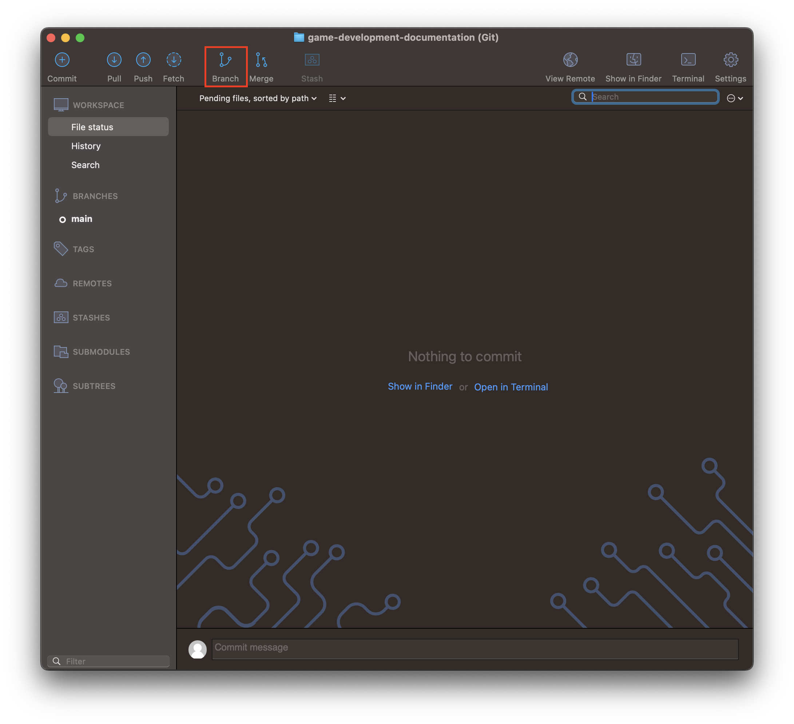
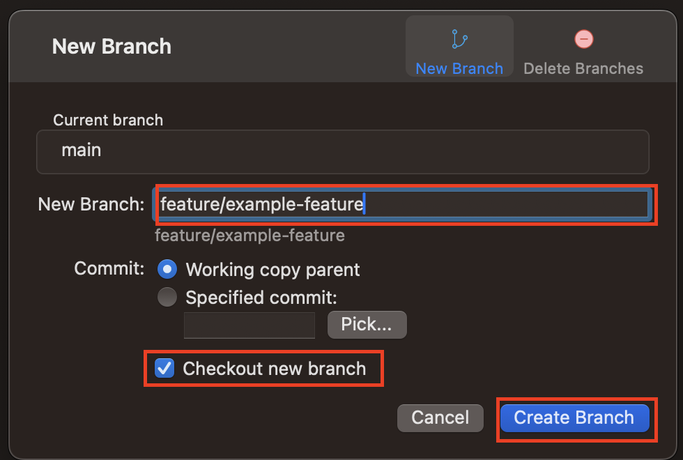
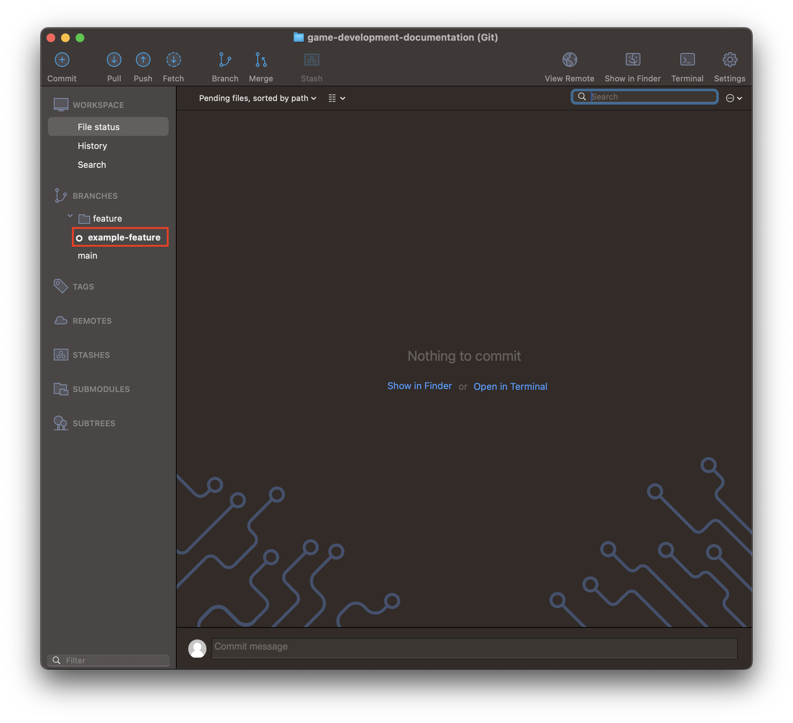
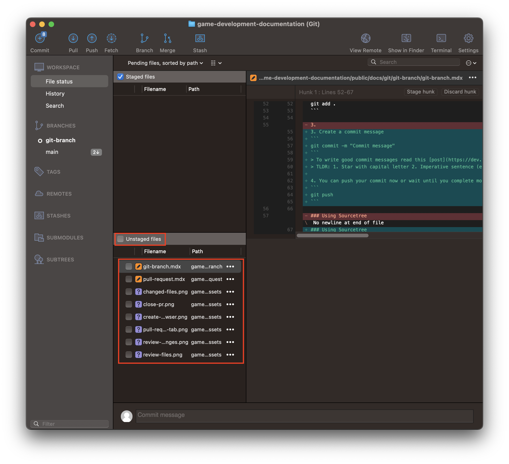
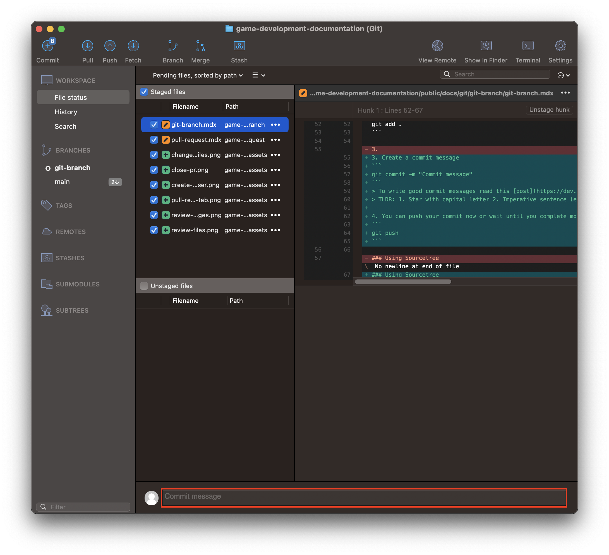
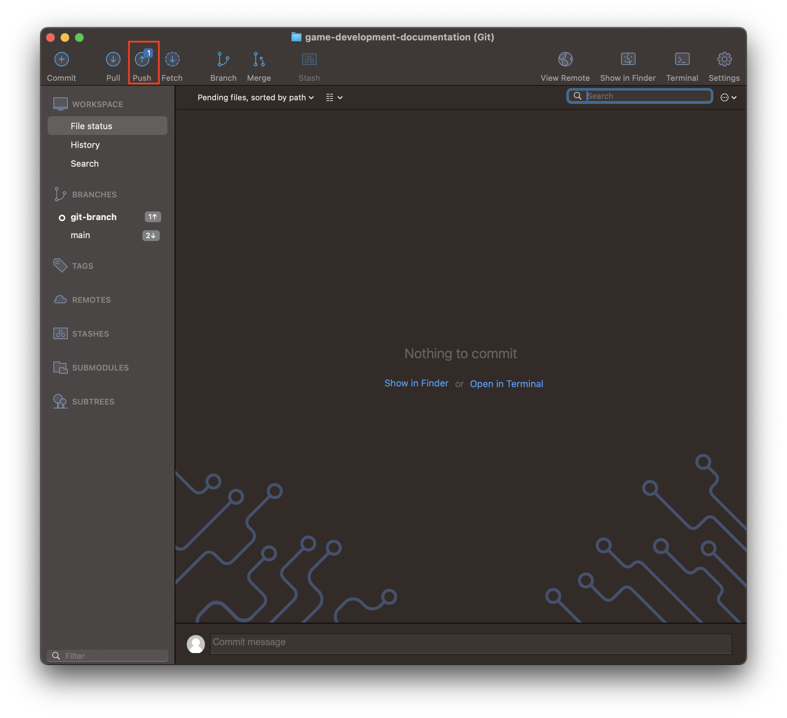
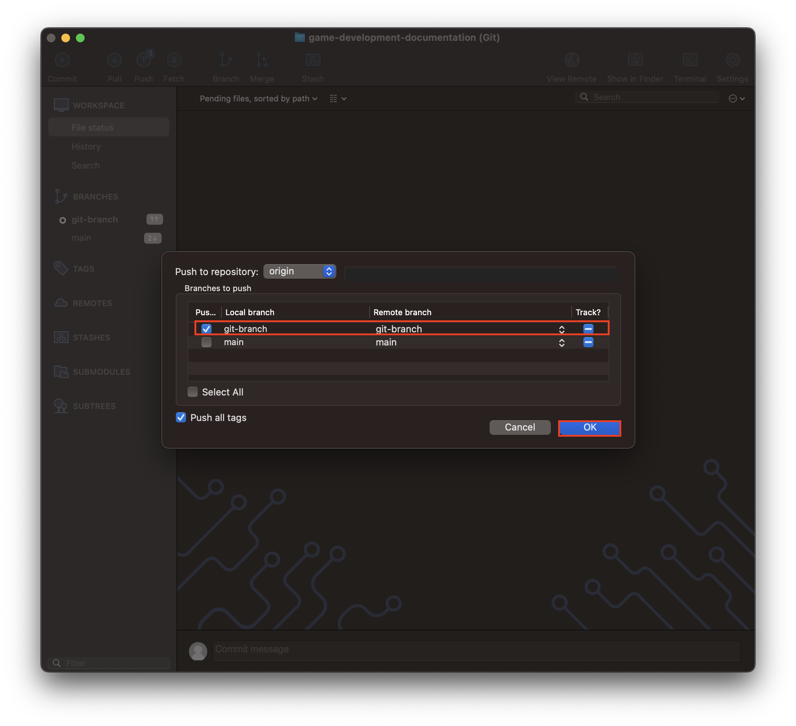

# Git Branch

## Creating a Branch

### Using Command Line
There are two ways to create a branch the same way.
1. Use 2 commands
```
git branch <branch-name>
git checkout <branch-name>
```
2. Use 1 command
```
git checkout -b <branch-name>
```

To change branches just use the `checkout` command
```
git checkout <branch-name>
```

### Using Sourcetree
1. Select **Branch** at the top


2. Create a **New Branch** name and select **Checkout new branch**. Then select **Create Branch**


3. Branches will appear on the left under **BRANCHES**


## Adding Commits

### Using Command Line
1. Check the status of the repository
```
git status
```
- This command shows all edited files

Example Output:
```
On branch git-branch
Changes to be committed:
  (use "git restore --staged <file>..." to unstage)
        modified:   game-development-documentation/public/docs/git/pull-request/pull-request.mdx

Changes not staged for commit:
  (use "git add <file>..." to update what will be committed)
  (use "git restore <file>..." to discard changes in working directory)
        modified:   game-development-documentation/public/docs/git/git-branch/git-branch.mdx
```
2. Stage the files you want to commit
```
git add <path-to-file>
```
- Or to add all (just make sure you are in the correct folder)
```
git add .
```

3. Create a commit message
```
git commit -m "Commit message"
```
> To write good commit messages read this [post](https://dev.to/shinjithdev/git-good-best-practices-for-branch-naming-and-commit-messages-oj4)
> TLDR: 1. Star with capital letter 2. Imperative sentence (e.g. `Fix bug` not `Fixed bug`) 3. no period

4. You can push your commit now or wait until you complete more commits. Pushing the commit will update your branch on Github.
```
git push
```

### Using Sourcetree
1. Select on the **Commit** button on the top left


2. Stage all the files you want to commit


3. Add a descriptive commit message at the bottom


4. Press **commit** when you completed your commit message


5. Press the **Push** button on the top to push all of your commits to update your branch on Github


6. Select the correct branch to push to and then click **OK**
