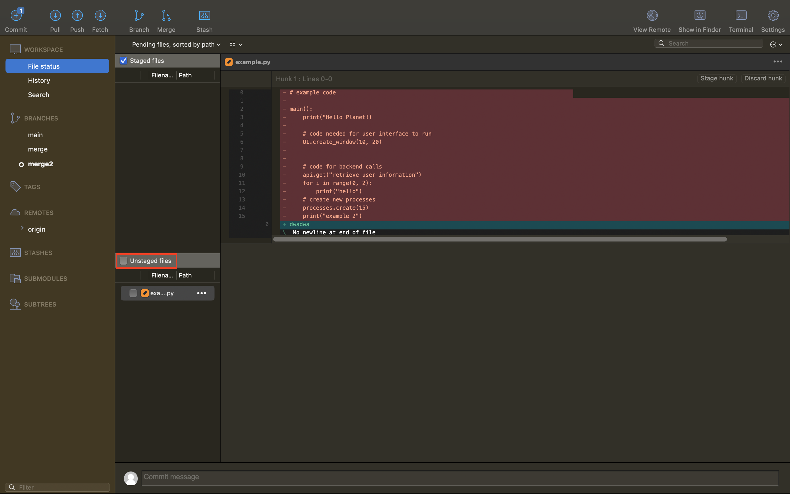
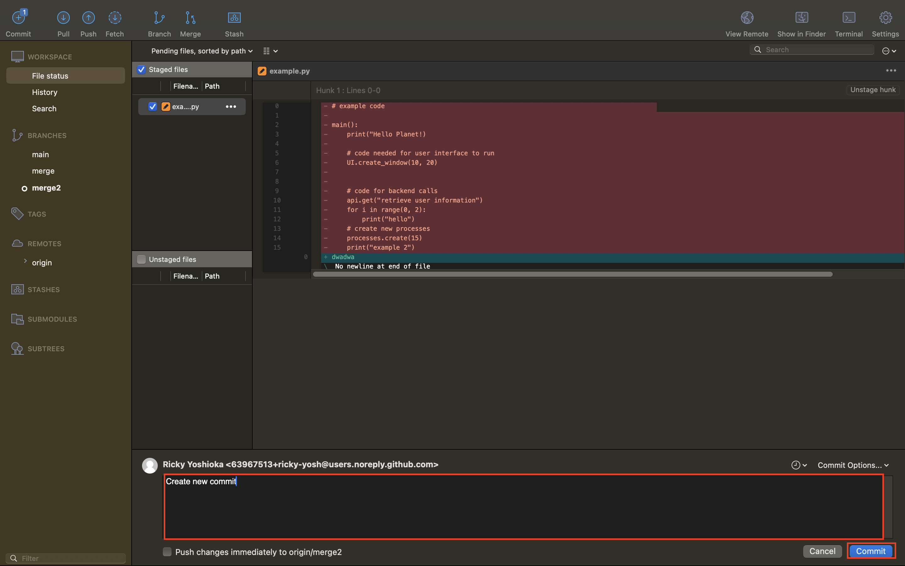
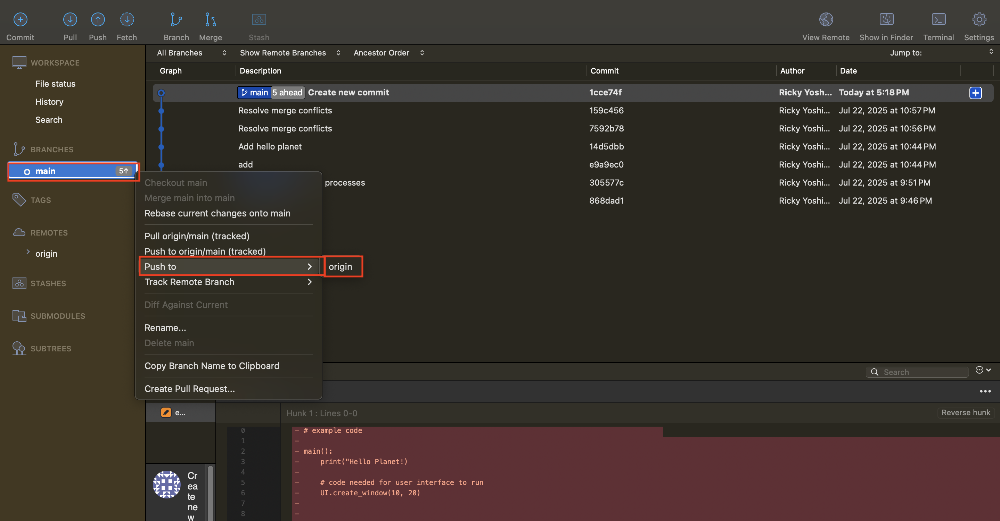
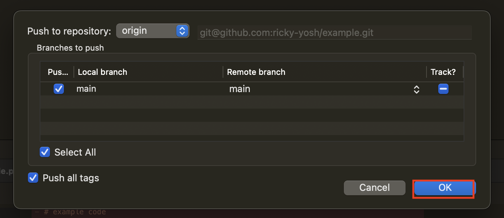
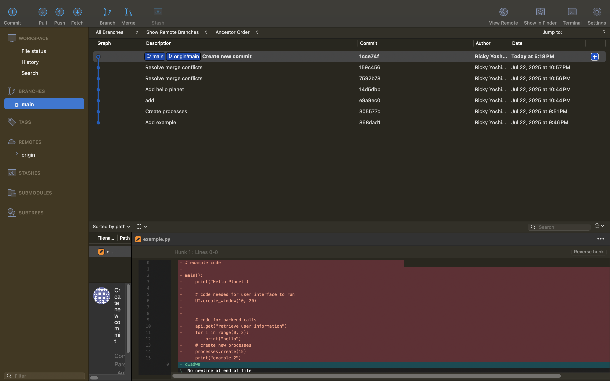

# Git Commit
This workflow is for a basic usage of git, with one branch (main) and making changes directly on the branch.

## CLI Version
1. See which files were edited
```
git status
```
> With Alias
> ```
> git st
> ```

2. Add all the files you want to commit, or just add all
```
git add .
```
> With Alias
> ```
> git a
> ```

3. Create a commit with a message
```
git commit -m "Create commit message"
```
> With Alias
> ```
> git cm "Create commit message"
> ```

4. Push the commit to your branch, in this case main
```
git push origin main
```
> With Alias
> ```
> git p
> ```

## Sourcetree Version
1. Add all the files you want to commit by adding them individually or just checking **Unstaged Files**


2. Create a message then pres **Commit**


3. Now you can push to main by right clicking main then **Push to > origin**


4. Now you can just press **OK**


5. Now your **origin/main** should be where you **main** is, meaning it updated correctly
