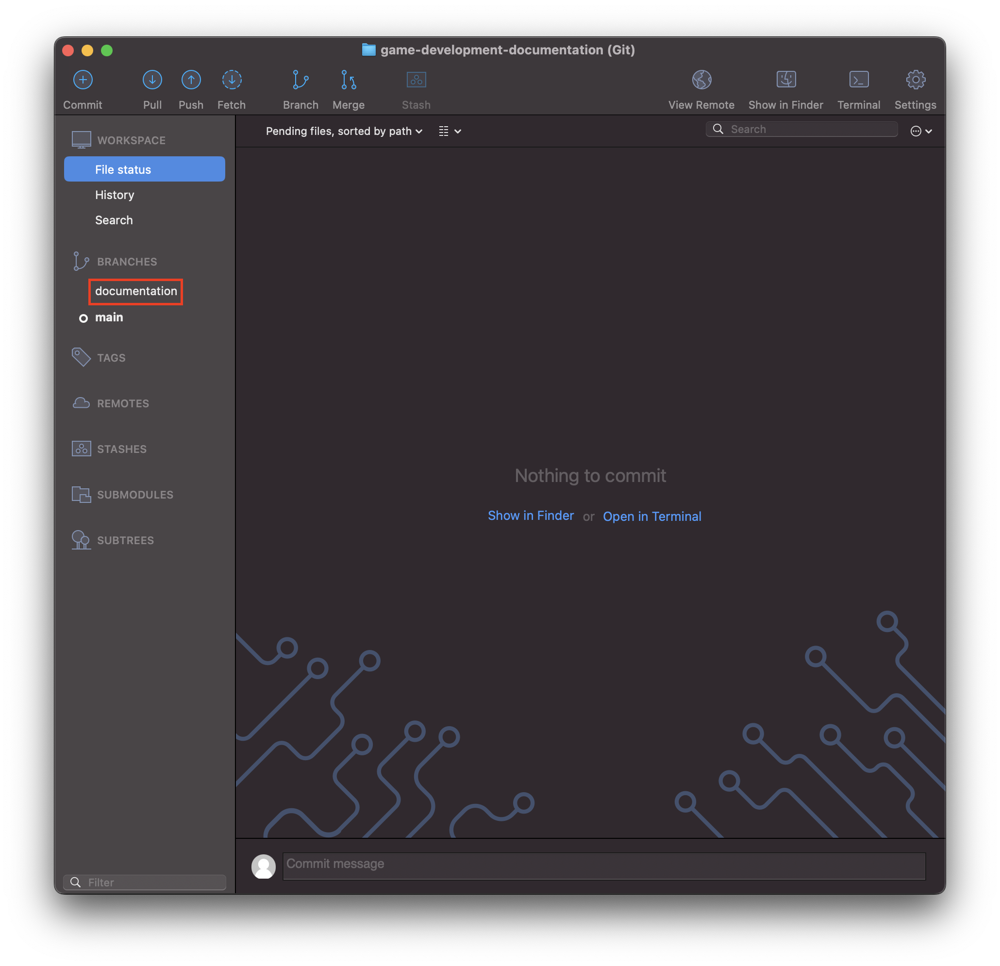
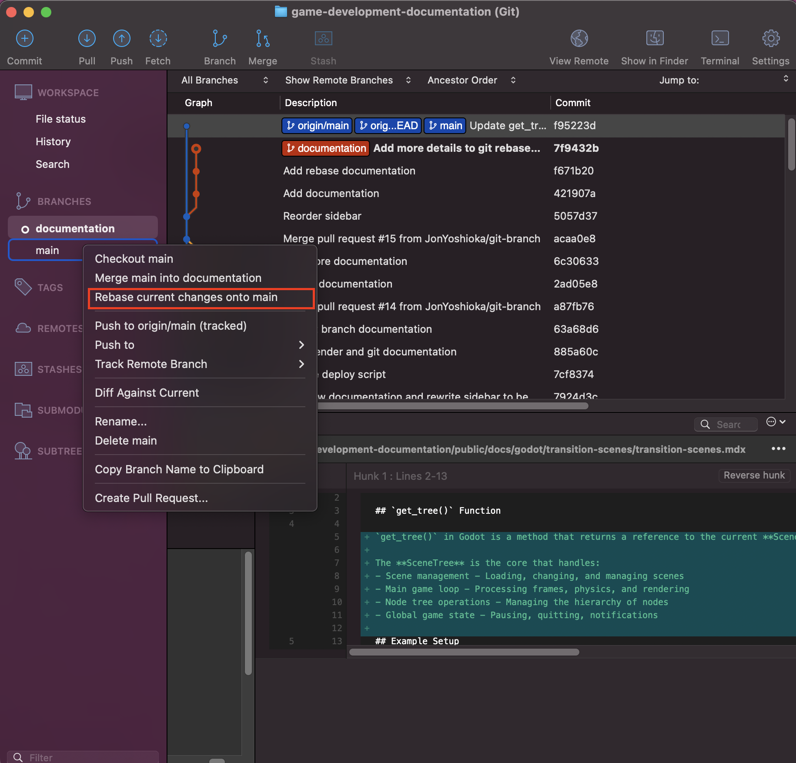
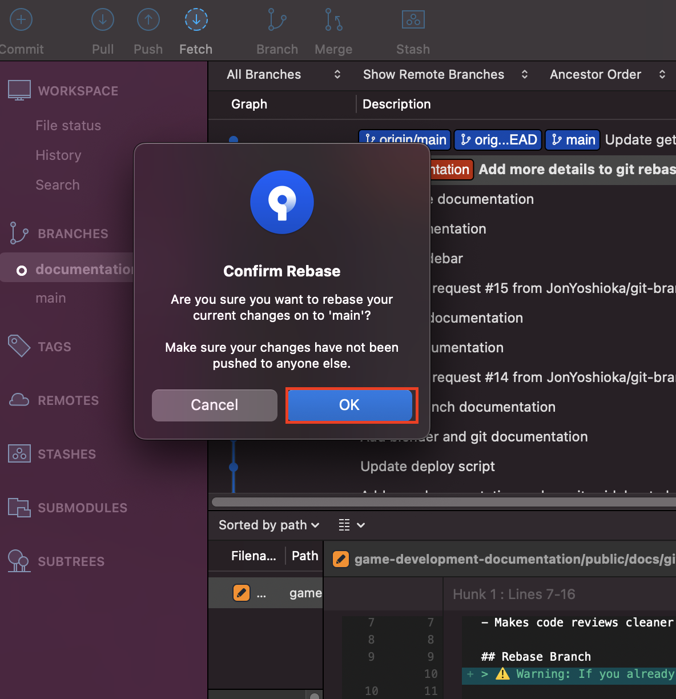

# Git Rebase
**Rebasing** takes your commits and places them on top of a different branch. It is as if you started working from that point.
## Benefits:
- Creates a clean, linear history
- Makes it easier to follow the project's evolution
- Eliminates unnecessary merge commits
- Makes code reviews cleaner

## Rebase Branch
> ⚠️ Warning: If you already pushed your branch to origin, delete the origin branch or do not rebase, otherwise you will have divergent branches.

### Using Command Line

1. First commit or stash any changes otherwise you will get an error.
```
error: cannot rebase: You have unstaged changes.
error: Please commit or stash them.
```

2. Checkout the branch you want to rebase
```
git checkout feature-branch
```

3. Use the `rebase` command to move your branch to the branch you want to start from
```
git rebase main
```
Example output:
```
Successfully rebased and updated refs/heads/documentation.
```

### Using Sourcetree

1. First commit or stash any changes otherwise you will get an error.


2. **Double-click** on the branch you want to rebase


3. **Right-click** on the branch you want to rebase to and select **Rebase current changes onto main**


4. Select **OK** to confirm the rebase


5. If your rebase was successful you can view it on the history
