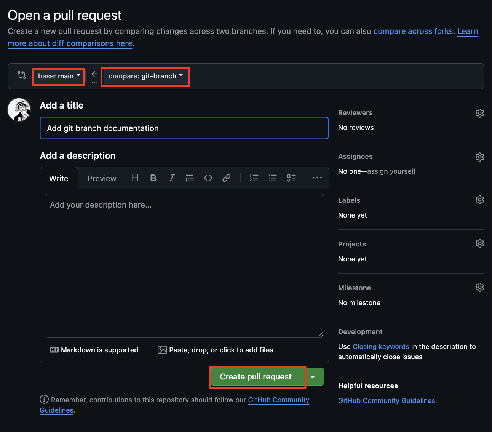

# Pull Request
**A pull request (PR)** --> Developer's proposed changes to a codebase
## Basic Flow
1. **Create a branch** - Make changes in separate branch
2. **Submit a PR** - Ask to "pull" changes to main branch
3. **Review** - Other devs review code
4. **Merge** - If approved, changes get added into codebase

### Why isn't called a Merge Request?
**Pull Request (GitHub's term)**: Requester's perspective - asking the maintainer to "pull" your changes from your branch into theirs.

**Merge Request (GitLab's term)**: What actually happens - your changes get "merged" into the main branch.

## Creating a Pull Request

### Using Command Line
1. Ensure that your branch is pushed
```sh
git push origin feature-branch-name
```

2. You can either go to GitHub and create a pull request there


3. You could also download the GitHub Command Line Tools.

    - To install:
    ```
    brew install gh
    ```
    - Create the pull request:
    ```
    gh pr create
    ```

4. Example next steps:
```
Where should we push the 'test' branch? github-user/example-repo

Creating pull request for test into main in github-user/example-repo

? Title (required) example
? Body <Received>
? What's next?  [Use arrows to move, type to filter]
Submit
Submit as draft
> Continue in browser
Add metadata
Cancel
```

5. **Continue in browser** will open a browser and you can complete the next steps there

### Using Sourcetree

1. Ensure that your branch is pushed

2. Right-click on your branch and select **Create Pull Request...**

3. If you run into an issue it is most likely a glitch in Sourcetree. Go to **Settings** > Remotes > Select your repository path > Click **Edit** > Switch **Host Type** > Switch it back to **Github** > Select **OK** > Select **OK**

4. Once it is working Sourcetree will open your browser and you can complete the next steps there.

## Pull Request Final Steps
When you are taken to the browser you will see this:


**Make sure you check:**
1. **base:** is the correct branch you want to merge to usually it is main or develop

2. **compare:** is the branch that you have created your feature on

3. **Create pull request** when you verified the branches are correct

## Reviewing a Pull Request
1. To review a pull request open up the **Pull requests** tab and select the PR you want to review


2. Switch to the **Files changed** tab


3. Click on the files to see the changes
 

4. When you are ready select **Review changes** and make any comments there


5. Finally you can return to the **Conversation** tab and either **Merge pull request** or **Close pull request**
