# Blocking Out the Level
You can create a CSG (Constructive Solid Geometry) Node, e.g. **CSGBox3D**, to help with prototyping. It allows you to create various shapes dynamically to later be exported as a mesh to Blender to add more fidelity.

`CMD+A` to create a **CSGBox3D** node
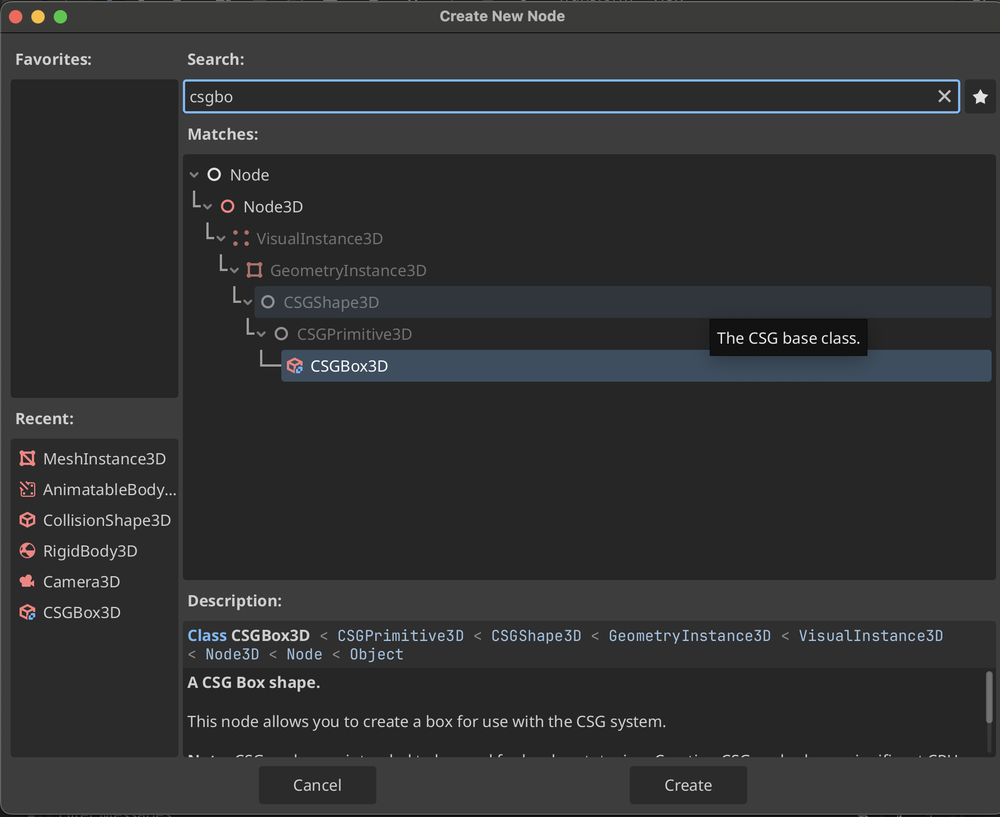

## Add Size Textures to the **CSGBox3D** Node
1. First download and use one of the two textures:
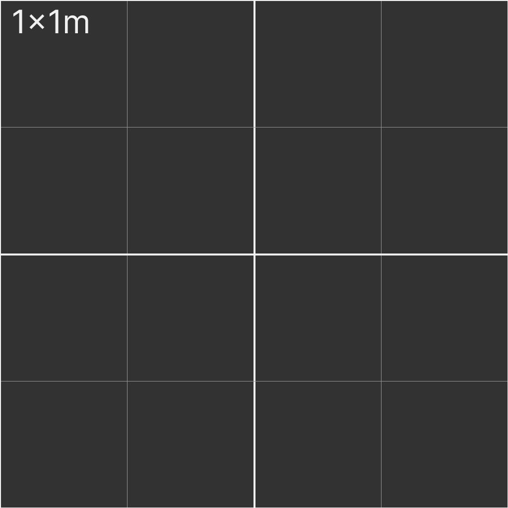
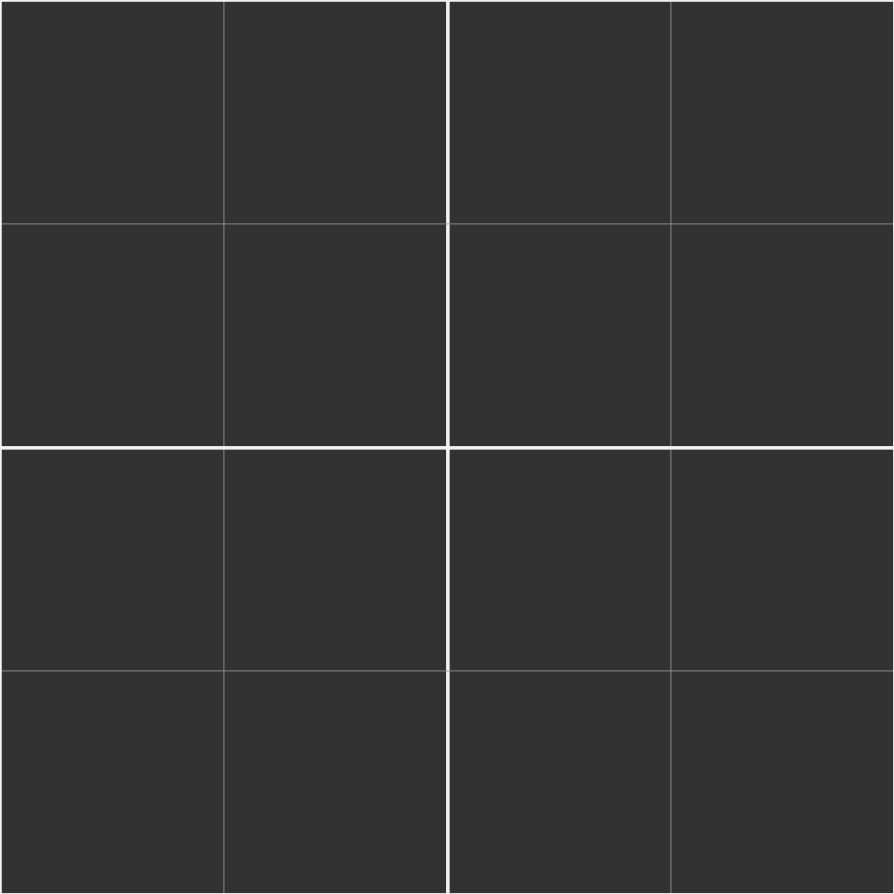

2. Add the material to a **CSGBox3D**
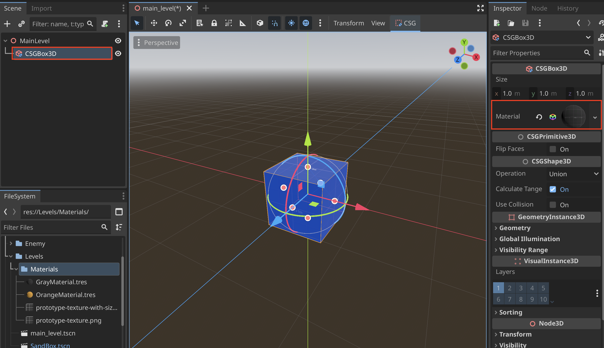

3. Ensure that **Triplanar** and **World Triplanar** are enabled
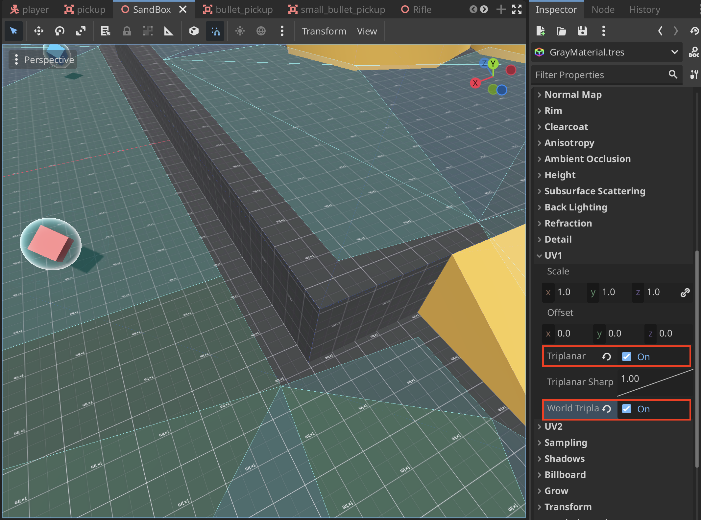

### Floor Plan in Viewport
1. Create a **Sprite3D** and import a floor plan texture
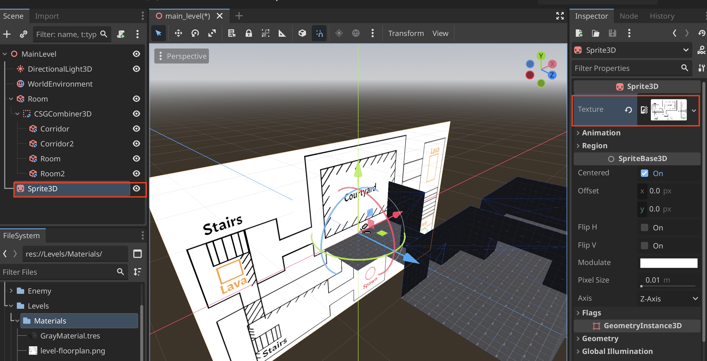

2. Orient the sprite correctly by changing the **Axis** to the correct axis
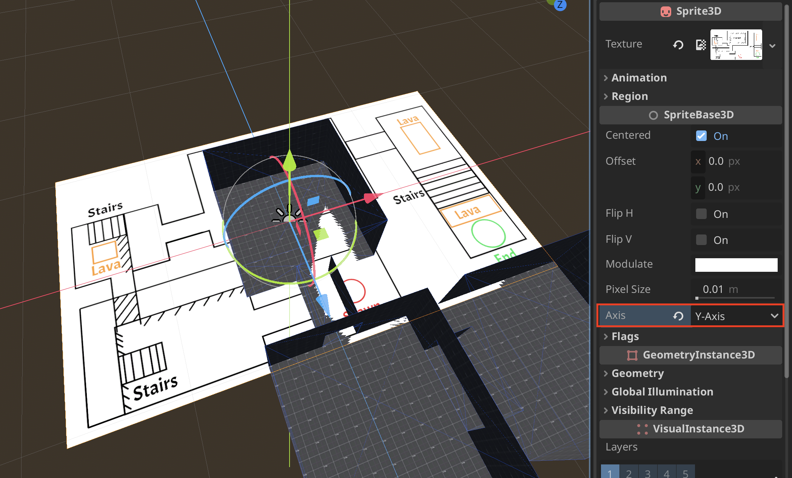

3. Make sure to **Scale** to the correct size and set y-coords to something higher to avoid z-fighting
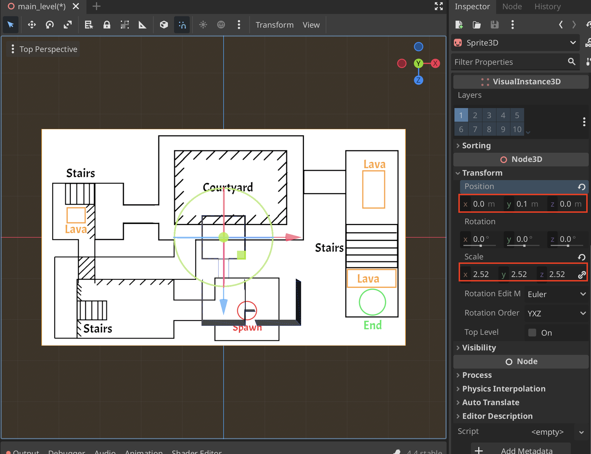

### Create a Room
1. To create a room we need to use the **Flip Faces** setting
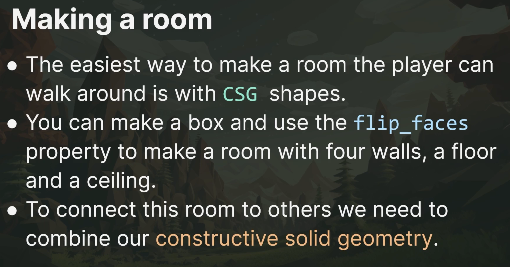

2. Select **Flip Faces** to create inside faces for rooms
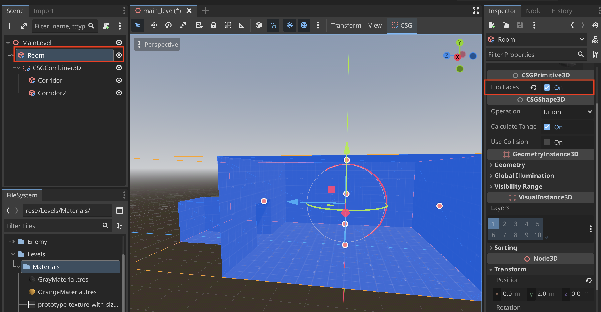

3. Create a **CSGCombiner3D Node** and create **CSGBox3D** Nodes as children
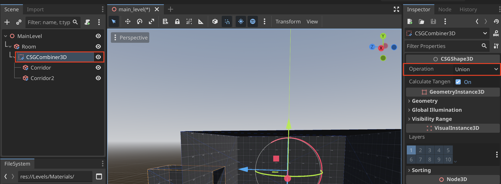

4. Make sure to set **Flip Faces** to enabled for the children to create more rooms and corridors
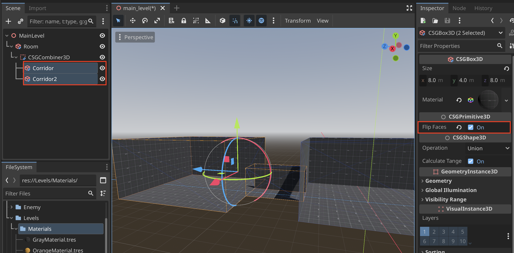

5. To disable shadows create a **DirectionalLight3D** and **WorldEnvironment** and in **DirectionalLight3D** in **Shadow > Enabled > Off**
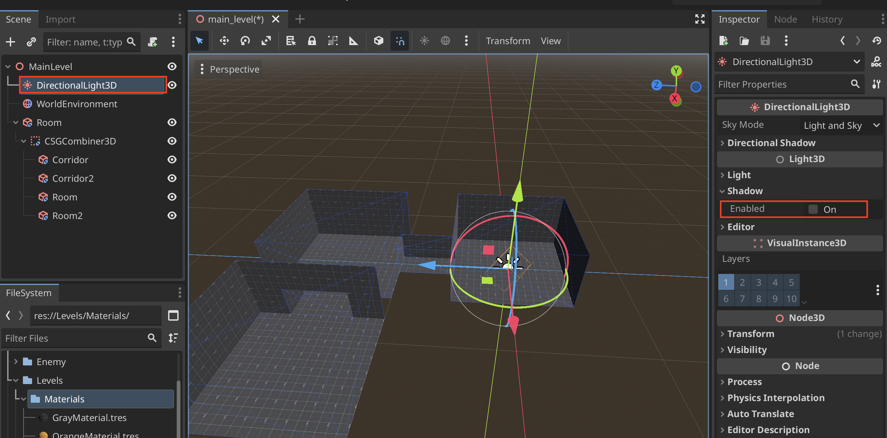

### Using **CSGCombiner3D**
1. Creating unique meshes using **CSGBox3D**'s can be done using the **Operation** setting
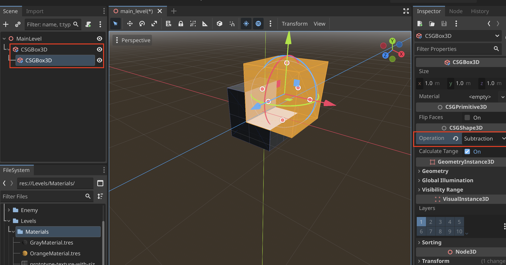

2. A good way to prevent a long child chain for using **Operation** we can use the **CSGCombiner3D Node**
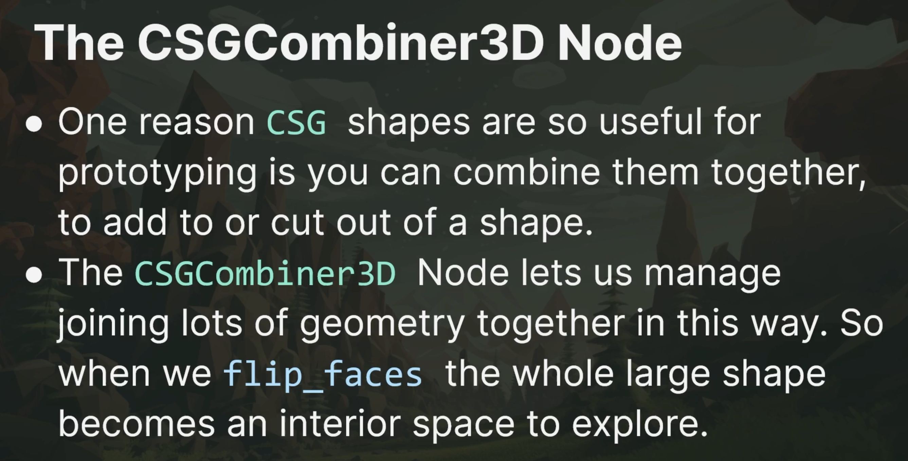

3. You can set the **Operation** which will apply to all the children
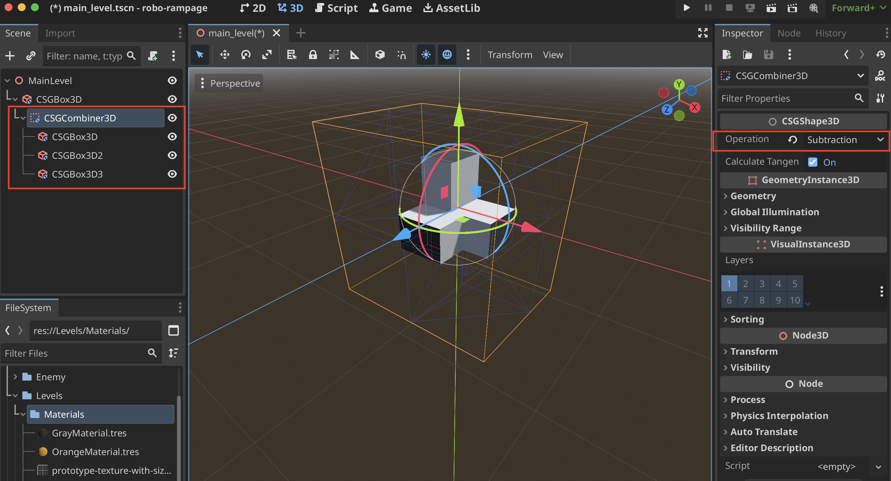

## Export Box Objects to Blender