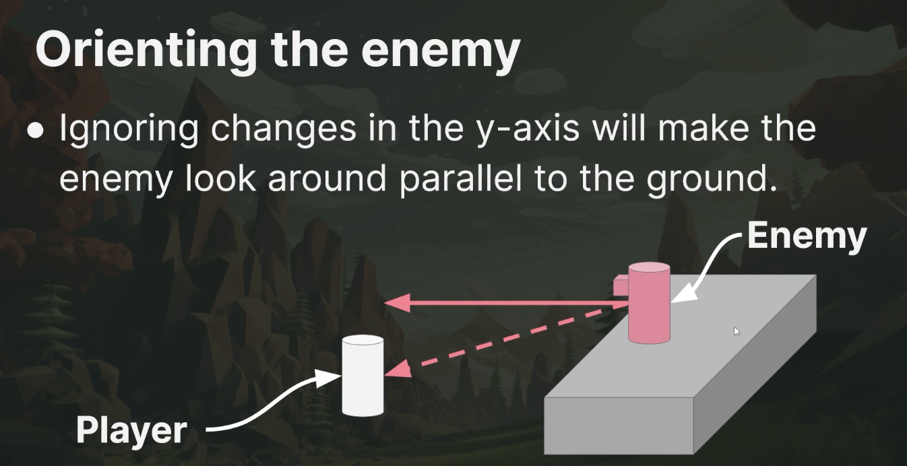

# Health and Damage

## Have Agent Face Player
1. First create a visor so we can see where the agent is looking. Have the visor face the z-axis


1. Sample look at direction code
```
func look_at_target(direction: Vector3) -> void:
	var adjusted_direction = direction
	adjusted_direction.y = 0
	look_at(global_position + adjusted_direction, Vector3.UP, true)
```
> In this code we ignore the y-axis
> 

## Agent Attacks

## Player Weapons

## Raycasts

## Damage Systems