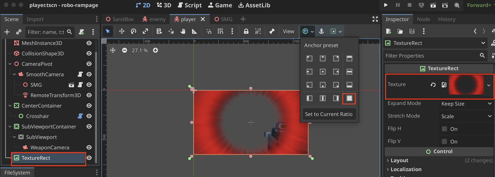
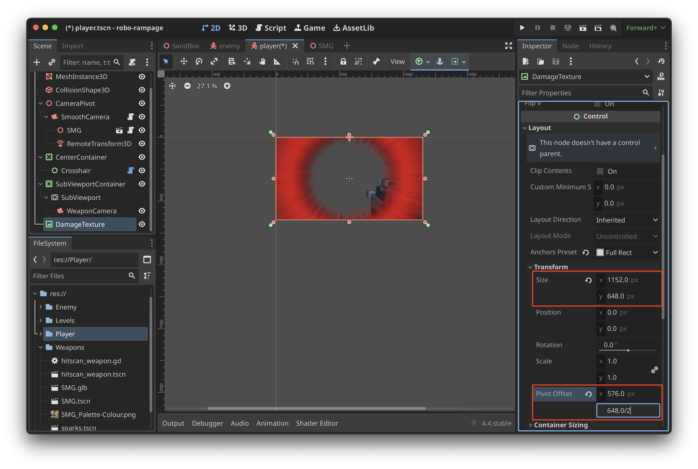

# Damage Overlay

1. Create a **Texture Rect** Control Node

> Control nodes that are under other control nodes are drawn at the very top

2. Update the **Pivot Offset** using the size and dividing it by 2
