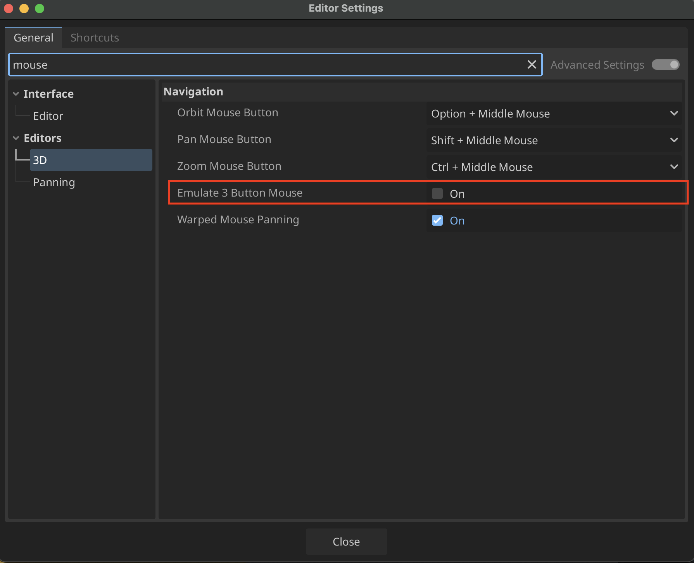

# Emulate Middle Mouse Button and Numpad

## Settings Adjustments
1. Go into **Godot > Editor Settings...**

2. Go to **Editors > 3D** and change Navigation Scheme to **Tablet/Trackpad** and enable **Emulate Numpad** and **Emulate 3 Button Mouse**

## New Navigation Shortcuts with Emulation
| Shortcut | Description |
|----------|------------|
| **Shift + Move Mouse** | Pan |
| **Ctrl + Move Mouse** | Zoom |
| **Alt + Move Mouse** | Orbit |

## If you want to use the trackpad
1. You can leave emulate mmb off and use two fingers on the trackpad as Middle Mouse Button

2. Sometimes with the trackpad the speed is hard to notice so you have to turn up the sensitivity

3. Depending on how the zoom feels you may want to decrease or turn off zoom inertia

----
| Control | Description |
|----------|-------------|
|**Alt + Two-finger trackpad**| Orbit |
|**Ctrl + Two-finger trackpad** or **Pinch Gesture** | Zoom |
|**Shift + Two-finger trackpad**| Pan |