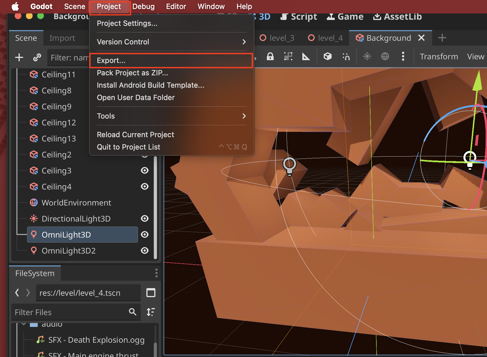
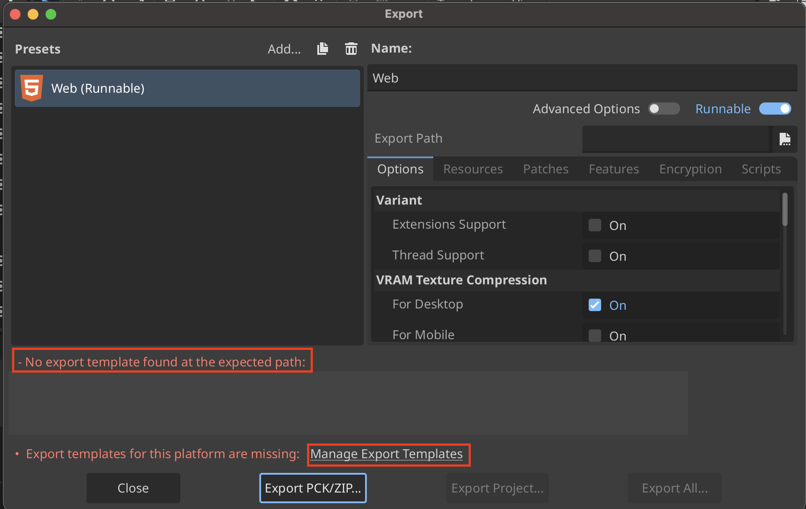
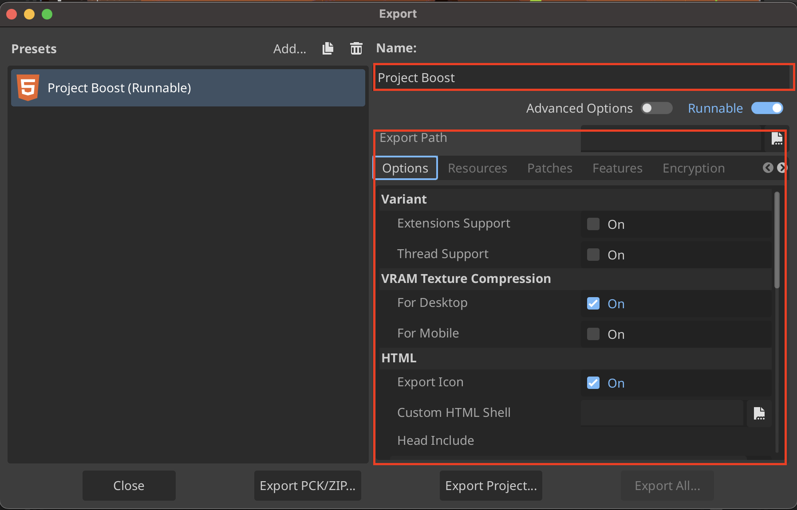
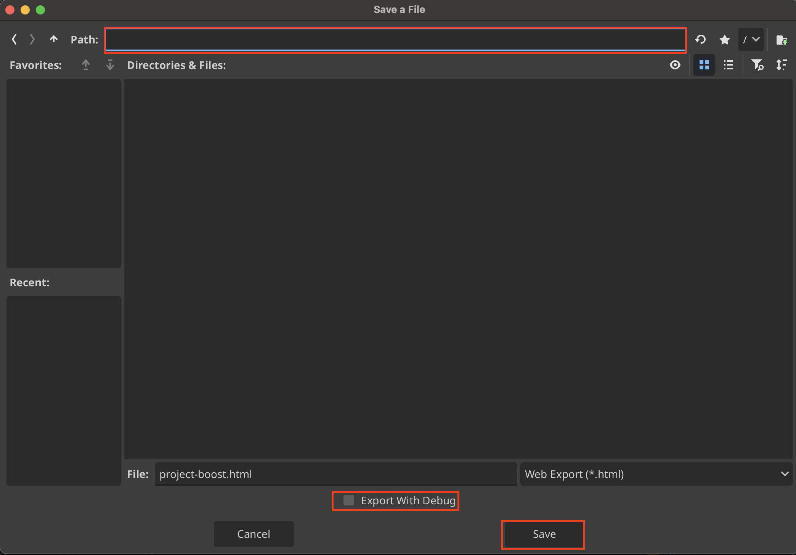

# Export Godot Build

Godot allows for easy export to **Windows**, **Linux**, **Mac**, **iOS**, **Android**, and **Web**.

> In order to export to console (e.g. Xbox and Playstation) you will need ot use a third-party service, due to the fact that console development requires access to proprietary SDK's and devkits.

## Example Export using Web
1. Go to **Project** then select **Export...**

2. Select **Add...** then your desired platform, in this case **Web**

3. If you get a `No export template` error it means you will need to download the template. To do that click on the **Manage Export Templates** link

4. Now select **Download and Install**

5. When the template finished installing it looks like this, and you can click **Close**

6. Reopen the export menu

7. Adjust necessary settings

8. Export the project by selecting **Export Project...**

9. Choose where to export your project too. Disable **Export with Debug**. Then click **Save...**

> **Export with Debug** creates a console when the game runs

## Export Settings

You can **Embed PCK** to combine the .PCK and .EXE files.
