# Game Over Menu

## Create Game Over Screen
1. Create a **User Interface** Node
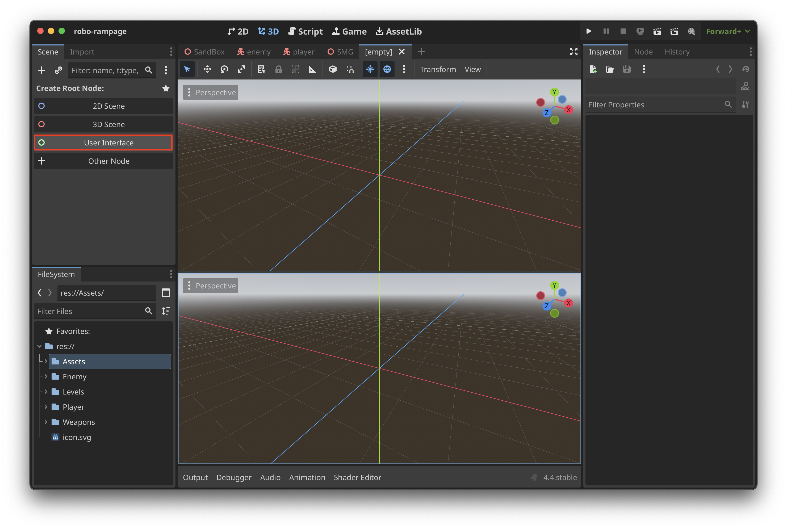

2. Under the **Theme** tab select **New Theme**
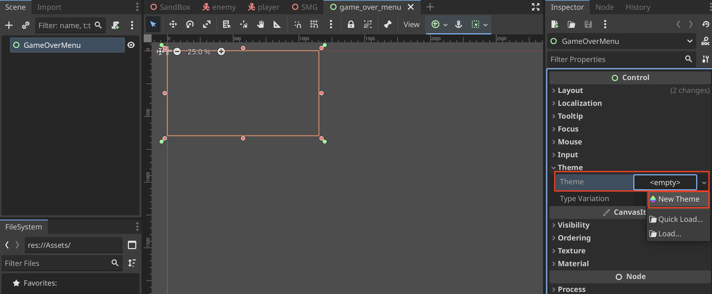

3. Under the **Default Font** you can add a new font
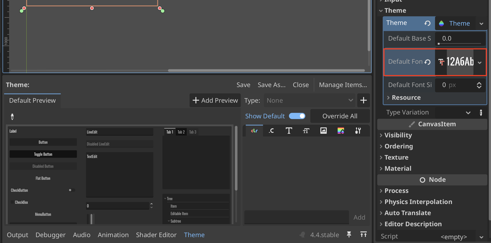
> Aside: You can download free open-source fonts at [Google Fonts](https://fonts.google.com/)

4. Create a new **Center Container** to hold all of our UI components
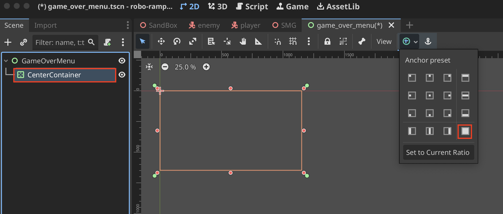

5. Create a **VBoxContainer** and set the minimum with under **Custom Minimum Size**
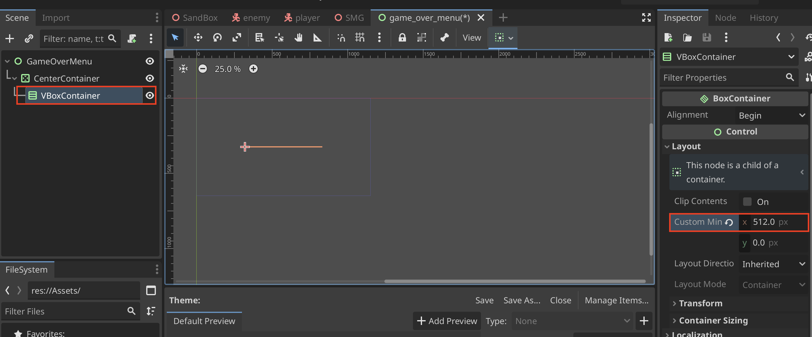

6. Create a **Label** and **Buttons** to go inside of the **VBoxContainer**
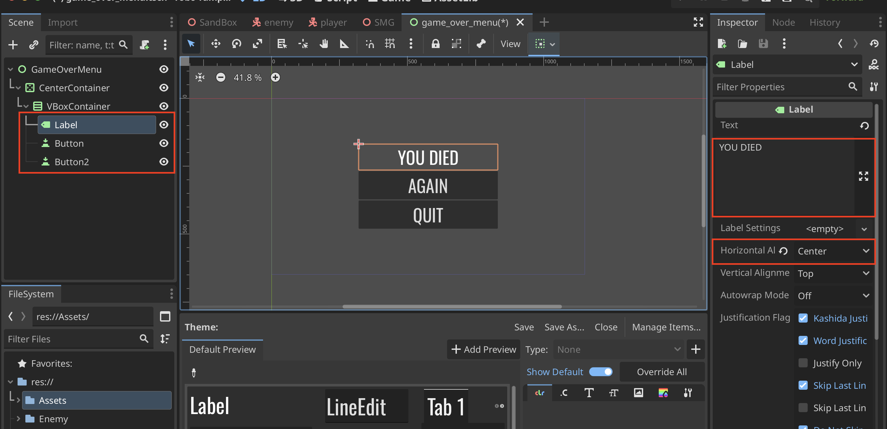

7. Under **Label Settings** you can override default sizes and add your own
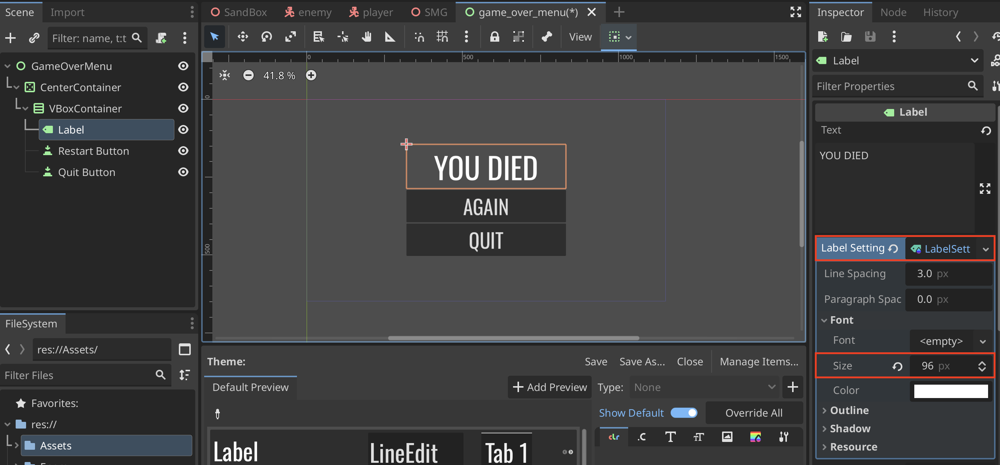

8. Create a script so we can connect the button presses
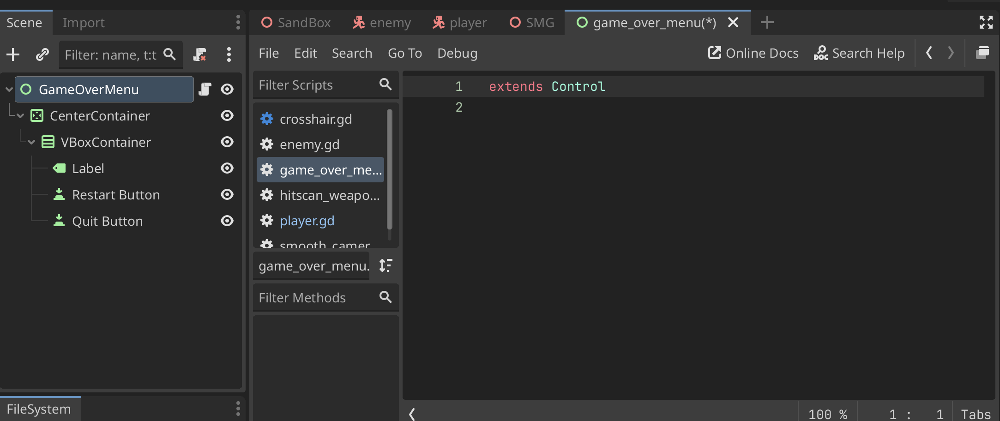

9. Click your button and under **Node > Signals > pressed()** select **Connect...**
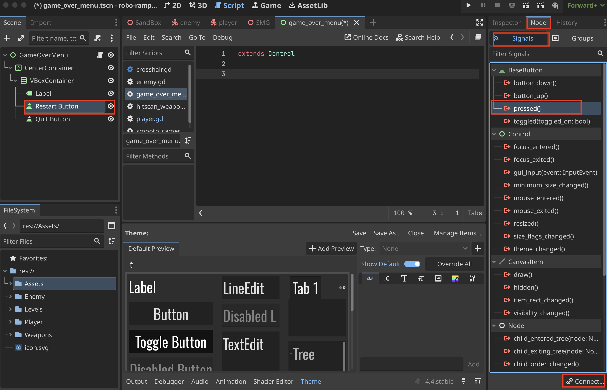

10. Select where your script is located and connect it
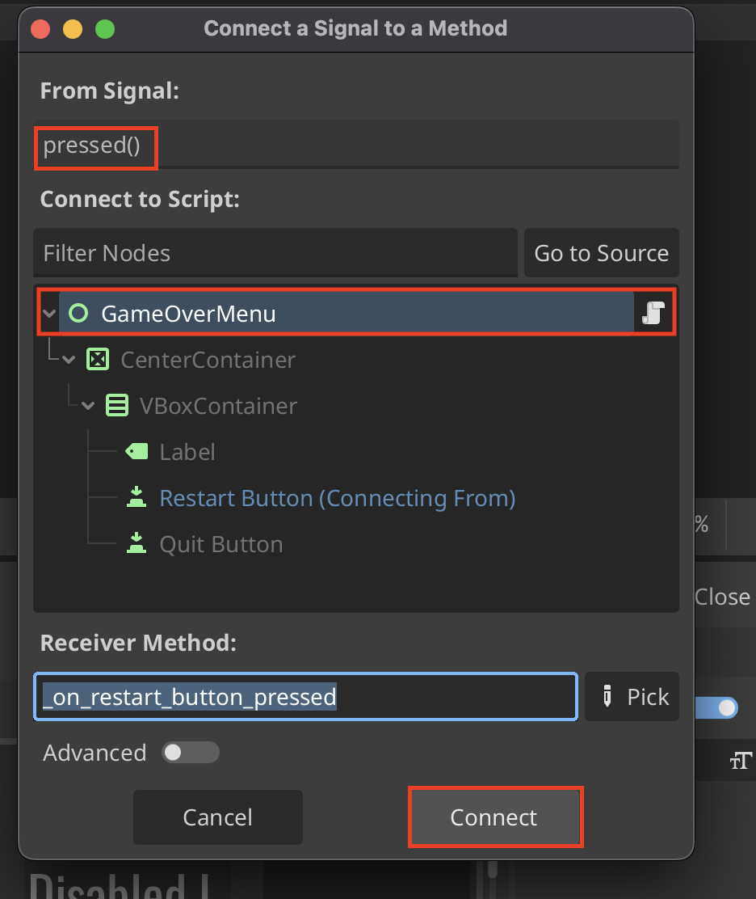

11. Your script will now be created as a function
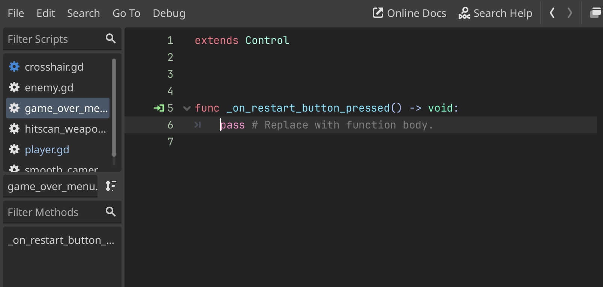

12. Example script
```
func game_over() -> void:
	visible = true
	Input.mouse_mode = Input.MOUSE_MODE_VISIBLE

func _on_restart_button_pressed() -> void:
	get_tree().reload_current_scene()

func _on_quit_button_pressed() -> void:
	get_tree().quit()
```

13. We can **Instantiate Child Scene...** and add our Game Over scene
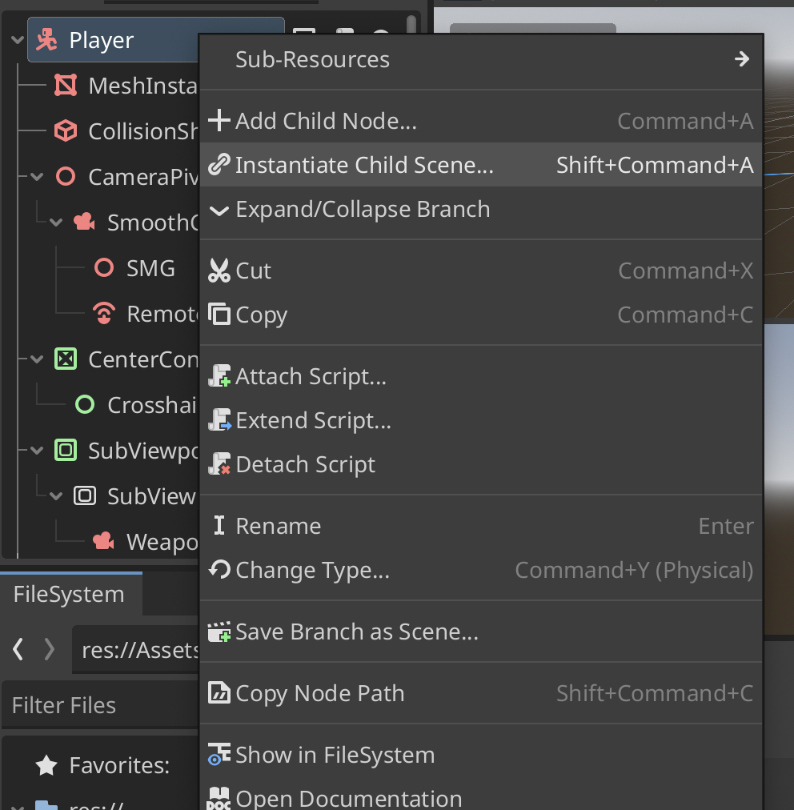

14. We should hide the game over scene so it only becomes visible when we lose
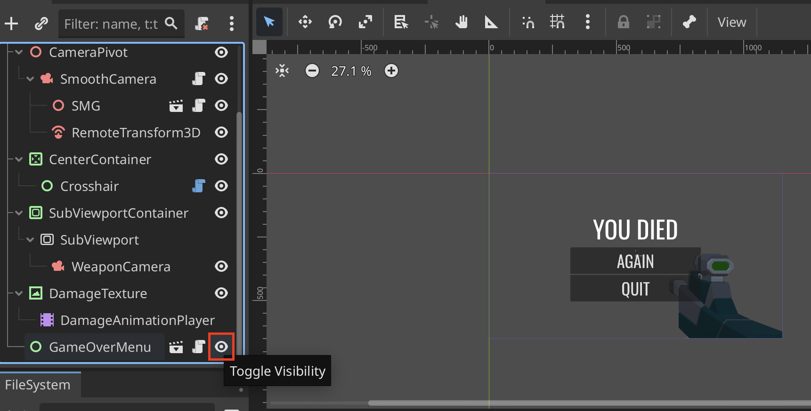

15. Add the game over call in the main script
```
@onready var game_over_menu: Control = $GameOverMenu

var hitpoints: int = max_hitpoints:
	set(value):
		if value < hitpoints:
			damage_animation_player.stop(false)
			damage_animation_player.play("TakeDamage")
		hitpoints = value
		print(hitpoints)
		if hitpoints <= 0:
			game_over_menu.game_over()
```

## Pause Game 
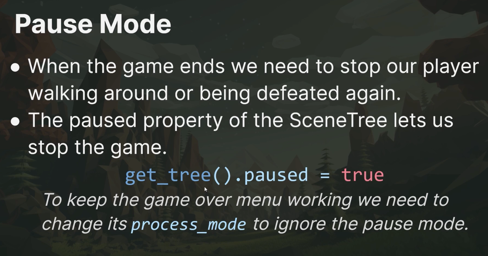
We can objects what to do while the game is paused

1. Example `get_tree().paused` calls
```
func game_over() -> void:
	get_tree().paused = true
	visible = true
	Input.mouse_mode = Input.MOUSE_MODE_VISIBLE

func _on_restart_button_pressed() -> void:
	get_tree().paused = false
	get_tree().reload_current_scene()
```

2. Change the **Process > Mode** to **Always** so that scripts and such always run, even if the game is paused
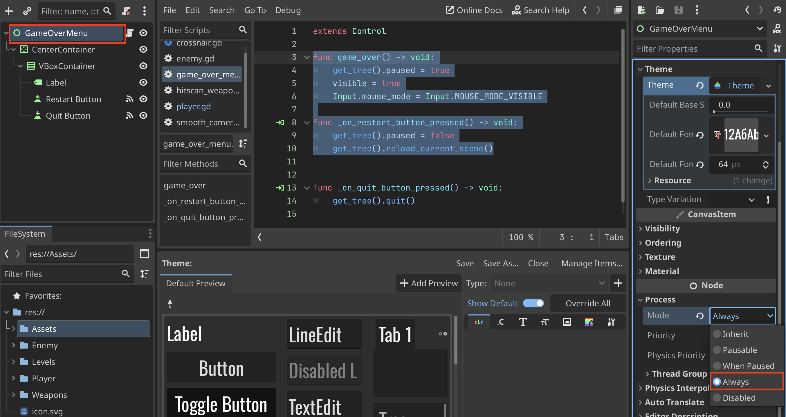