# Godot Animation

## Animation Player


### Example Usage of the AnimationPlayer
1. Add the **AnimationPlayer** to the node


2. While **AnimationPlayer** is selected click on the **Animation** button and select **New...**


3. Make sure you adjust the **Animation Length** and **Zoom** so you can see your keyframes.


4. Now all the transforms have keys that you can add as keyframes to your animation
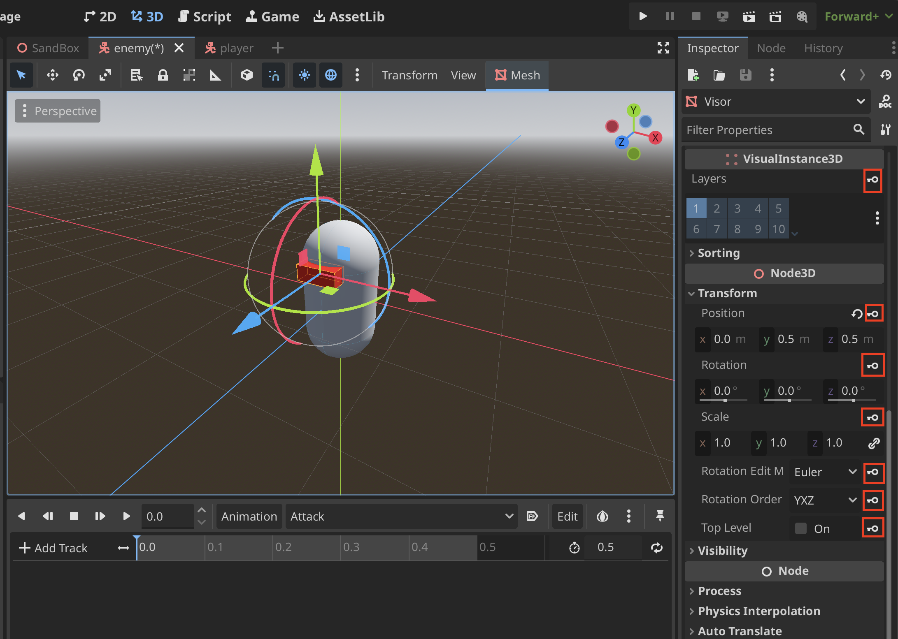

5. When you add a keyframe Godot asks if you want to **Create RESET Track(s)** select **Create**
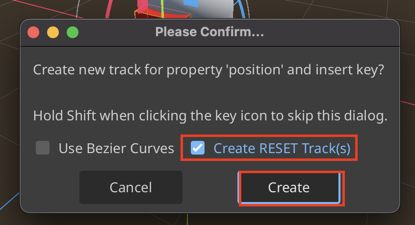
> **RESET Tracks** help return properties back to their original values when an animation finishes. If an animation opens a door the RESET track restores the door to its closed position when the animation is done

6. Example of a completed track. You can even animation materials!
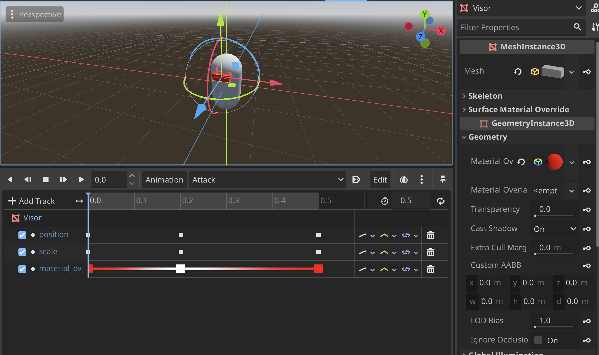

7. If you want to access the animation from the script. You can use an onready variable to access the **AnimationPlayer**
```
@onready var animation_player: AnimationPlayer = $AnimationPlayer
```

8. Then you can call the animation like this
```
...
if provoked:
    if distance <= attack_range:
        animation_player.play("Attack")
...
```

### Adding Script Functions to the AnimationPlayer
1. We can call this variable from the **AnimationPlayer** by adding a new track
```
func attack() -> void:
	print("Enemy Attack")
```

2. Click on **Add Track** in the **Animation** window and select **Call Method Track...**


3. Select the **Node** with the **Script** that has the **function** you want to add to the animation


4. Once the track is added you can right click on the new track and select **Insert Key...**
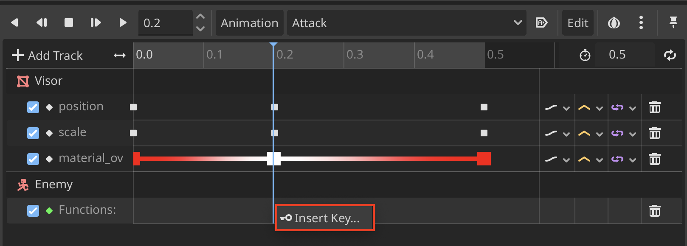

5. Here you can select the **function** you want to add


6. This is what it looks like once its added to the animation


### Animation Easing Between Keyframes
1. Select the keyframes that you want to edit
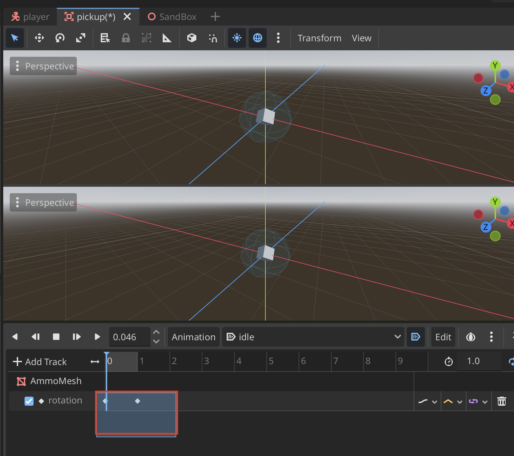

2. On the insepctor **Right-Click** on **Easing** to edit the type of easing
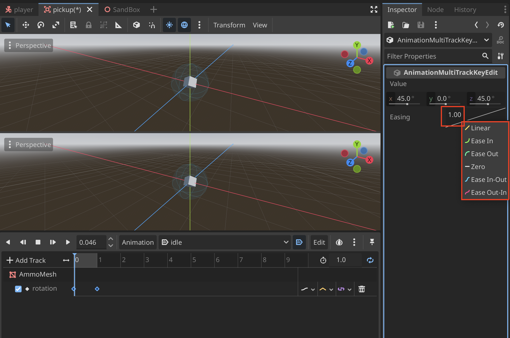

## Animation Tree


What is an **AnimationTree**
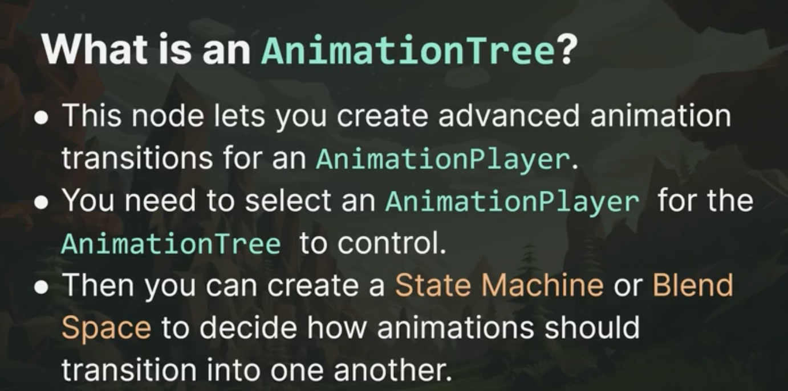

### Example Usage of the AnimationTree
1. First add an **AnimationTree** to our scene
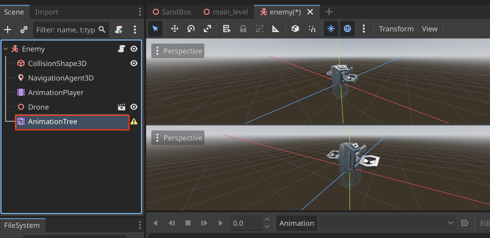

2. For the **Tree Root** create a **New AnimationNodeStateMachine**
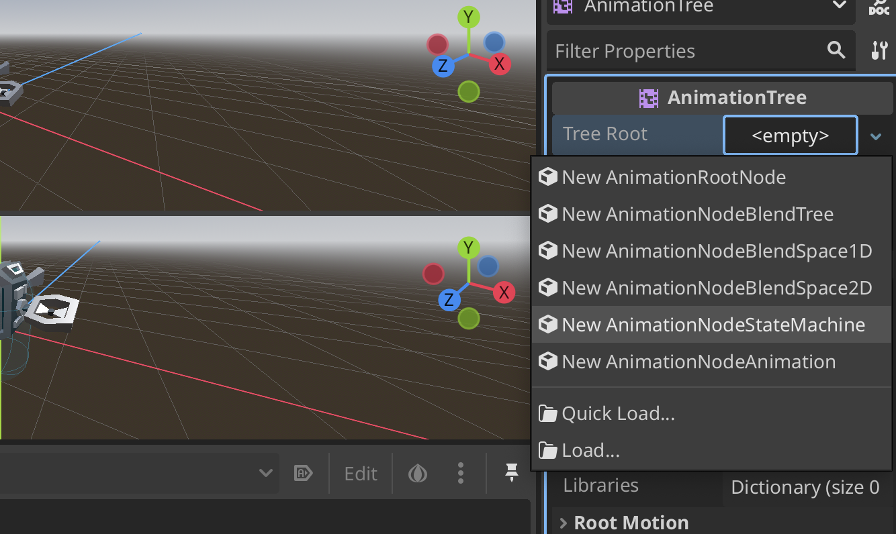

3. Add the **AnimationPlayer** to **AnimationTree**
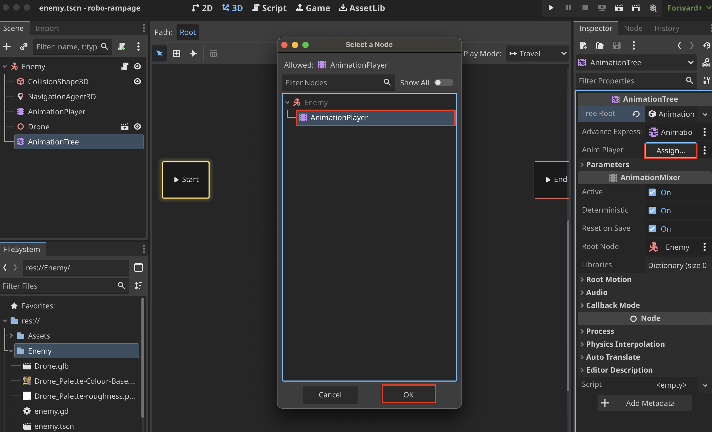
> This tells the **AnimationTree** which animations we will be controlling (i.e. Attack and Idle, which are in AnimationPlayer)

4. Set **Active** to true
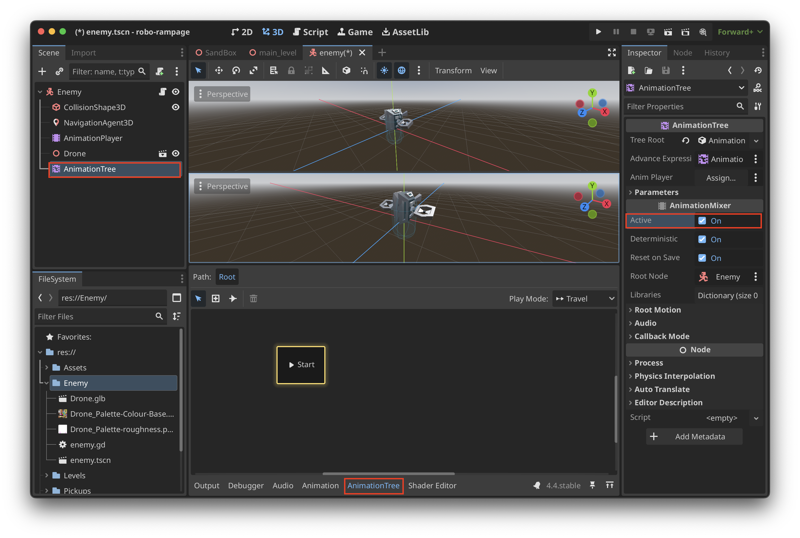
> When **AnimationTree** is set to **Active** we are unable to play **AnimationPlayer** in the Viewport, because the **AnimationTree** is overwriting what the **AnimationPlayer** is doing

5. **Expand Bottom Panel** to make the **AnimationTree** larger
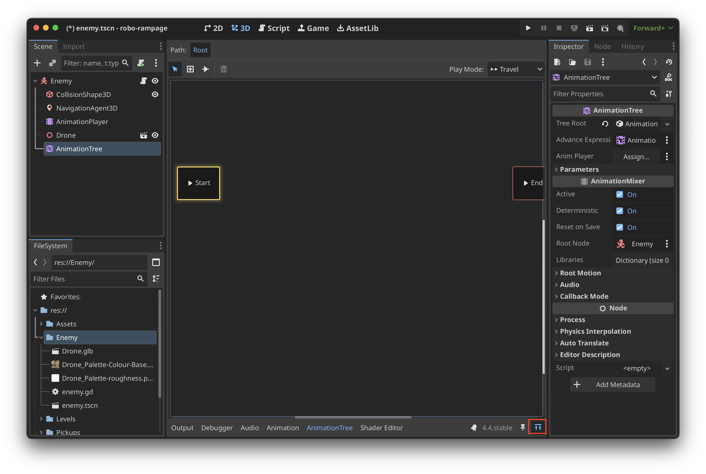

6. Here is an example setup of a simple **AnimationTree**
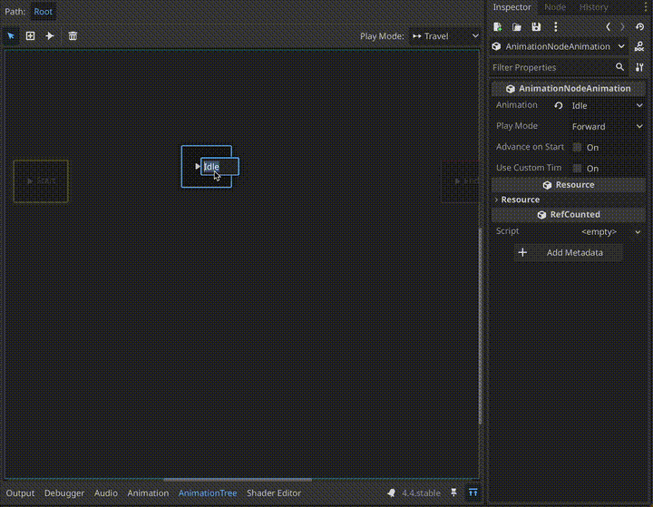

7. Create a reference to the **AnimationTree**
```
@onready var animation_tree: AnimationTree = $AnimationTree
```

8. Create a reference to the **Playback** property
```
@onready var playback: AnimationNodeStateMachinePlayback = animation_tree["parameters/playback"]
```
> **AnimationNodeStateMachinePlayback** is the object through which we can tell our **AnimationTree** to swap from Idle to Attack animations

9. To find the Playback property path go to **AnimationTree > Playback > Copy Property Path**
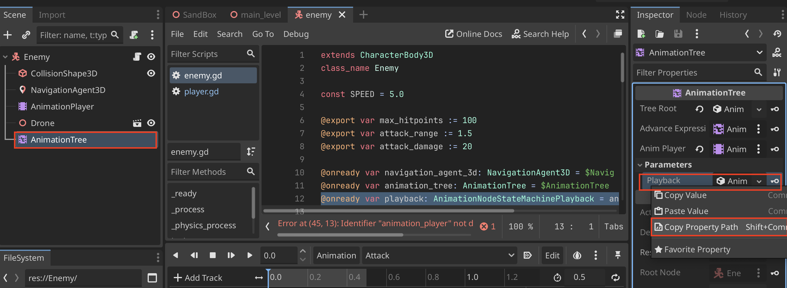

10. To change the animation use the **travel()** method in **AnimationNodeStateMachinePlayback**
```
...
if provoked:
    if distance <= attack_range:
        playback.travel("Attack")
...
```