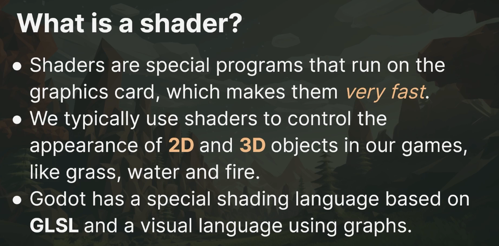
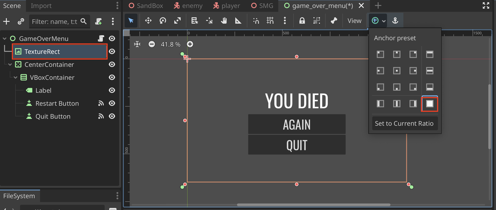
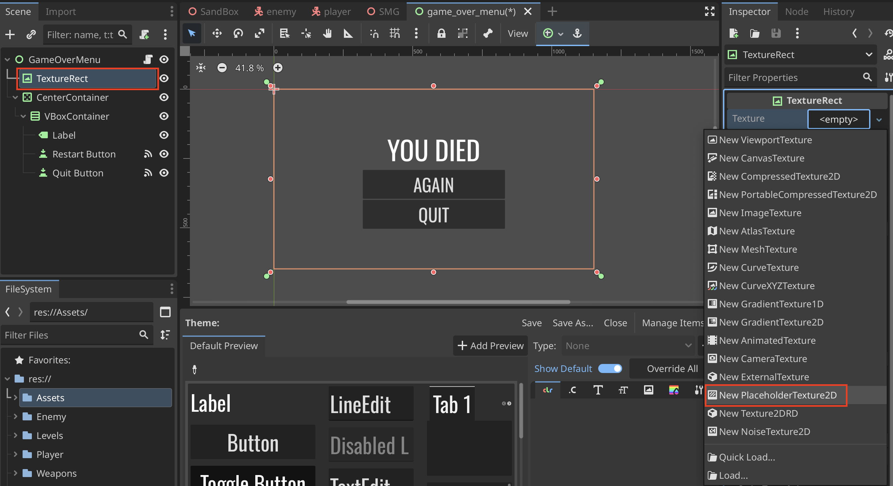
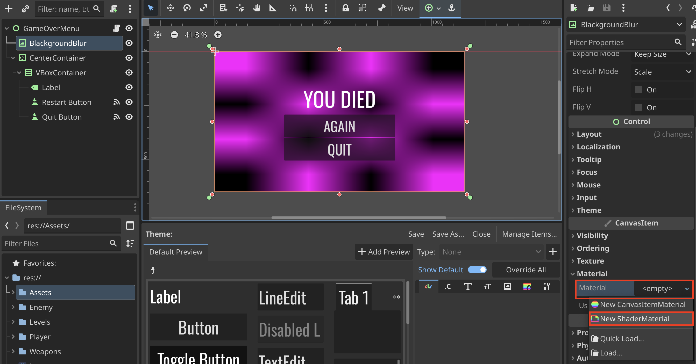
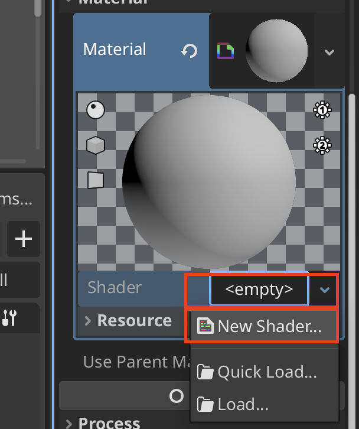
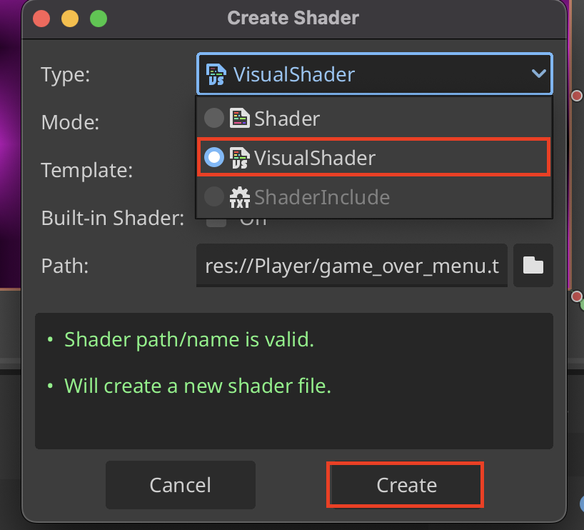
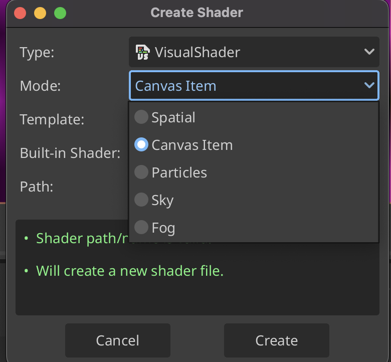
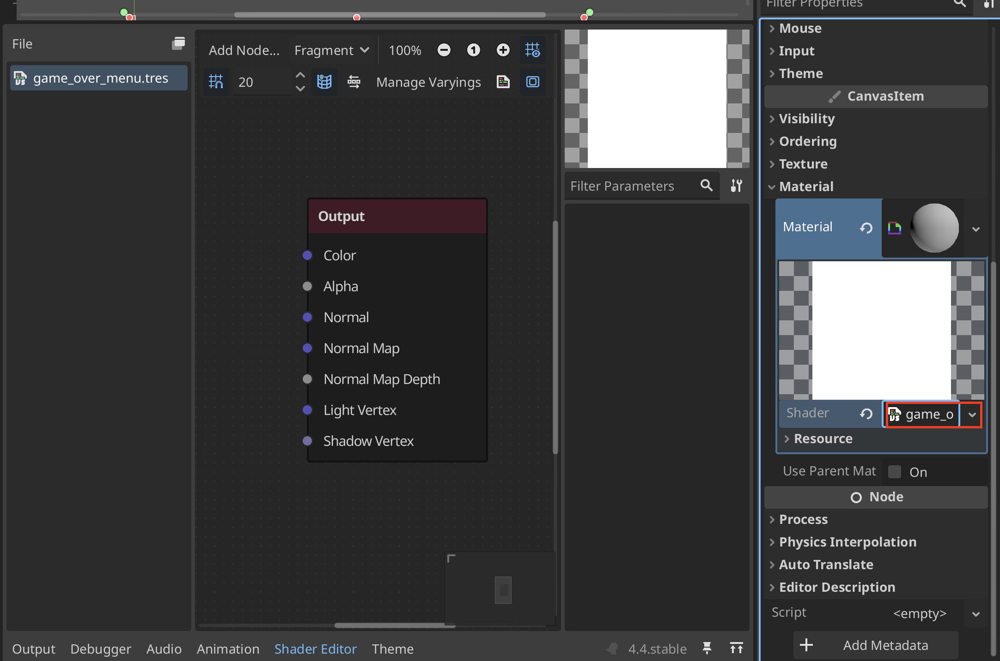
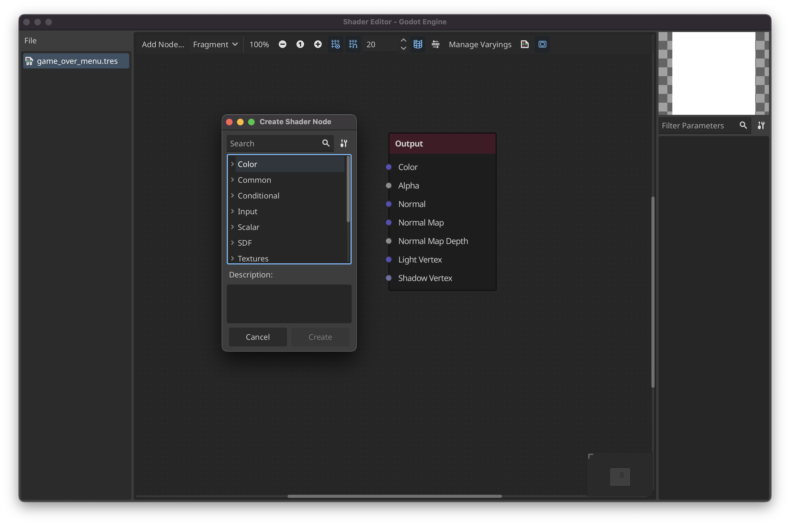

# Godot Shaders

## Visual Shader Language
### Create a Shader

1. First create a **TextureRect**

2. Create a **New PlaceholderTexture2D**

3. Create a new **New ShaderMaterial** under **CanvasItem > Material**

4. Make a **New Shader...**

5. Under the settings you can adjust the language to **Visual Language**

> There are also various Mode's that can be edited. **Canvas Item** is a 2d shader
> 

6. Click on the shader and the shader editor will open

7. **Right-click** to open the Node Picker

8. Example of a blurred background 

## GLSL