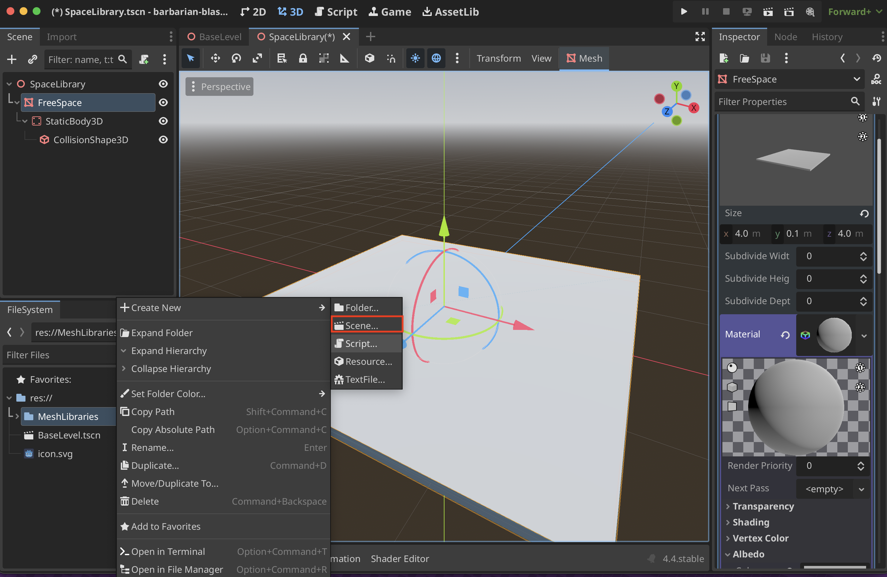
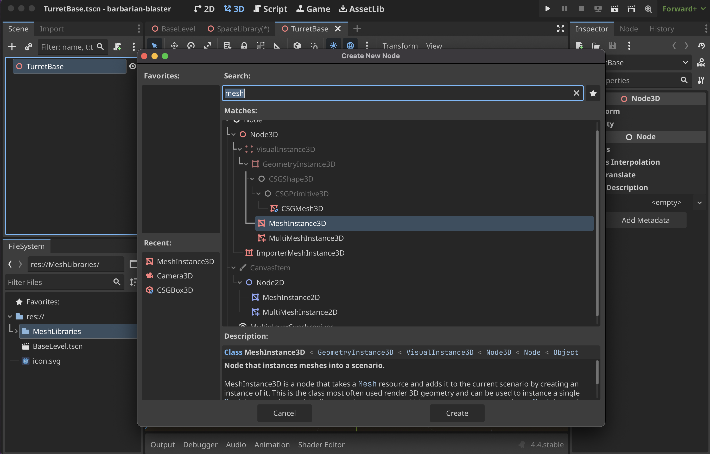
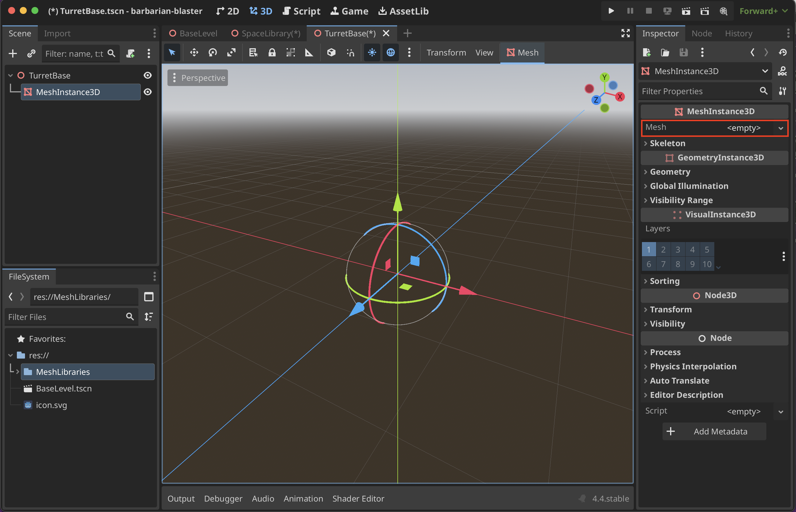
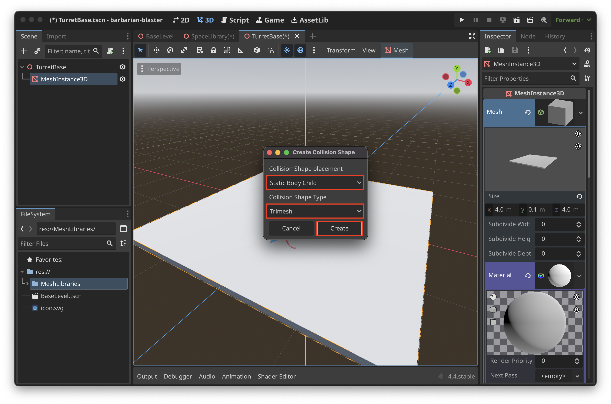
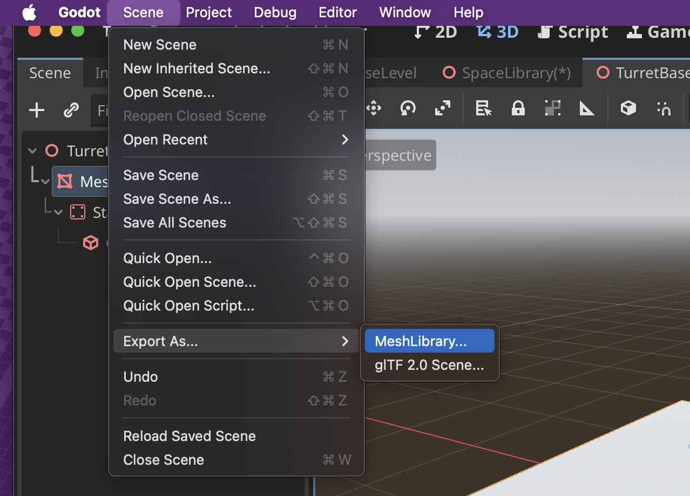
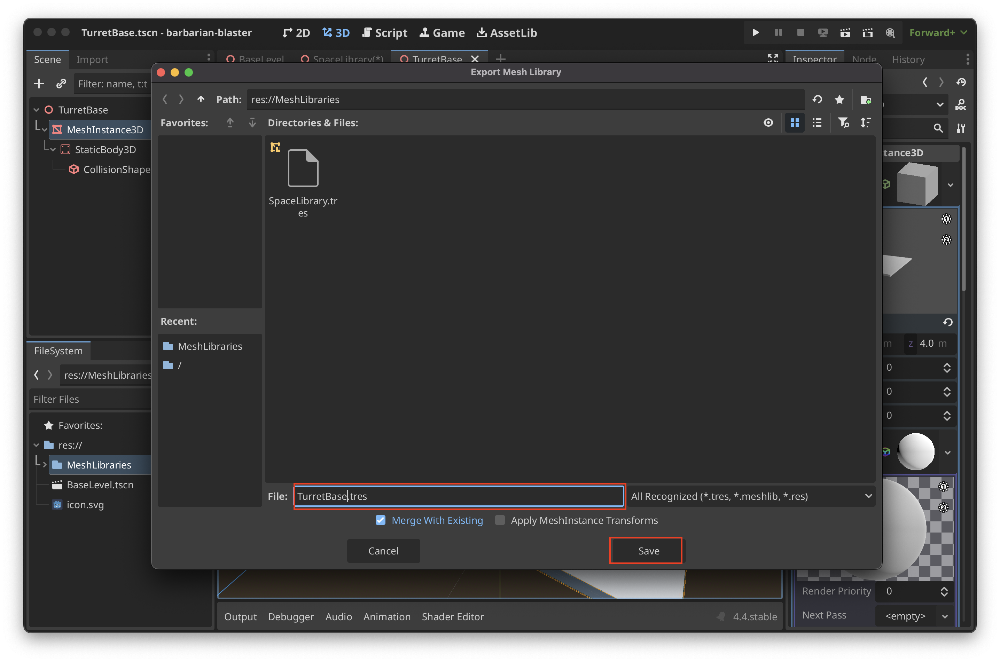
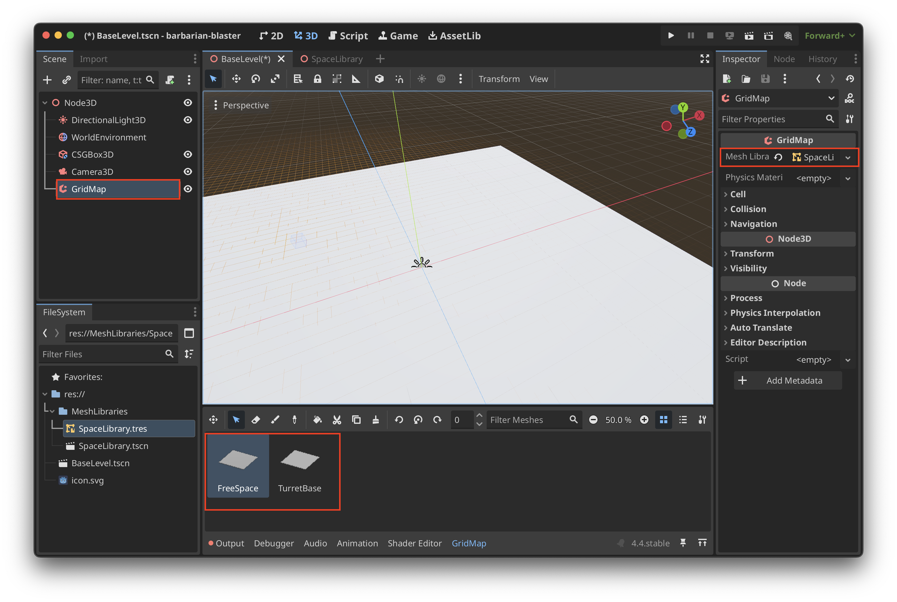

# Gridmap and Mesh Library

## Creating a Mesh Library
1. Create a **Scene...** in the Mesh Library Folder. Create a Mesh Library folder if one does not exist

2. Update the scene name and root type

3. Create a **MeshInstance3D** 

4. Make sure to add a **Mesh** to the new **MeshInstance3D**

5. Update properties to your liking

6. Make sure to add a new **StandardMaterial3D** to the **Mesh**.

7. Create a **CollisionShape3D** to allow players to click on this square. Click on the **Contextual Mesh** button then **Create Collision Shape...**

8. You can select **Static Body Child** with a **Trimesh** collision shape type then **Create**

9. Select **Scene > Export As... > MeshLibrary...**

10. Create an appropriate name then select **Save**

11. If you want to add more items to the library. Just create another **MeshInstance3D** and follow the same steps. To check double click on the `.tres` file and you can see that there was another mesh added to the mesh library (the 0 and 1 are the two meshes)

## Create a Gridmap

1. Create a **GridMap**

2. Add the **MeshLibrary** you created to the **GridMap**
