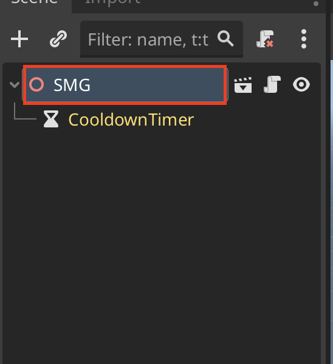
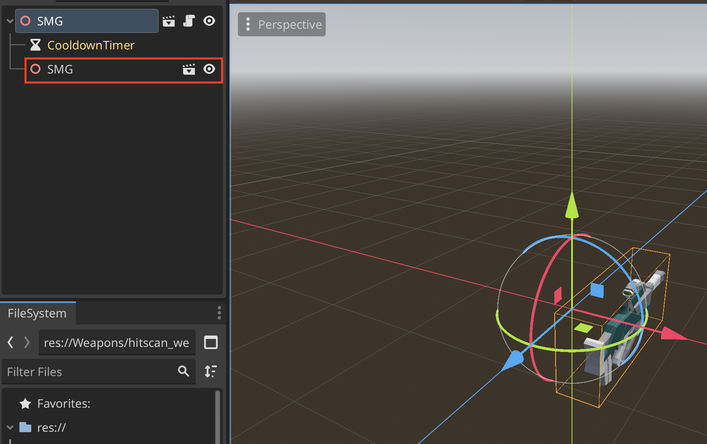

# Inheritance with Scenes

A common design pattern in Godot is to use inheritance through scenes. This allows for scenes to share common properties while building upon them.

## Setup
1. First create your parent scene

2. You can add a **New Inherited Scene** by right clicking on the scene in the **FileSystem** window

3. The yellow indicates that it is the parent's property

4. You can rename the new scene and it will still retain its parent's properties

5. Now you can add new properties to the child scene
