# Navigation

Navigation structure in Godot


## Implementation
### Create Navigation Region
1. Create a **NavigationRegion3D**


2. Create a **New NavigationMesh**
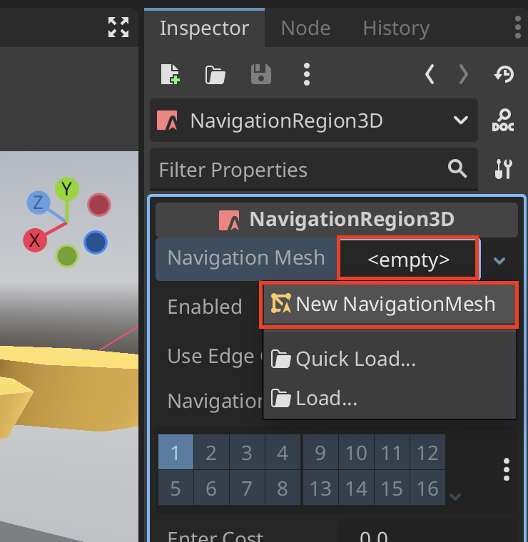

3. Make the map children of the **NavigationRegion3D** so we can use it as the **NavigationMesh**
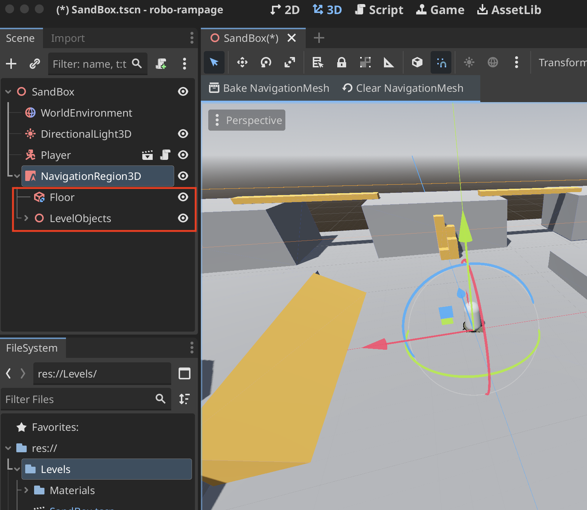

4. **Bake NavigationMesh**
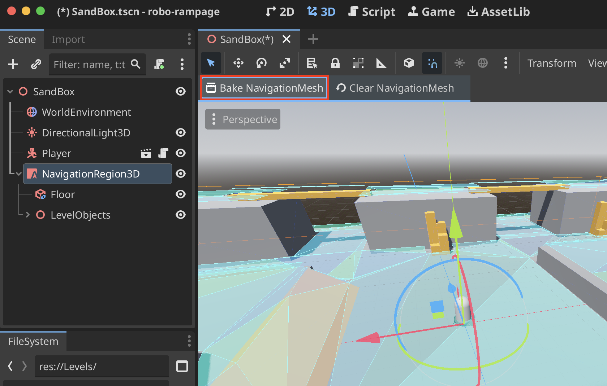

### Bake Navigation Mesh Settings
1. One of the reasons you may want to adjust the **NavigationMesh** Settings is because of generation issues
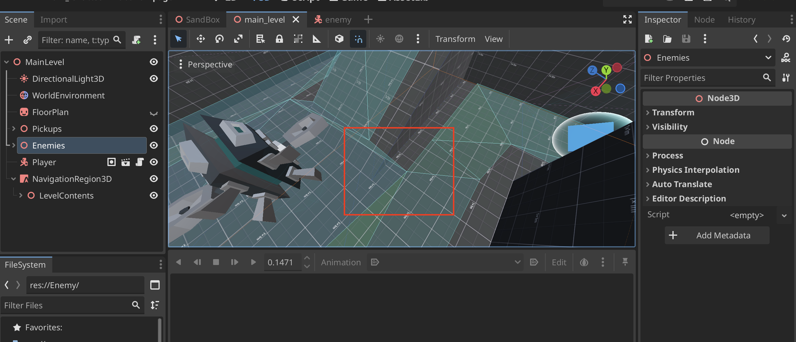

2. Go into your **NavigationMesh** and update the **Radius** so that the mesh becomes thinner
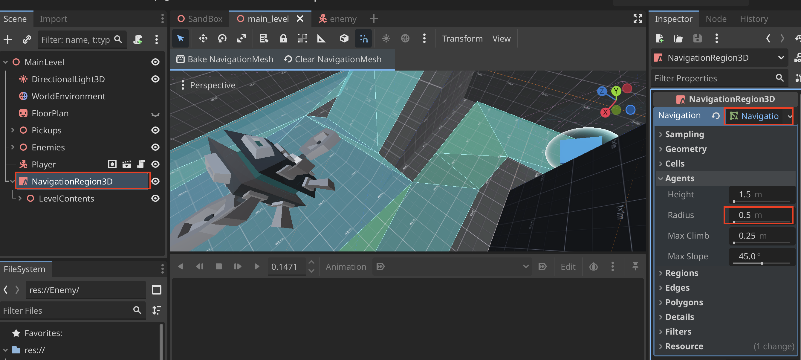
> Result:
> 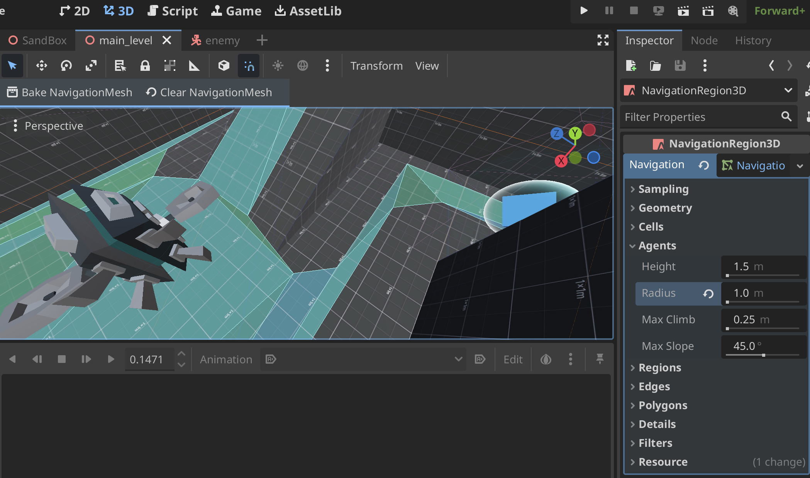

3. If there are issues with a ledge you can adjust that too by enabling **Edge Span**
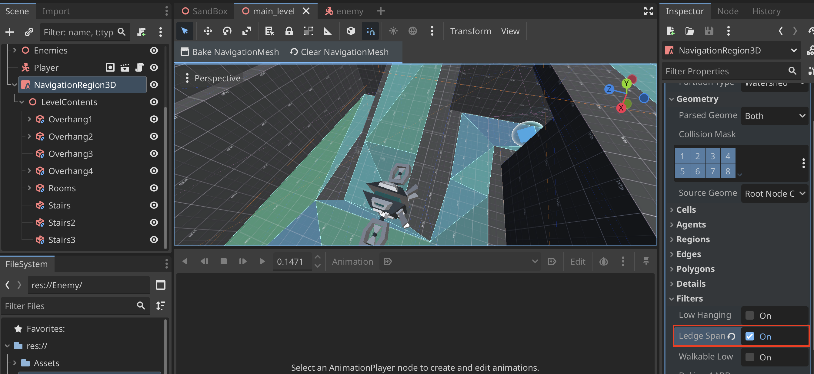

### Create Navigation Agent
1. Create **NavigationAgent3D** in the agent node
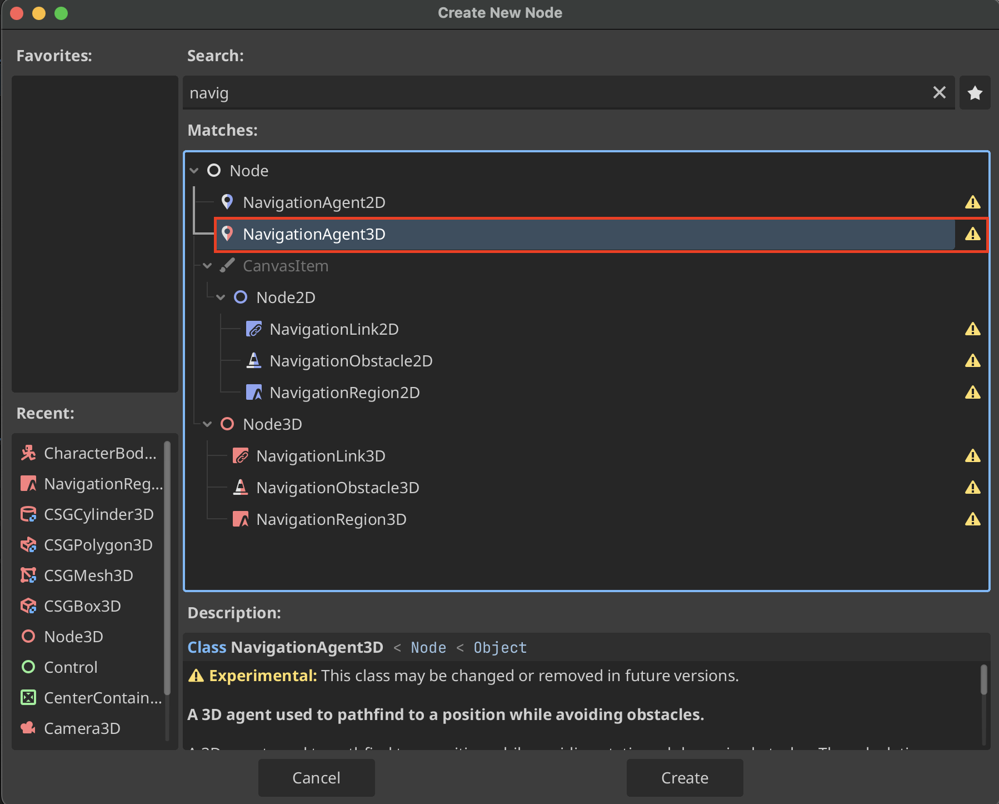

2. Create a script on the agent node
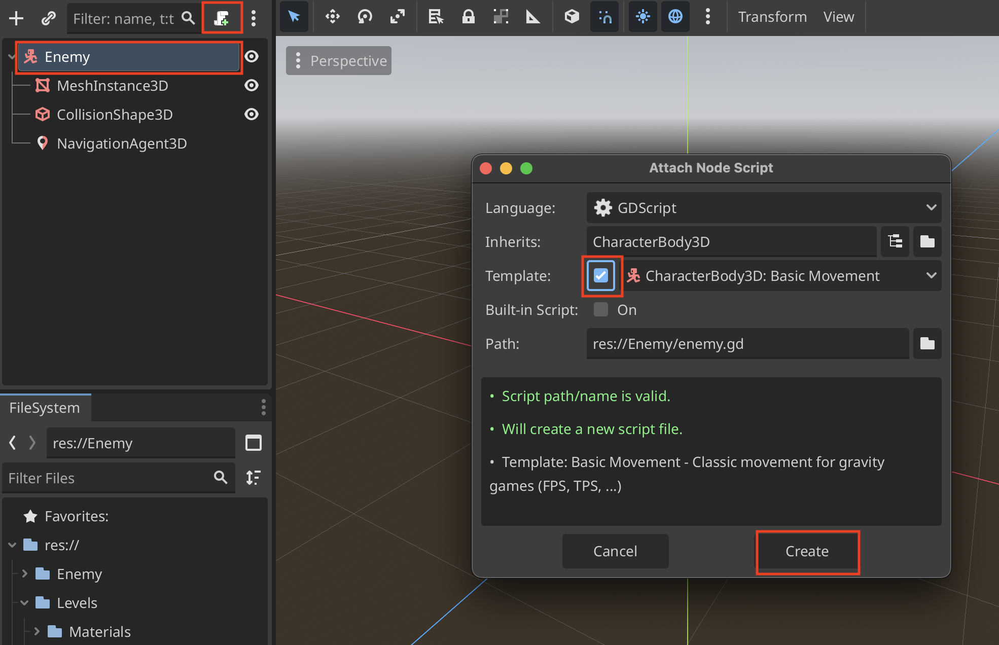

3. Comment out from the template script so the agent does not take user input
```
#move_and_slide()
```

4. Update agent path
```
@onready var navigation_agent_3d: NavigationAgent3D = $NavigationAgent3D

var player

func _ready() -> void:
	var player = get_tree().get_first_node_in_group("player")

func _process(delta: float) -> void:
	navigation_agent_3d.target_position = player.global_position

func _physics_process(delta: float) -> void:
	var next_position = navigation_agent_3d.get_next_path_position()
```

5. Make sure to actually add the player group since we are accessing it in the code with `get_tree().get_first_node_in_group("player")`


6. Add the **agent** scene
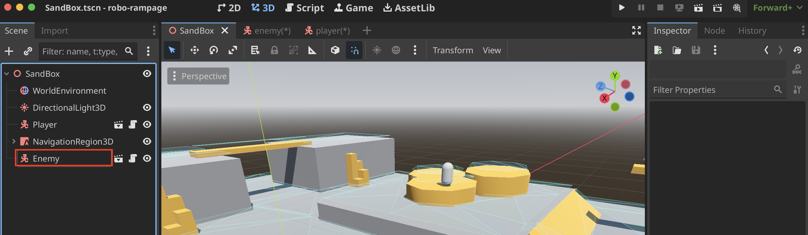

7. Enable debug to see the path while playing


8. How the **Navigation Path** appears in debug
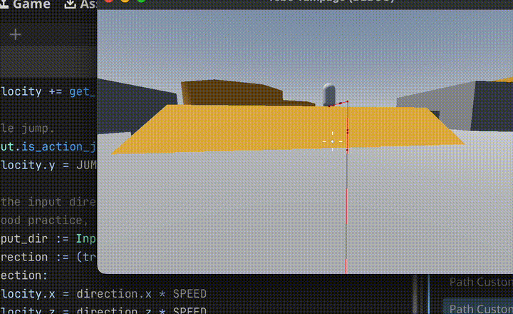

## Add Agent Movement

Use `direction_to()` and `distance_to()`

> "Normalized" means that the vector caps out at 1 meter long. This is good because we can multiply it by a speed and move in the direction by the speed.

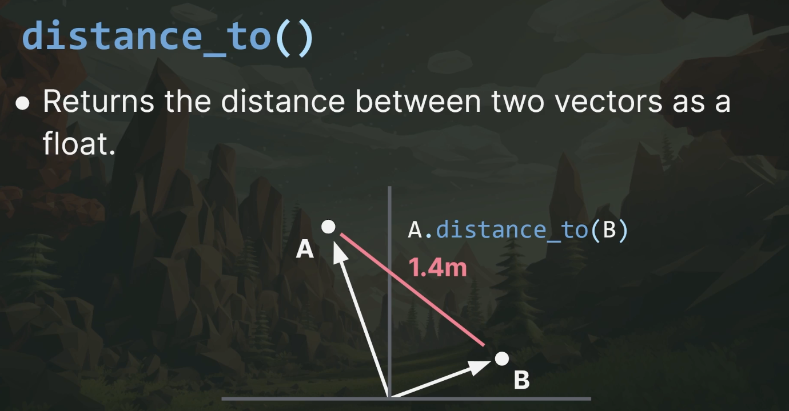
> We can use this to check if target is within a certain distance. Some recommend using `distance_squared_to()` for more performance, but it is a debated topic and `distance_to()` works fine in most cases.

1. Update agent script. Agent can move around and follow player.
```
func _physics_process(delta: float) -> void:
	var next_position = navigation_agent_3d.get_next_path_position()
	# Add the gravity.
	if not is_on_floor():
		velocity += get_gravity() * delta
		
	var direction = global_position.direction_to(next_position)
	
	if direction:
		velocity.x = direction.x * SPEED
		velocity.z = direction.z * SPEED
	else:
		velocity.x = move_toward(velocity.x, 0, SPEED)
		velocity.z = move_toward(velocity.z, 0, SPEED)

	move_and_slide()
```

2. Completed script in agent
```
extends CharacterBody3D

const SPEED = 5.0
const JUMP_VELOCITY = 4.5
@onready var navigation_agent_3d: NavigationAgent3D = $NavigationAgent3D

var player
var provoked := false
var aggro_range := 12.0

func _ready() -> void:
	player = get_tree().get_first_node_in_group("player")
	
func _process(_delta: float) -> void:
	if provoked:
		navigation_agent_3d.target_position = player.global_position

func _physics_process(delta: float) -> void:
	var next_position = navigation_agent_3d.get_next_path_position()
	# Add the gravity.
	if not is_on_floor():
		velocity += get_gravity() * delta
		
	var direction = global_position.direction_to(next_position)
	var distance = global_position.distance_to(player.global_position)
	
	if distance <= aggro_range:
		provoked = true
	
	if direction:
		velocity.x = direction.x * SPEED
		velocity.z = direction.z * SPEED
	else:
		velocity.x = move_toward(velocity.x, 0, SPEED)
		velocity.z = move_toward(velocity.z, 0, SPEED)

	move_and_slide()
```