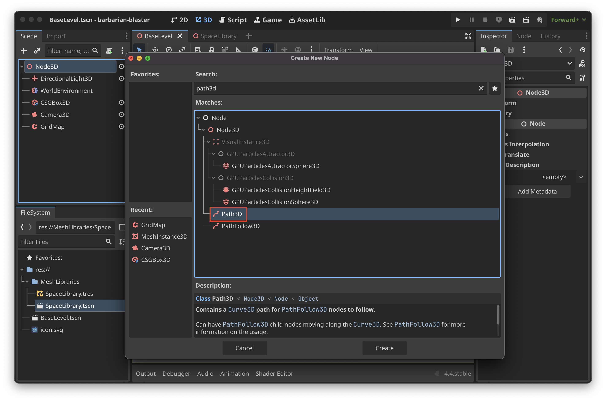
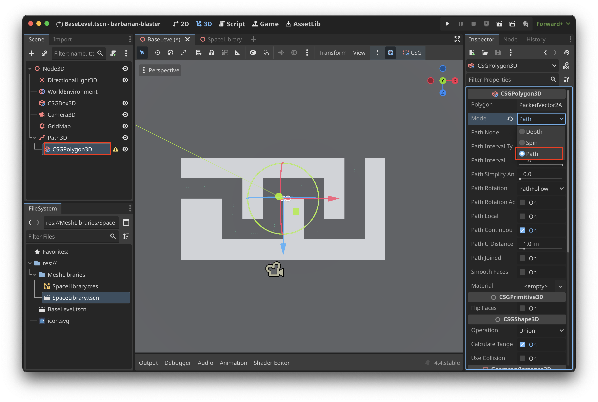
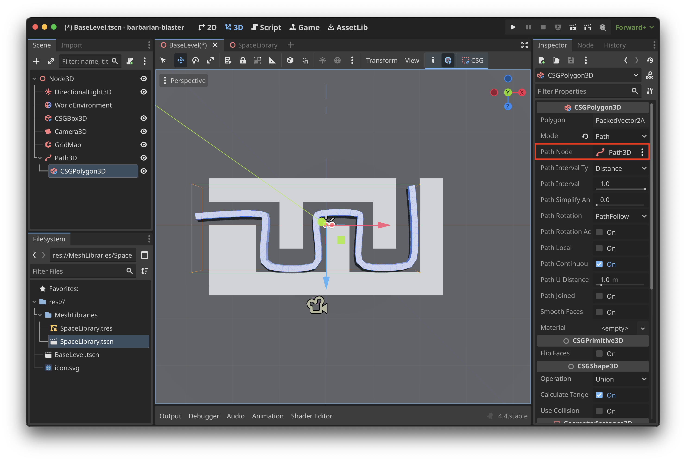

# Path3D

## Setting Up Path3D
1. Create **Path3D**

2. Click on **Add Point** and make sure you are in top down mode and start plotting points on a line

3. Click on **Select Points** to clean up the Path3D points

4. You can use **Select Control Points** and **Shift + Click** to create curves in the path

5. To solidify the shape create a **CSGPolygon3D** as a child of **Path3D** and change **Mode** to **Path**

6. Set the **Path Node** to **Path3D**
