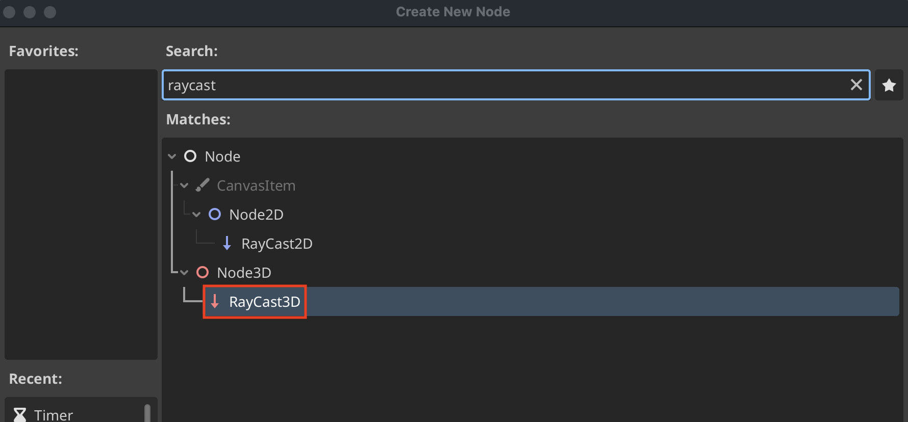
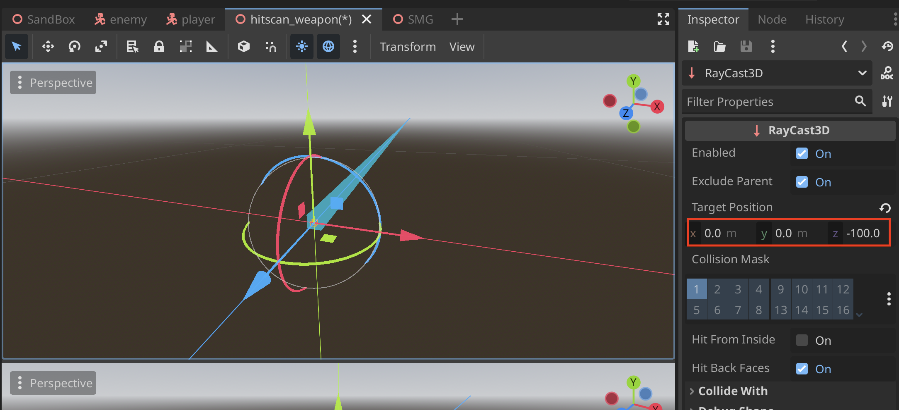
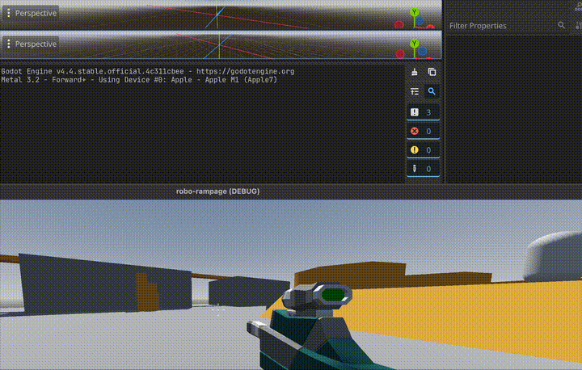

# Raycasts

## Create Raycast3D
1. Create a **Raycast** Node


2. Make sure you change the distance to how far you want the **Raycast** to go


3. Add **@onready** var for the raycast
```
@onready var ray_cast_3d: RayCast3D = $RayCast3D
```

4. We can detect what the raycast hits with this:
```
printt("weapon fired", ray_cast_3d.get_collider())
```

## Creating Sparks at Raycast3D
1. Export variable for sparks
```
@export var sparks: PackedScene
```

2. **Instantiate and move the sparks **global_position** to where the raycast made contact
```
func shoot() -> void:
	var collider = ray_cast_3d.get_collider()
	var spark = sparks.instantiate()
	add_child(spark)
	spark.global_position = ray_cast_3d.get_collision_point()
```

3. Visualization
