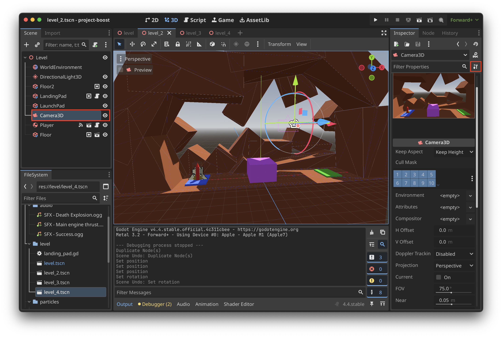
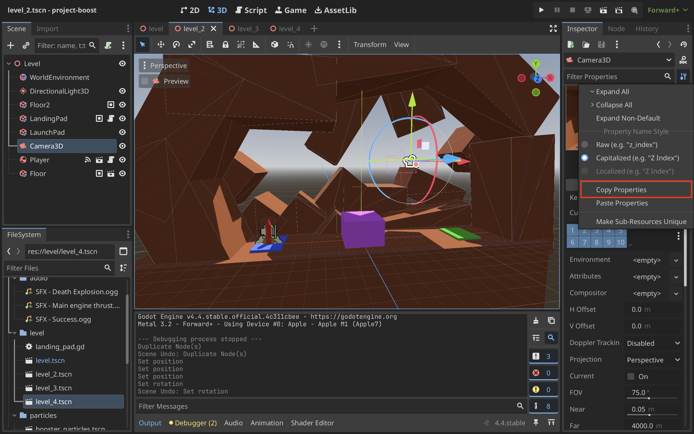
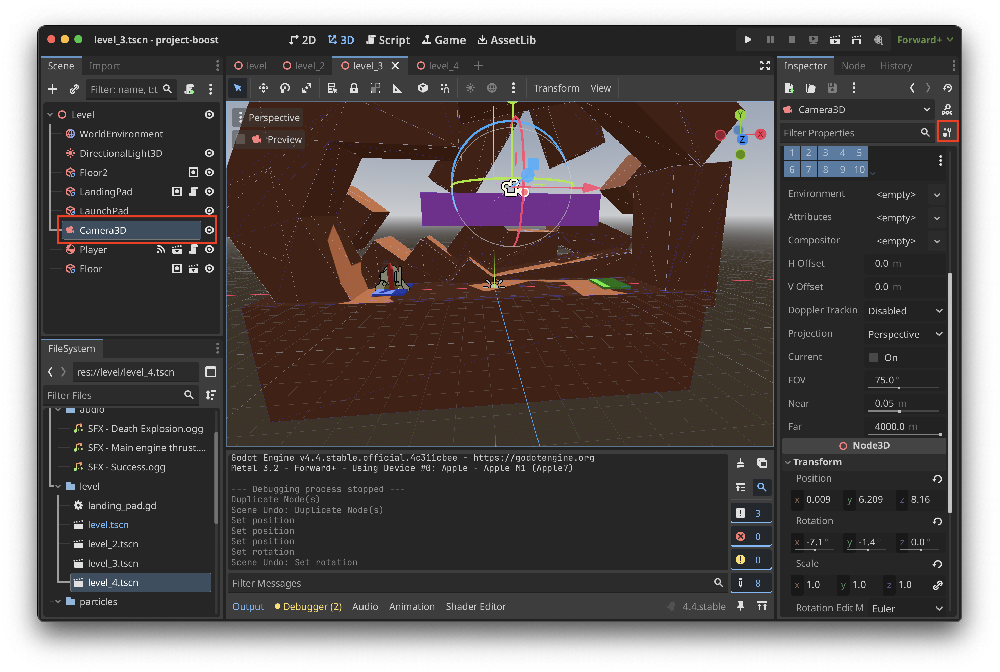

# Reusing Node Properties

When creating a level, you may need properties from a Node in another level. There is a way to easily copy those properties and reuse them.

## Copying Node Properties
1. Select the Node that you want to copy the properties of

2. Select **Copy Properties**

## Pasting Node Properties
1. Select the Node that you want to change

2. Select **Paste Properties**
