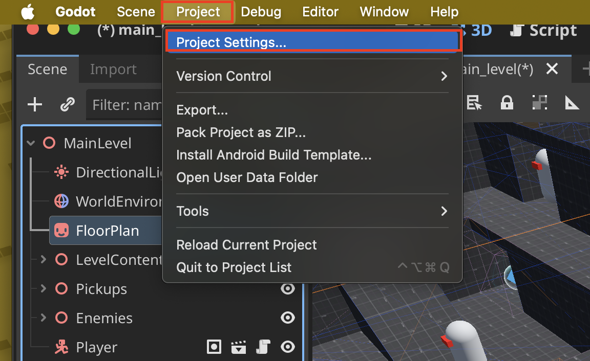

# Transition Between Scenes

## Set **Main Scene**
1. Go to **Project > Project Settings...**


2. Select the scene path that you want as your **Main Scene**


## `get_tree()` Function

`get_tree()` in Godot is a method that returns a reference to the current **SceneTree** object, which is the main loop and scene management system in Godot.

The **SceneTree** is the core that handles:
- Scene management - Loading, changing, and managing scenes
- Main game loop - Processing frames, physics, and rendering
- Node tree operations - Managing the hierarchy of nodes
- Global game state - Pausing, quitting, notifications

## Example Setup

1. The landing platform exports a filepath
```
extends CSGBox3D

@export_file("*.tscn") var file_path
```
- The filepath appears on the **Inspector**


- Because we declared that we only want files with the scene extension `("*.tscn")` we only get_groups scenes


2. On our player script we have a function that uses the `_on_body_entered` signal to detect if we should move on to the next level

```
func _on_body_entered(body: Node) -> void:
    ...
		if "Goal" in body.get_groups():
			complete_level(body.file_path)
    ...
```

- Corresponding signal:


3. The final call uses a `tween` to add time and finally calls the `get_tree().change_scene_to_file.bind()` function to change scenes

```
func complete_level(next_level_file) -> void:
	...
	var tween = create_tween()
	tween.tween_interval(1.5)
	tween.tween_callback(get_tree().change_scene_to_file.bind(next_level_file))
```