# Inkscape Shortcuts

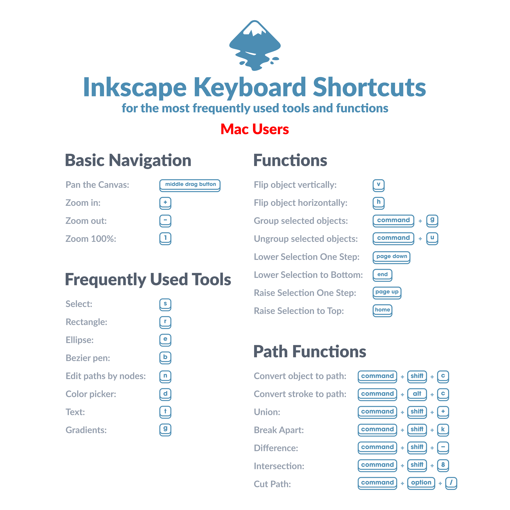

## Moving Around 🖱️

| Action               | Shortcut       | Image |
|----------------------|----------------|-------|
| Zoom in / out        | `+` / `-`      | 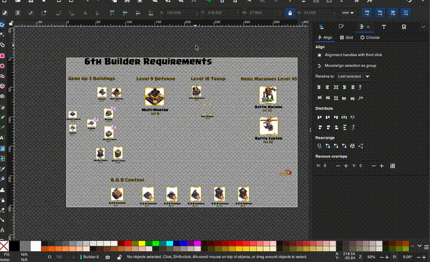 |
| Zoom 100%            | `1`            | 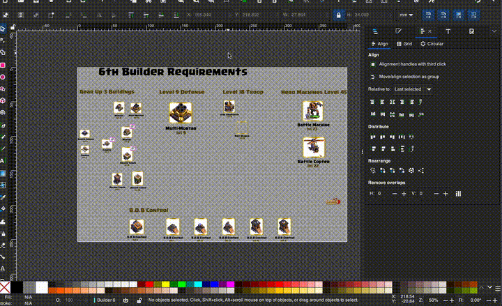 |
| Zoom to selection    | `3`            | 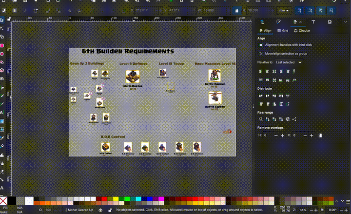 |
| Zoom to drawing      | `4`            |  |
| Zoom to page         | `5`            | 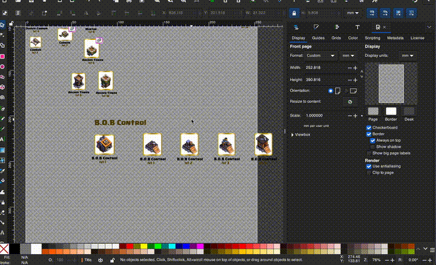 |
| Toggle all dialogs (Toggle Sidebar) | F12 (better is **⌘B**) |  |
| Focus Mode | Shift + F11 (better is **⌘F**) |  |

> To update keybinds go to **Inkscape > Settings... > Interface > Keyboard**
> 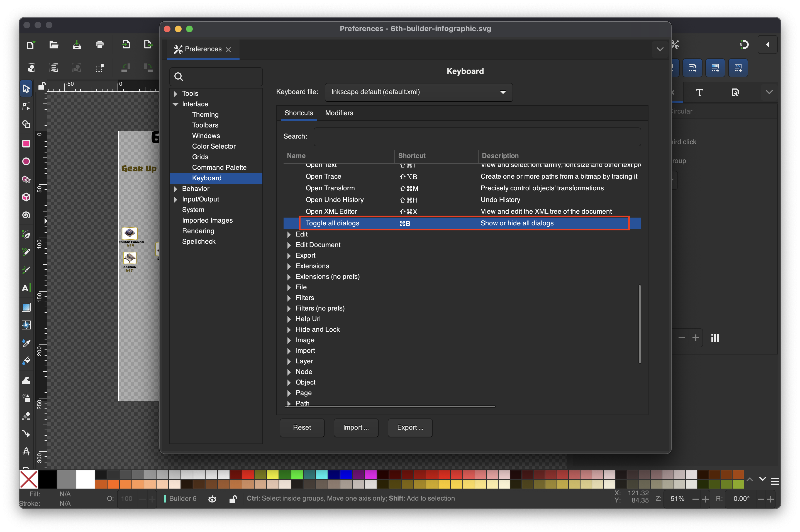
> 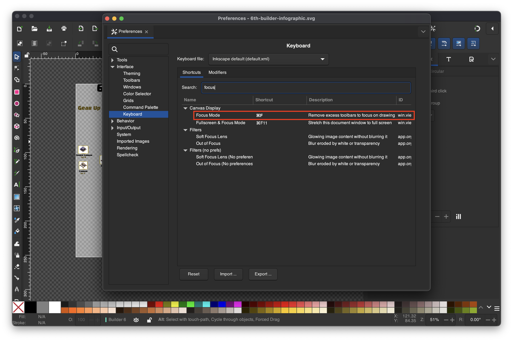

## Selecting & Moving 🎯
| Action                | Shortcut     |
|-----------------------|--------------|
| Select tool           | `S` then press |
| Move in small steps   | **Arrow keys**   |
| Move in bigger steps  | **Shift + Arrow** |
| Duplicate object      | **Ctrl + D**     |
| Delete object         | **Delete**       |

### While In Select Mode
| Action                | Image     |
|-----------------------|--------------|
| `S` again to Rotate   | 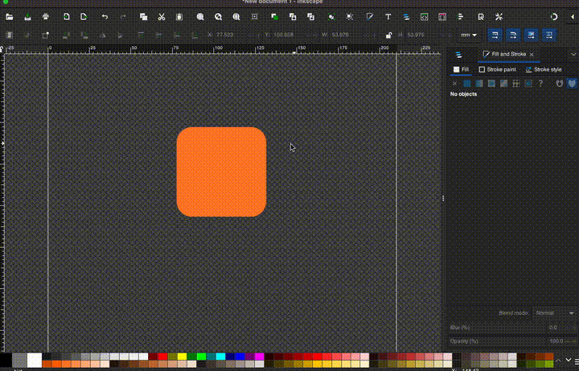 |
| **Shift + Click** origin to reset | 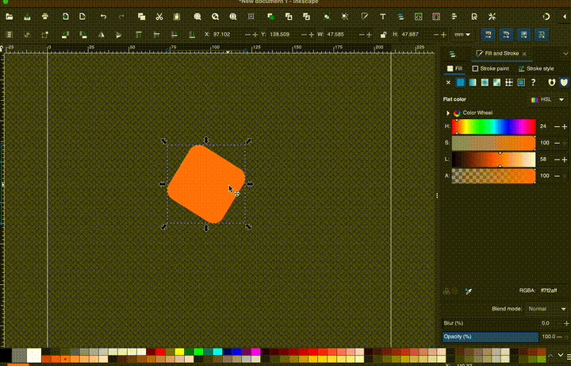
| While Dragging press **Space** to copy | 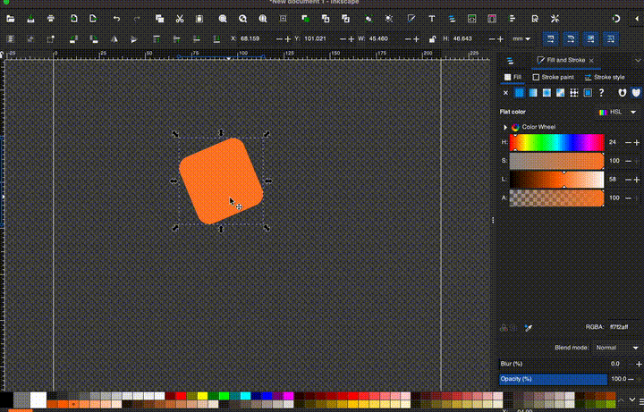

## Drawing Tools 🛠️
| Tool                  | Shortcut     |
|-----------------------|--------------|
| Rectangle             | `R` or `F4`  |
| Ellipse / Circle      | `E` or `F5`  |
| Bezier (Pen)          | `B`          |
| Text                  | `T` or `F8`  |
| Color picker (Dropper)| `D` or `F7`  |

### While Drawing
| While Drawing...                | What It Does                              | Images |
|---------------------------------|-------------------------------------------|--------|
| Hold `Ctrl`                     | Lock proportions (square/circle) or snap angles |  |
| Hold `Shift`                    | Draw from the center instead of a corner  | 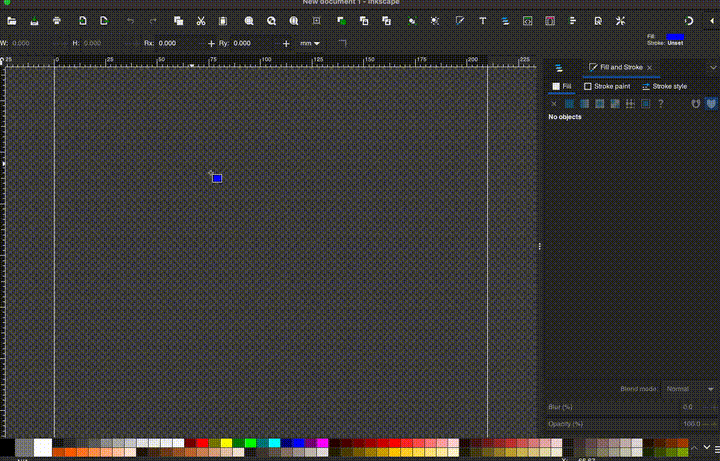 |
| Hold `Ctrl + Shift` together    | Perfect shape, drawn from center          | 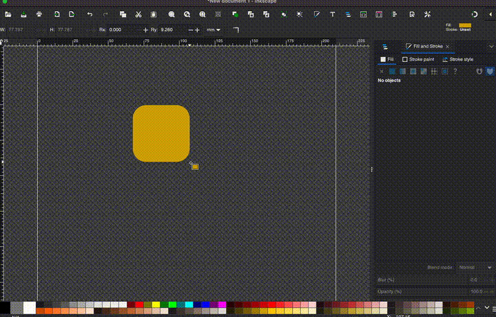 |

## Colors & Styles 🎨
| Action                | Shortcut         |
|-----------------------|------------------|
| Fill & Stroke panel   | **Shift + Ctrl + F** |
| Copy style            | **Shift + Ctrl + C** |
| Paste style           | **Shift + Ctrl + V** |

## Arranging Objects 📐
| Action                  | Shortcut           |
|-------------------------|--------------------|
| Group                   | **Ctrl + G**           |
| Ungroup                 | **Ctrl + U**           |
| Bring to front          | **Home**               |
| Send to back            | **End**                |
| Raise / Lower one step  | **Page Up / Page Down** |
| Enable Snapping  | **Shift + 5** |

## Path Basics ✂️
| Action          | Shortcut   |
|-----------------|------------|
| Combine paths   | **Ctrl + K**   |
| Break apart     | **Shift + Ctrl + K** |
| Union           | **Ctrl + +**   |
| Difference      | **Ctrl + -**   |

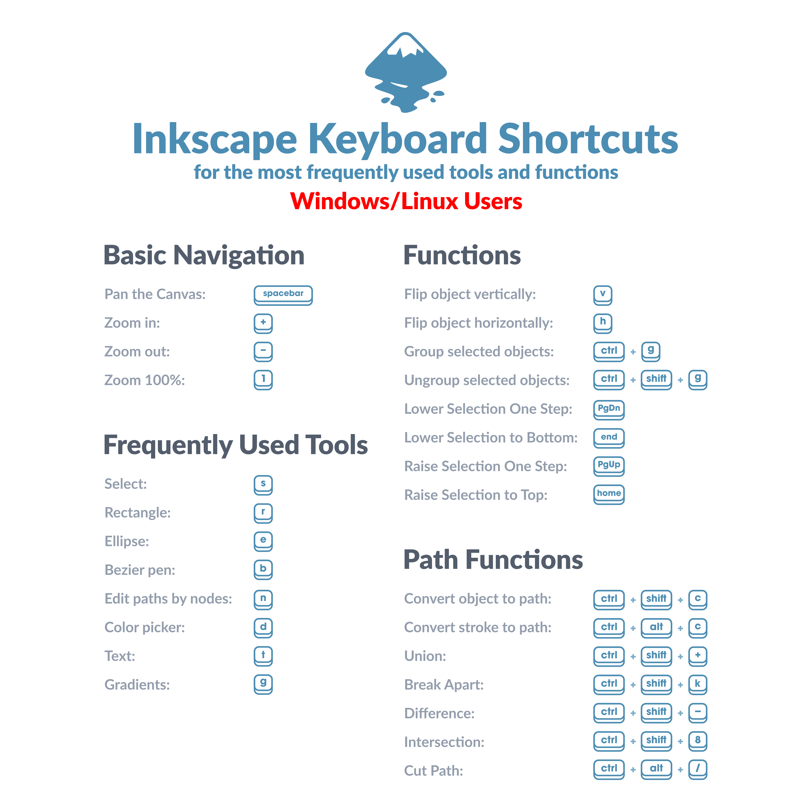