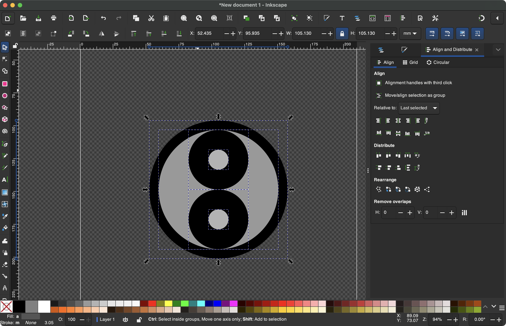
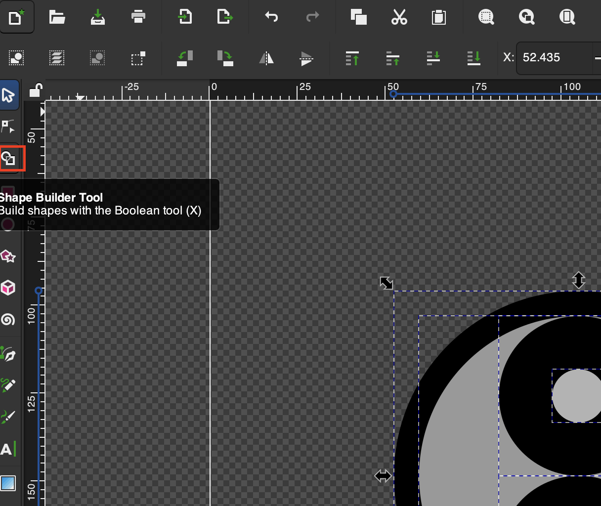
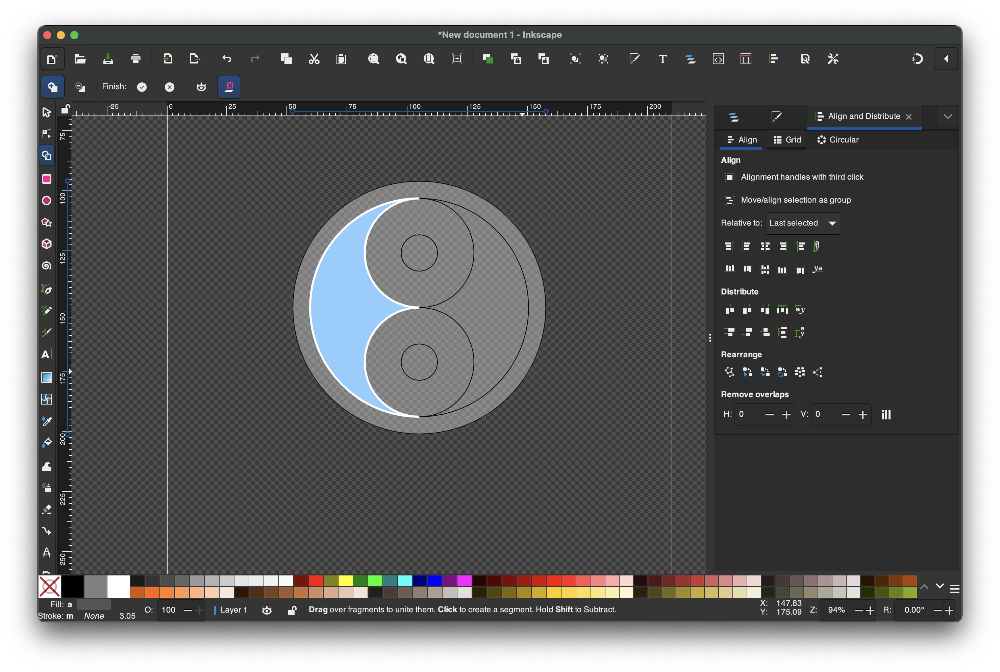
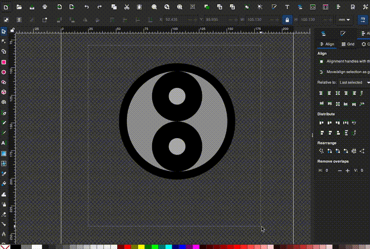

# Shape Builder Tool
Allows you to **add** shapes together and **subtract** them

## Example Shape Builder Tool Usage
1. First select all your objects

2. Select the **Shape Builder Tool**

3. We are placed in the **Shape Builder** environment

4. Combine shapes by **dragging** two shapes together in the **Shape Builder Environment**
