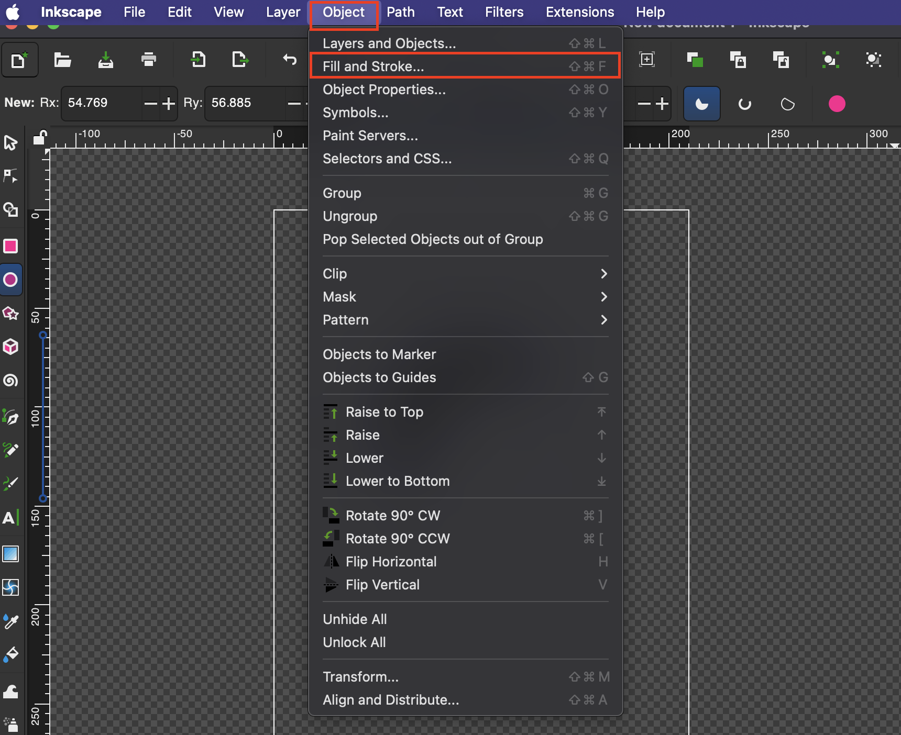
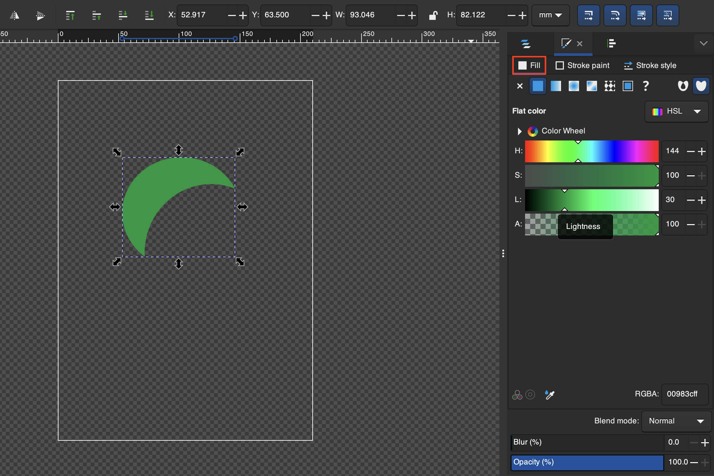
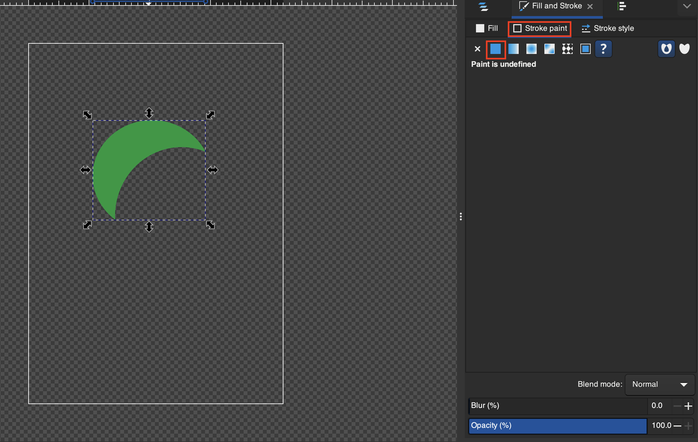
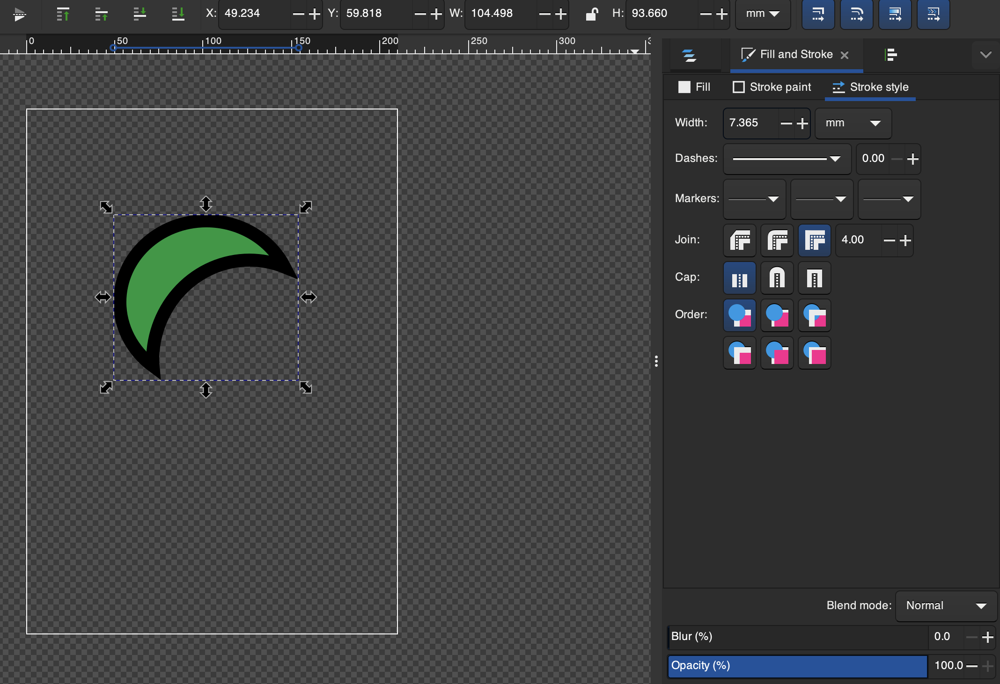

# Stroke and Fill

## Example Use
1. Go to **Objects > Fill and Stroke...**

2. You can edit the color in the **Fill** tab

3. To apply a stroke you can go the the **Stroke** tab and select **Flat Color**

3. In **Stroke Style** you can edit stroke properties
