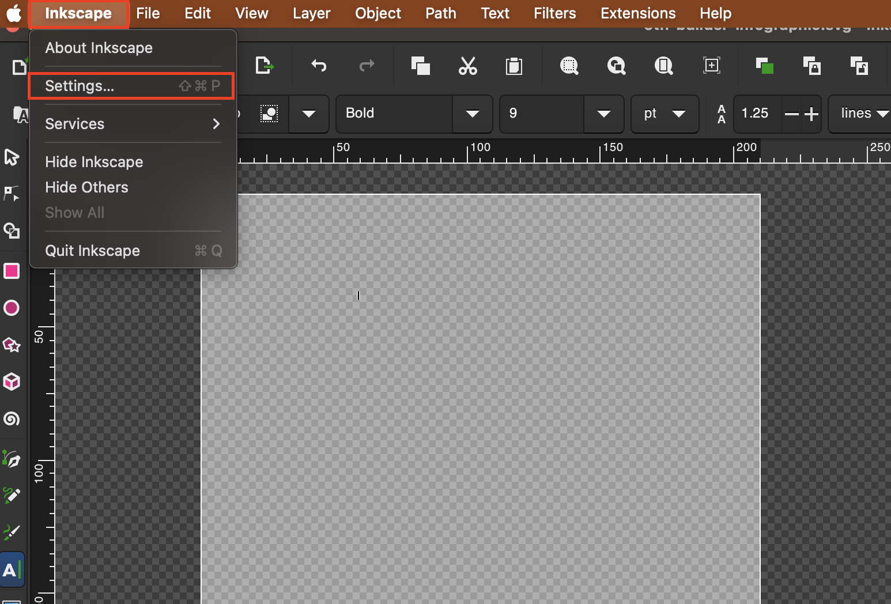
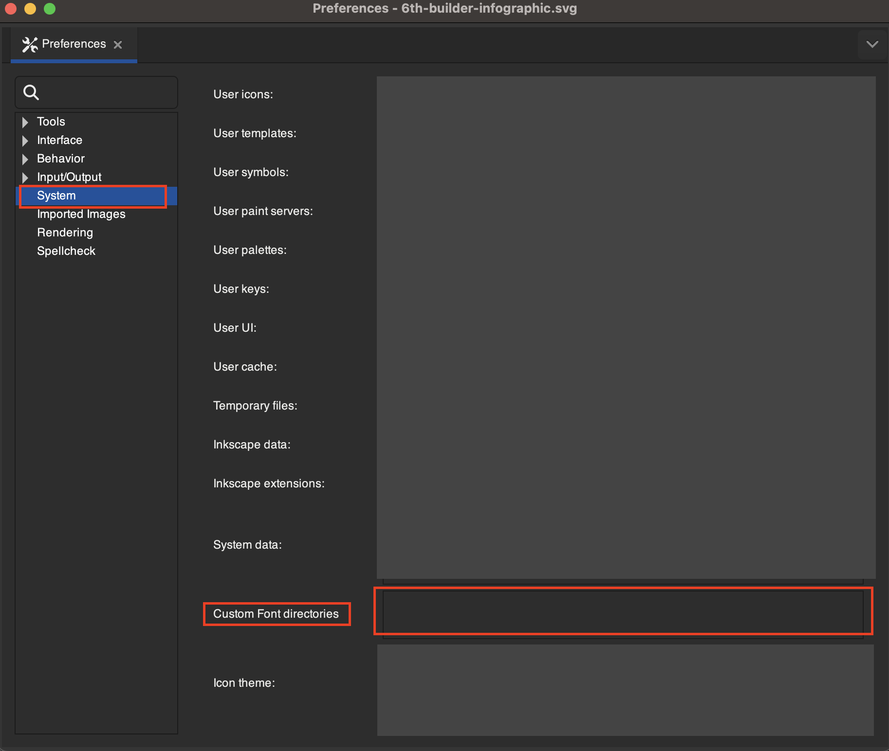
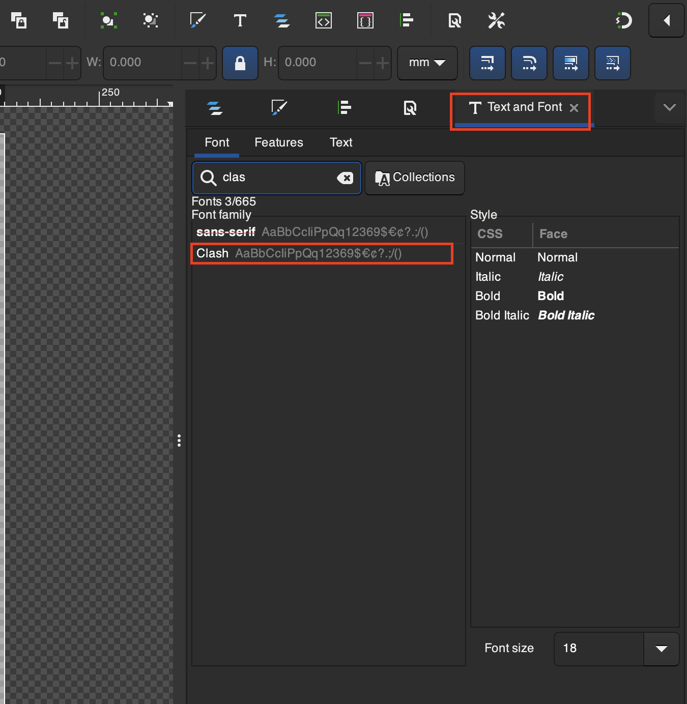

# Use New Fonts
1. Download a new font which may come in a `.ttf` or a `.otf`

2. Place the font file in a folder, and copy the file path. Example:
```
Users/user/fonts
```

3. Open **Inkscape > Settings...** in Inkscape


4. Under **System > Custom Font directories** place the path of the font folder so Inkscape can access the file e.g. `Users/user/fonts`


5. Restart Inkscape

6. Your new fonts should be available under the **Text and Font** menu
