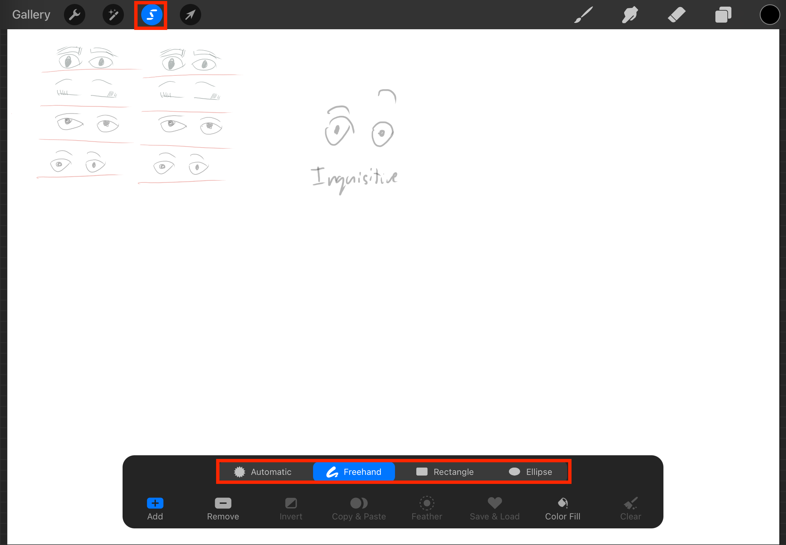
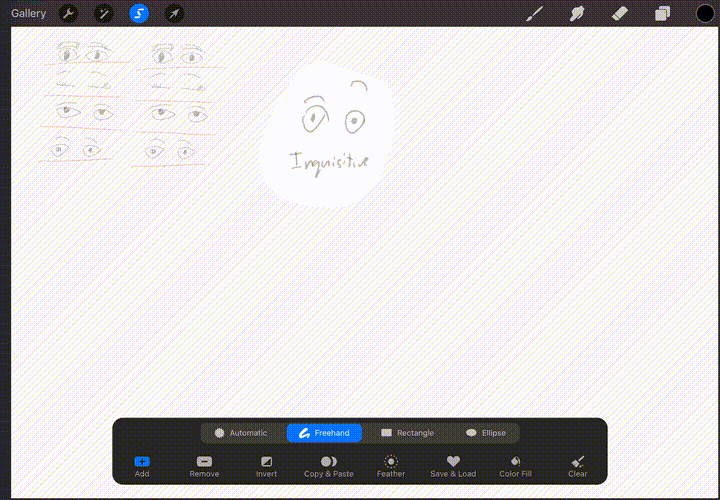

# Copy and Paste

1. Use the **Select Tool** on the top left

2. Draw around the image you want to cut

3. Use the three finger swipe to open a menu and select **Cut**

4. Use the three finger swipe to open a menu and select **Paste**
