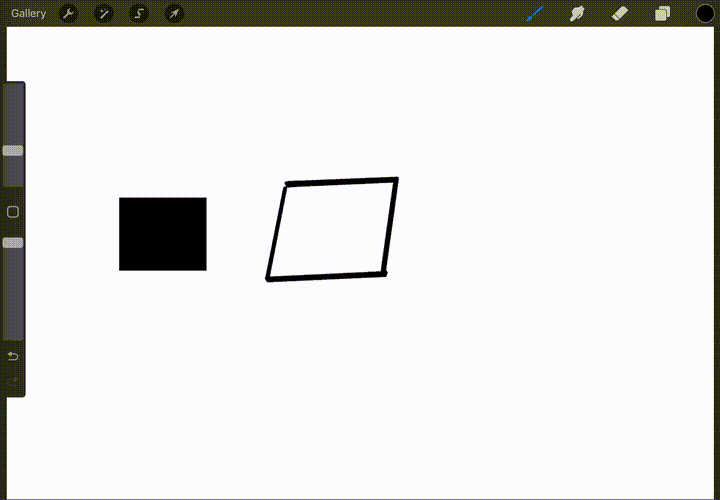
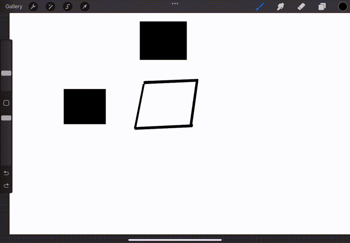

# Create Shapes

## QuickShape

For more information see the [official documentation](https://help.procreate.com/procreate/handbook/guides/quickshape)
## Example:

## Make Rectangles

In the **Selection Tool** select **Rectangle** then **Color Fill**

## Change Shape Perspective
Use the **Transform Tool** and select **Distort** you can then grab the corners and distort the drawing
