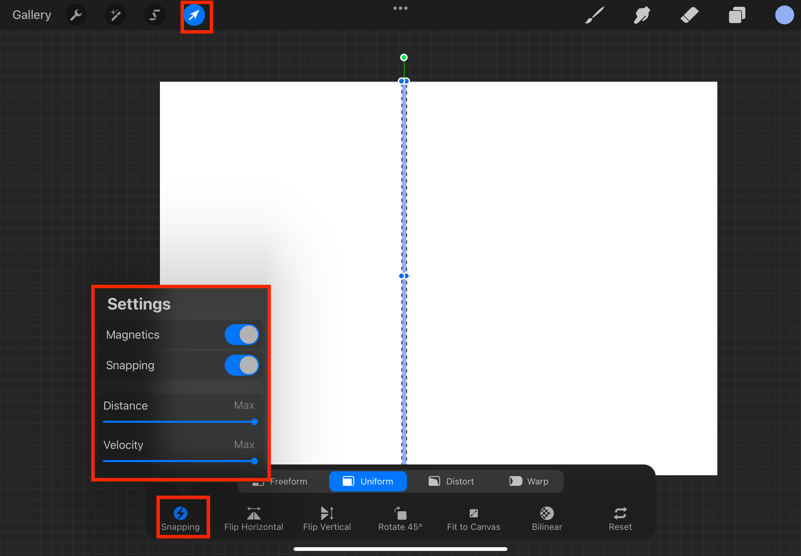
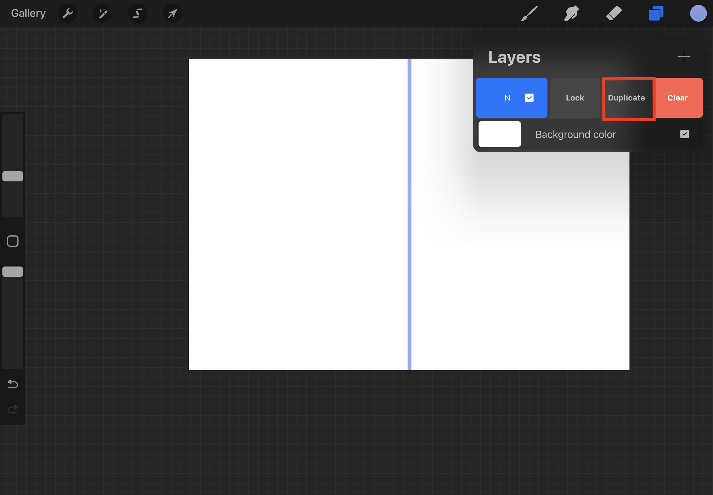

# Creating a Grid Pattern

1. Select the **Selections Menu**

2. Select **Rectangle** and ensure that **Add** and **Color Fill** are enabled

3. Drag and create the rectangle

4. Select the **Transform Menu** and set up snapping

5. Drag and adjust the rectangle to your preferred size

6. Select the **Layers** 

7. Swipe left on the layer to duplicate it

8. The layers will be duplicated and now edit the new layer

9. Use the **Rotate 45°** to make it perpendicular to the original line

11. Pinch the two layers to combine into one layer

12. The final layer should look like this. You can duplicate it to make the pattern larger
