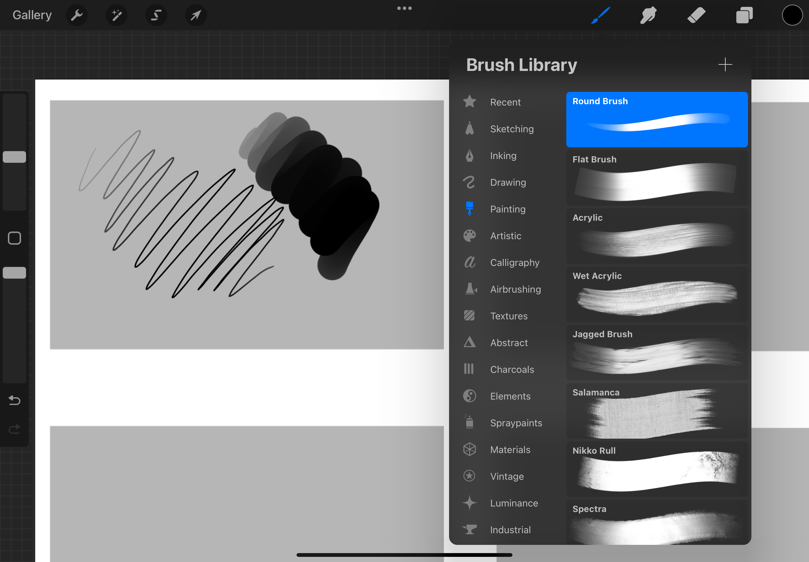
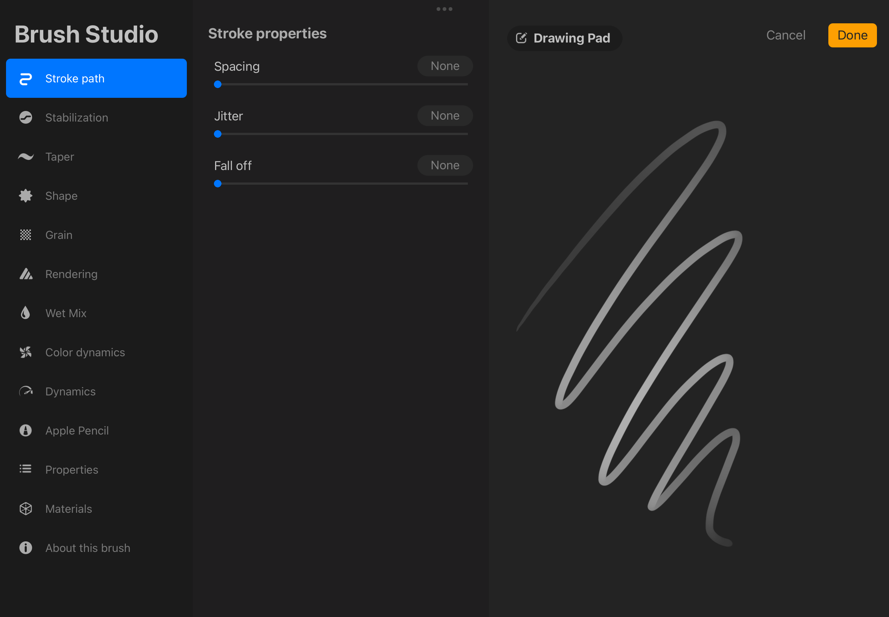
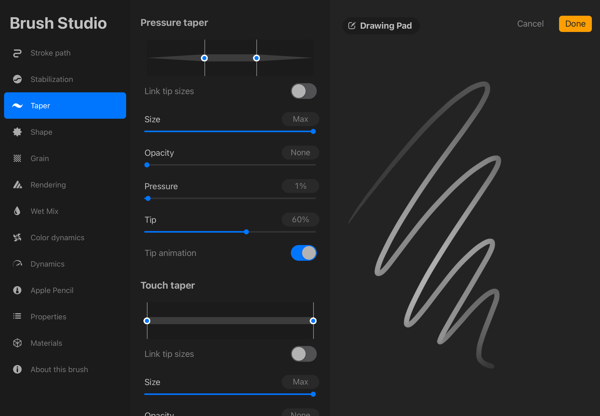
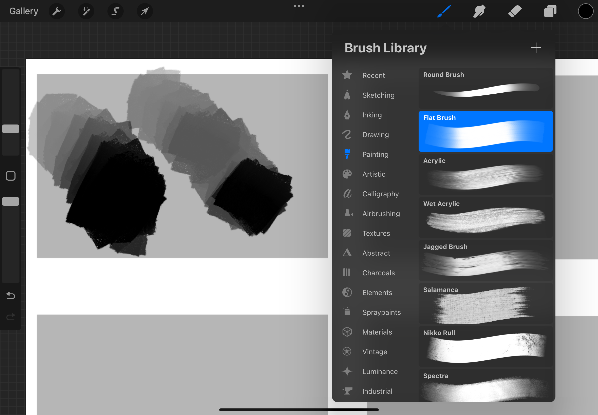
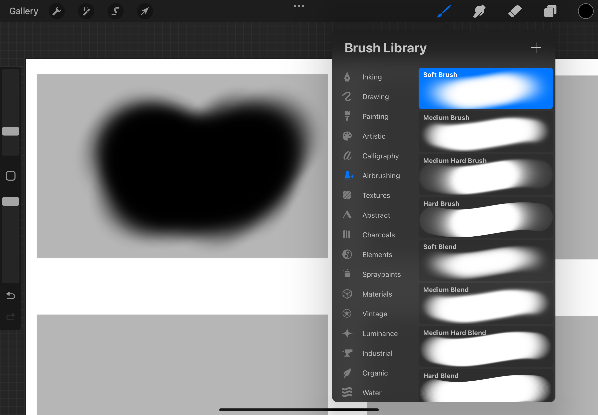
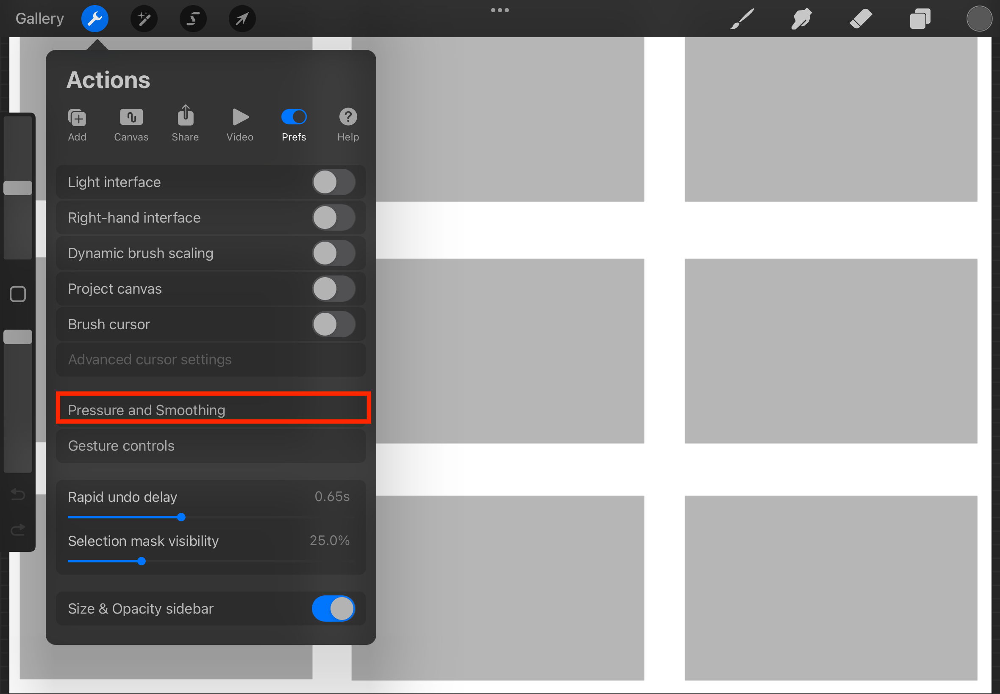
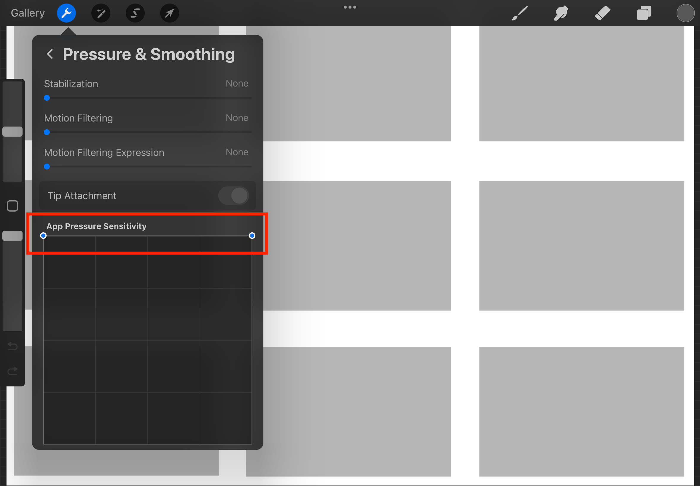

# Procreate Brushes

## Basic Brushes to Uses
1. **Round Brush** - For details

> You may want to adjust some settings
> 
> 

2. **Flat Brush** - Base sketch of value paintings (big areas of colors)

3. **Soft Brush** - Big gradients (e.g. sky)

## Disable or Increase Pressure

1. If you want to edit **Pressure** coming from your stylus go to the **Actions Menu** then select **Pressure and Smoothing**

2. You can edit the the graph to your liking. For a no-pressure feel make it flat on the top of the graph like so
