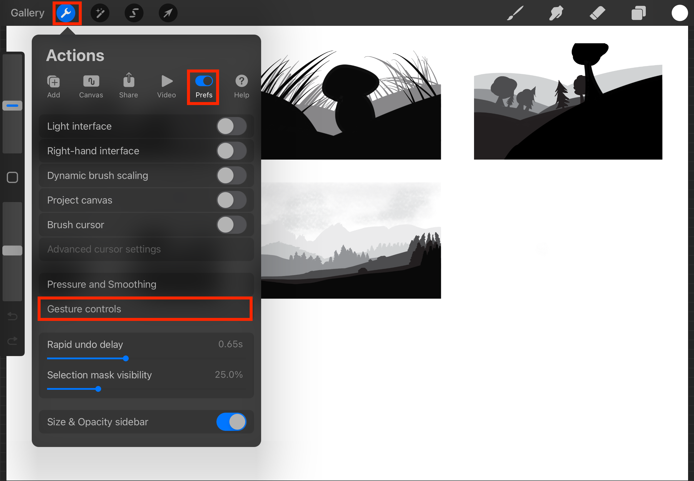
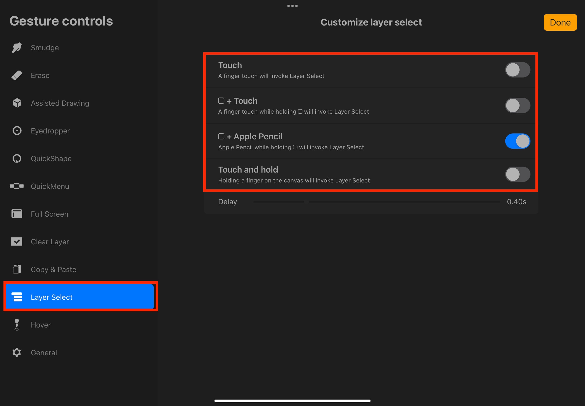
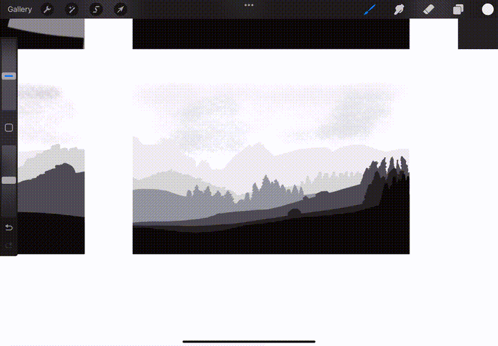

# Quick Layer change
1. Open **Actions Menu** then the **Prefs** tab then **Gesture controls**

2. Once in **Gesture controls** go to **Layer Select** then enable one of the options

3. Example of what using the layer change shortcut looks like
